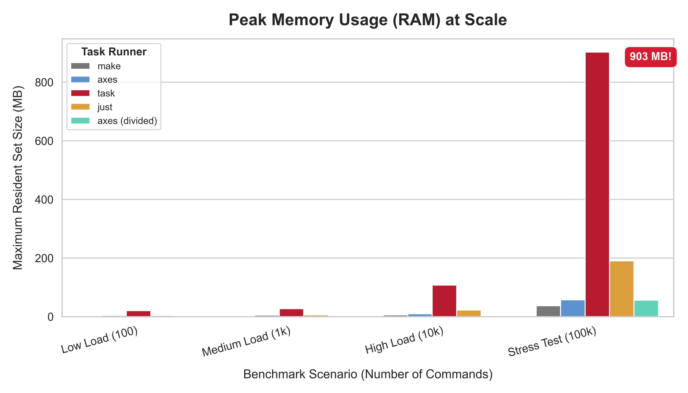

# `axes` Performance Benchmarks

This document provides a comprehensive analysis of `axes`'s performance compared to other popular task runners. The goal is to empirically validate our design philosophy: **delivering advanced orchestration at class-leading speed and efficiency.**

All benchmarks were executed using `hyperfine` for statistical accuracy and `/usr/bin/time -v` for detailed resource usage analysis.

## Test Environment

* **OS:** Linux (via WSL2 on Windows 11)
* **Hardware:** Intel Core i7-1165G7, 16GB RAM, NVMe SSD
* **Tools:**
  * `axes`: v0.3.0-beta
  * `just`: 1.43.0
  * `make`: GNU Make 4.3
  * `task`: v3.45.4

## The Benchmark Harness: Dogfooding `axes`

To ensure our benchmarks are reproducible and easy to run, we've created a powerful benchmark harness **using `axes` itself**. The configuration lives in [`examples/stress_tests/.axes/axes.toml`](./examples/stress_tests/.axes/axes.toml) and is a perfect example of advanced `axes` features.

### How to Run the Benchmarks Yourself

1. **Navigate to the examples directory:**

    ```sh
    cd examples/
    ```

2. **Use the `hyperfine` script:** The `stress_tests` project defines a `hyperfine` script that acts as a flexible wrapper. You can select which tests to run using flags.

    ```sh
    # Run a comparative benchmark for the "high load" scenario
    # -ah: axes-high, -jh: just-high, -mh: make-high, -th: task-high
    # --high: Use the high-intensity hyperfine settings (100 runs)
    axes stress_tests/hyperfine -ah -jh -mh -th --high
    ```

3. **Use the `time` script:** To get detailed memory and resource usage for a single run.

    ```sh
    # Get resource usage for axes on the "high load" test
    axes stress_tests/time -ah
    ```

## 1. Startup Latency

Startup time is critical for a CLI tool's "feel." This benchmark measures the time taken to simply print the version (`--version`).

| Tool | Average Time (Mean ± σ) | Relative Speed |
| :--- | :---: | :---: |
| `make` | **813.1 µs ± 54.7 µs** | **1.21x Faster** |
| `just` | 980.6 µs ± 127.2 µs | 1.00x |
| **`axes`** | **982.9 µs ± 94.5 µs** | **1.00x** (Baseline) |
| `task` | 13.7 ms ± 0.5 ms | 13.9x Slower |

### Analysis

`axes` achieves a sub-millisecond startup time, making it feel instantaneous. This is a direct result of our **explicit initialization** architecture, where costly operations like loading the global index are deferred until a command that actually needs them is run. For simple commands like `--version`, no disk I/O occurs.

---

## 2. Execution Performance & Memory Efficiency at Scale

This is the true test of a task runner's architecture. We measure both execution time and peak memory usage across four different workloads, from a simple script to an extreme stress test.

| Benchmark Scenario |    Tool    | Time (Mean)  |  Peak Memory  |
|:-------------------|:----------:|:------------:|:-------------:|
|    **Low Load**    |   `make`   | **~1.9 ms**  | **~2.4 MB**   |
|   (100 commands)   | **`axes`** |   ~3.6 ms    |   ~4.6 MB     |
|                    |   `task`   |   ~21.5 ms   |   ~20.4 MB    |
|                    |   `just`   |   ~38.4 ms   |   ~4.5 MB     |
|     ―――――――――      |     ――     |    ――――――    |    ――――――     |
|  **Medium Load**   | **`axes`** | **~4.1 ms**  | **~5.5 MB**   |
|   (1k commands)    |   `make`   |   ~4.5 ms    |   ~2.7 MB     |
|                    |   `just`   |   ~42.2 ms   |   ~6.1 MB     |
|                    |   `task`   |   ~58.8 ms   |   ~27.5 MB    |
|     ―――――――――      |     ――     |    ――――――    |    ――――――     |
|   **High Load**    | **`axes`** | **~10.5 ms** | **~10.0 MB**  |
|   (10k commands)   |   `just`   |   ~73.9 ms   |   ~23.1 MB    |
|                    |   `make`   |   ~172.8 ms  |   ~5.9 MB     |
|                    |   `task`   |   ~740.2 ms  |   ~107.6 MB   |
|     ―――――――――      |     ――     |    ――――――    |    ――――――     |
|  **Stress Test**   |   `axes`   |   ~79.6 ms   |   ~57.6 MB    |
|  (100k commands)   | **`axes`(divided)** | **~54.0 ms** | **~56.2 MB**  |
|                    |   `just`   |   ~359.1 ms  |   ~190.7 MB   |
|                    |   `make`   | *TLE (>90s)* |   ~37.6 MB    |
|                    |   `task`   | *TLE (>90s)* |   ~903.1 MB   |

* **TLE:** Time Limit Exceeded. The tool was unable to complete the benchmark.

### What's the Data Tells

#### **The Scalability Curve**




The benchmarks reveal a clear status about architectural design:

1. **Simple Tasks (`Low Load`):** `make`, written in C, is the undisputed champion of minimal overhead. Its raw execution speed is phenomenal for trivial scripts. `axes` is highly competitive, while `just` and `task` show significant startup/parsing overhead even for simple tasks.

2. **The Crossover Point (`Medium Load`):** At a thousand commands, `axes`'s architecture begins to pay off. The one-time cost of deserializing its binary AST is now smaller than the cost of `make` parsing its text-based `Makefile`. **`axes` takes the lead.**

3. **Dominance at Scale (`High Load` & `Stress Test`):** As complexity increases, the performance of tools that parse text on every run (`make`, `just`) degrades significantly. `task`'s performance and memory usage collapse completely, likely due to an inefficient internal representation of the script. In contrast, `axes`'s performance scales in a near-linear fashion. Its **AOT + JIT** model proves to be drastically superior:
    * **Time:** In the most extreme test, `axes` is **4.5x faster** than its closest competitor and orders of magnitude faster than tools that failed to complete.
    * **Memory:** `axes` demonstrates exceptional memory efficiency. It uses **15.7x less memory** than `task`, which balloons to nearly a gigabyte of RAM. This is a direct result of our zero-copy parameter engine and compact AST representation.

## Conclusion: An Architecture Built for Complexity

These benchmarks empirically validate the core design principles of `axes`:

* **AOT Compilation is Superior:** Paying the parsing cost once into a binary format is architecturally superior to re-parsing text on every run, especially at scale.
* **Memory Efficiency Matters:** A focus on zero-copy operations and efficient data structures allows `axes` to handle massive workloads that cause other tools to fail.
* **Scalability is a Feature:** `axes` is not just fast—it is engineered to *stay* fast as your projects grow from a handful of scripts to thousands of orchestrated commands.

`axes` provides the features of a high-level orchestrator with the performance and resource efficiency of a low-level executor, offering a solution without compromise.
