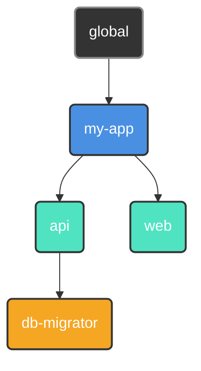

<p align="center">
  
</p>

<p align="center">
  <a href="#"></a>
  <a href="https://github.com/retypeos/axes/releases"></a>
  <a href="https://deepwiki.com/RetypeOS/axes"></a>
  <a href="https://github.com/retypeos/axes/blob/main/LICENSE"></a>

</p>

<p align="center">
  <strong>Read this in other languages:</strong><br>
  <a href="./README.md">English</a> •
  <a href="./docs/es/README.md">Español</a>
</p>

<h1 align="center">axes: The Universal Orchestration Layer for Your Development Flow</h1>

<p align="center">
  <strong>The power of an orchestrator, the speed of an executor. Built in Rust.</strong>
</p>

<p align="center">
  <strong>axes</strong> is a high-performance workflow orchestrator that unifies complex, polyglot projects under a simple, consistent, and ultra-fast command-line interface. It acts as an abstraction layer over your existing tools—from <code>npm</code> and <code>docker</code> to other <i>task runners</i>—providing a universal command language for your entire ecosystem.
</p>

---

### The Problem: Command Fragmentation

As projects grow, the number and variety of commands needed to operate them explode. This "command fragmentation" creates constant friction:

- **Inconsistent Commands:** In this part of the monorepo, do we use `npm test`, `pytest`, `cargo test`, or `go test ./...`?
- **Environment Management:** Which virtual environment (`venv`, `nvm`) needs to be activated? Which `.env` file needs to be loaded?
- **Fragile Scripts:** Relying on `bash` or `PowerShell` scripts for business logic and argument parsing is a maintenance nightmare that is not portable across operating systems.

This constant cognitive load breaks workflow and slows down teams. Simple task runners offer shortcuts, but they don't solve the underlying orchestration problem. `axes` is designed to solve it from the root.

### The Solution: Performance and Orchestration, Unified

For years, developers have faced a false dilemma: use a simple, fast runner with limited features, or a powerful but slow and complex orchestrator. **`axes` eliminates this compromise.**

We deliver advanced orchestration capabilities at a speed that is not just competitive, but class-leading. Our architecture is designed to scale with your project's complexity, maintaining elite performance where other tools falter.

| Command (minimal start time)        | Average Time (Mean ± σ) | Relative Speed |
|:------------------------------------|:-----------------------:|:--------------:|
| **`axes --version`**                | **17.1 ms ± 0.9 ms**    | **1.00**       |
| `just --version`                    | 32.7 ms ± 2.8 ms        | 1.92x Slower   |
| `task --version`                    | 107.1 ms ± 11.8 ms      | 6.28x Slower   |

| Command (Hot Execution, High Load)  | Average Time (Mean ± σ) | Relative Speed |
|:------------------------------------|:-----------------------:|:--------------:|
| **`axes <script>`**                 | **40.2 ms ± 1.1 ms**    | **1.00**       |
| `just <script>`                     | 73.6 ms ± 2.7 ms        | 1.83x Slower   |
| `task <script>`                     | 855.1 ms ± 50.2 ms      | 21.28x Slower  |

*In an extreme stress test with 100,000+ commands, `axes` completes in **~118 ms**, while `task` takes over **33 seconds**—a performance difference of nearly **300x**.*

> Benchmarks executed with `hyperfine` on Windows 11 (i7-1165G7, 16GB RAM, NVMe SSD).
> The "High Load" test involves a script with 10,000 commands. Full methodology and results for all platforms are in our
> [BENCHMARKS.md](./examples/BENCHMARKS.md) file.

This level of performance is the direct result of an **architecture obsessed with efficiency**:

1. **Lazy and Parallel Loading:** `axes` reads and compiles only the configuration it needs, and it does so concurrently, leveraging all available CPU cores.

2. **Ahead-of-Time (AOT) Compilation to a Universal AST:** On the first run, your `axes.toml` files are compiled into a highly optimized, platform-agnostic **Abstract Syntax Tree (AST)**. This universal AST is then saved in a compact binary cache, which is **100% portable across operating systems** (Windows, macOS, Linux).

3. **Just-in-Time (JIT) Optimized Execution:** Every subsequent ("hot") execution bypasses slow text parsing entirely. `axes` deserializes the universal AST from the binary cache, performs an ultra-fast in-memory **"JIT" specialization** for your current OS, and executes the resulting flat command list instantly.

**The result is an engineering guarantee: you pay the orchestration cost once. You get maximum, scalable performance on every run after that.**

- ⚙️ **[In-depth Architecture Analysis (`TECHNICAL.md`)](./TECHNICAL.md):** For those interested in the engineering behind our performance.

---

### The `axes` Philosophy: Design Principles for Modern Workflows

`axes` is built on a foundation that simple tools ignore.

#### 1. Orchestration over Execution

Projects do not live in isolation; they have relationships. `axes` allows you to organize your projects into a **logical tree**, where children inherit and can override their parents' configuration (scripts, variables, environment).



*A `deploy` script defined in `my-app` is available to `api` and `web`, but `db-migrator` can have its own specialized version.*

#### 2. Ergonomics over Shortcuts

Your scripts become first-class command-line applications, complete with documentation, parameters, defaults, and validation—all declared in your `axes.toml`.

```toml
# in .axes/toml
[scripts]
# 1. Required positional parameter.
test = "pytest --env <params::0(required)>"

# 2. Named parameter with a default value and value-only mapping.
build = "docker build . -t my-app:<params::tag(alias='-t', map='', default='latest')>"

# 3. Multiline script with a required, quoted positional parameter and an optional branch.
push = [
  "git add .",
  "git commit <params::0(map='-m ', required, literal)>",
  "git push origin <params::branch(alias='-b', map='', default='main')>"
]
```

```sh
# --- Script: test ---
axes test production   # -> Executes: pytest --env production
axes test              # -> ERROR: Positional argument at index 0 is required.

# --- Script: build ---
axes build                 # -> Executes: docker build . -t my-app:latest
axes build --tag v1.2.0    # -> Executes: docker build . -t my-app:v1.2.0
axes build -t v1.2.0       # -> Executes: docker build . -t my-app:v1.2.0

# --- Script: push ---
axes push "New feature"    # Executes 'git push origin main' (uses default branch)
axes push "Fix bug" -b fix # Executes 'git push origin fix' (uses branch alias)
axes push                  # ERROR: Positional argument at index 0 (commit message) is required.
```

Say goodbye to fragile `bash` scripts for parsing arguments.

#### 3. Robustness by Design

`axes` identifies projects by an immutable `UUID`, not a volatile file path. Rename or move your project directories freely—`axes` will never lose track of your projects. This makes refactoring large monorepos trivial and safe.

---

### `axes` in Action: A Glimpse of Power

#### 1. Universal and Context-Aware Commands

Run a script in the current directory. The syntax is simple and predictable.

```sh
# Executes the 'build' script defined in the nearest axes.toml
$ axes build --release

# Executes the 'test' script in a specific sub-project.
$ axes my-app/api test
```

#### 2. Cross-Platform and DRY Workflows

Define constants as variables and reuse them in your scripts.

```toml
[vars]
host = "http://localhost:8080" # Defined once.

[scripts.browse]
desc    = "Opens local documentation in the browser."
windows = "start <vars::host>" # Reuses the variable.
macos   = "open <vars::host>"
linux   = "xdg-open <vars::host>"
```

#### 3. Dynamic Real-Time Values

Execute commands and use their output instantly as variables.

```toml
[scripts]
# Tags a Docker image with the current short git hash
tag_release = "docker tag my-app:latest my-app:<run('git rev-parse --short HEAD')>"
```

#### 4. Immersive Focus Sessions

Dive into a sub-project. `axes` sets up and tears down your environment for you.

```toml
# in my-app/api/.axes/axes.toml
[options]
at_start = "source .venv/bin/activate" # Executes upon entering the session.
at_exit  = "docker-compose down"       # Executes upon exiting.
```

```sh
$ axes my-app/api start  # Starts a session. `at_start` executes automatically.

(axes: my-app/api) $ axes test  # You no longer need to repeat the context.
(axes: my-app/api) $ exit       # `at_exit` executes upon exit.
```

**Your development environment, on demand.**

### Advanced Example: Orchestrating a Polyglot Monorepo

Imagine a monorepo with a Python backend (`Poetry`) and a React frontend (`npm`). `axes` unifies the development experience.

**Project Structure:**

```sh
mi-monorepo/
├── web/                 (React App)
│   ├── ...
│   └── .axes/axes.toml
├── api/                 (Python/FastAPI App)
│   ├── ...
│   └── .axes/axes.toml
└── .axes/axes.toml      (Root/Inherited Config)
```

**`mi-monorepo/.axes/axes.toml` (Root)**

```toml
[vars]
DOCKER_REGISTRY = "registry.my-company.com"
APP_NAME = "mi-monorepo"

[scripts]
# A 'lint' script that delegates execution in parallel and silent mode.
lint = [
    "@> axes web lint",
    "@> axes api lint",
]
```

**`mi-monorepo/api/.axes/axes.toml` (Backend)**

```toml
[scripts]
lint = "poetry run ruff check ."
run = "poetry run uvicorn app.main:app --reload"
build = "docker build . -t <vars::DOCKER_REGISTRY>/<vars::APP_NAME>-api:latest"
```

**`mi-monorepo/web/.axes/axes.toml` (Frontend)**

```toml
[scripts]
lint = "npm run lint"
run = "npm run dev"
build = "docker build . -t <vars::DOCKER_REGISTRY>/<vars::APP_NAME>-web:latest"
```

The `axes lint` command, run from the root, will now run the linters of both sub-projects **simultaneously**, showing only the output of the linters themselves.

### Command Modifiers: Total Control Over Execution

`axes` gives you granular control over how each command is executed using simple prefixes:

- `# Message...`: **Comment/Print.** Prints the text to the console instead of executing it. Perfect for showing status messages.
  - Instead of using: `echo 'Starting build...'` - Slow, inefficient, and may require special parsing.
  - You can use: `# Starting build...` - Simpler and respects the content itself.

- `@ <command>`: **Silent Mode.** The command is executed, but `axes` will not print the command itself to the console. Useful for cleanup tasks or noisy scripts.
  - `@ rm -rf ./cache`

- `- <command>`: **Ignore Errors.** If the command fails (non-zero exit code), `axes` will continue with the next command in the script instead of stopping.
  - `- docker stop old-container`

- `> <command>`: **Parallel Execution.** Groups this command with subsequent `>` commands into a batch that runs concurrently. `axes` waits for the entire batch to finish before moving on.

```toml
[scripts.test-all]
run = [
    "# --- Starting all tests in parallel ---",
    "> axes api test",
    "> axes web test",
    "> axes integration test",
    "# --- All tests completed ---"
]
```

Modifiers can be combined in any order (e.g., `@-` or `->@`) for powerful, precise orchestration.

**The Unified Workflow:**

- `axes lint`: From the root, runs linting on **both** sub-projects in parallel.
- `axes api run`: Starts only the API server.
- `axes web build`: Builds only the frontend's Docker image, using global variables.

`axes` creates a **cohesive language** over a set of heterogeneous tools, making the development experience predictable and simple, no matter the stack's complexity.

## Installation & Architectural Guarantee

`axes` is a single, dependency-free binary engineered for **architectural confidence**. The same high-performance experience is guaranteed on **Windows, macOS, and Linux**.

1. **Download:** Go to the [**`axes` Releases page**](https://github.com/retypeos/axes/releases) and grab the binary for your system.
2. **Place in PATH:** Extract the executable and move it to a directory in your system's `PATH`.
3. **Verify:** Open a **new terminal** and run `axes --version`.

Our unique **AOT + JIT** architecture produces a **platform-agnostic binary cache**. This means your team can commit the `.axes-cache` directory to version control. If a developer on Windows compiles the configuration, their teammates on macOS and Linux will instantly benefit from "hot" executions, skipping the initial compilation cost.

---

## Architectural Confidence

`axes` is engineered with **architectural confidence** thanks to its Rust foundation and its unique caching system.

- **Engineering Guarantee:** The core logic, the **AST Compiler**, and the execution engine are designed to be **platform-agnostic**. The superior speed you get from the **AOT (Ahead-of-Time) Compilation** is consistent across all operating systems.

- **Team Collaboration Feature:** `axes` creates an optimized binary cache that can be **shared across different operating systems** (e.g., via a network drive or a shared project folder). If one developer compiles the workflow on Windows, another developer on Linux instantly benefits from the **Hot Execution Path**, skipping the costly initial parsing.

We continuously test and improve the experience on all platforms. If you encounter any platform-specific issues, please [**Open an Issue**](https://github.com/retypeos/axes/issues).

---

### Next Steps: Conduct Your Own Orchestra

The friction you feel every day is not a requirement. It is a problem with a solution. `axes` is that solution.

- ➡️ **[Quick Start Guide (`GETTING_STARTED.md`)](./GETTING_STARTED.md):** Build your first orchestrated monorepo in 15 minutes.
- 📖 **[Mastering `axes.toml` (`AXES_TOML_GUIDE.md`)](./AXES_TOML_GUIDE.md):** The definitive reference for every feature and syntax.
- ⌨️ **[Command Reference (`COMMANDS.md`)](./COMMANDS.md):** A complete guide to all CLI commands (`init`, `register`, `tree`, etc.).

---

### It's Time to Improve Your Workflows and Get Productive Again

`axes` is more than a tool; it is an open-source project dedicated to restoring control, consistency, and performance to development. Your voice and support are crucial.

- **Find a Bug or Have a Great Idea:** [**Open an Issue**](https://github.com/retypeos/axes/issues). We value every piece of feedback.
- **Want to Contribute Code?:** Pull Requests are always welcome. Check out our [Contribution Guidelines](./CONTRIBUTING.md) to get started.

#### Support `axes` Development

We are obsessed with performance, robustness, and an excellent developer experience. Your financial support allows us to dedicate time and resources to maintain this level of excellence and accelerate our roadmap.

Funds are used directly for:

- **Compensating core developers** for their dedication to maintenance and new feature development.
- **Covering CI/CD infrastructure costs**, including the future addition of macOS and Linux runners.
- **Prioritizing major architectural features**, such as artifact caching.

Every contribution, from a symbolic thank-you to corporate sponsorship, is essential fuel for our development engine.

➡️ **[Support us on Open Collective](https://opencollective.com/retypeos)**

*(We are in the process of applying for GitHub Sponsors. Thank you for making `axes` possible!)*

---

**Install `axes` today. Stop remembering commands. Start building.**
