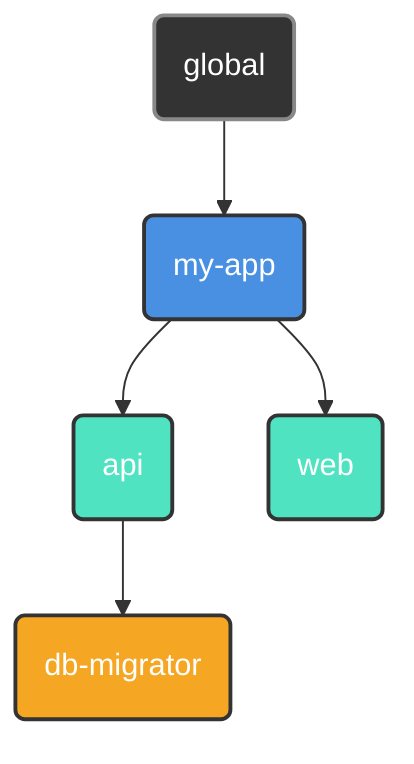

<p align="center">
  
</p>

<p align="center">
  <a href="#"></a>
  <a href="https://github.com/retypeos/axes/releases"></a>
  <a href="https://deepwiki.com/RetypeOS/axes"></a>
  <a href="https://github.com/retypeos/axes/blob/main/LICENSE"></a>

</p>

<p align="center">
  <strong>Read this in other languages:</strong><br>
  <a href="./README.md">English</a> •
  <a href="./docs/es/README.md">Español</a>
</p>

<h1 align="center">axes: The Universal Orchestration Layer for Your Development Flow</h1>

<p align="center">
  <strong>The power of an orchestrator, the speed of an executor. Built in Rust.</strong>
</p>

<p align="center">
  <strong>axes</strong> is a high-performance workflow orchestrator that unifies complex, polyglot projects under a simple, consistent, and ultra-fast command-line interface. It acts as an abstraction layer over your existing tools—from <code>npm</code> and <code>docker</code> to other <i>task runners</i>—providing a universal command language for your entire ecosystem.
</p>

---

### The Problem: Command Fragmentation

As projects grow, the number and variety of commands needed to operate them explode. This "command fragmentation" creates constant friction:

- **Inconsistent Commands:** In this part of the monorepo, do we use `npm test`, `pytest`, `cargo test`, or `go test ./...`?
- **Environment Management:** Which virtual environment (`venv`, `nvm`) needs to be activated? Which `.env` file needs to be loaded?
- **Fragile Scripts:** Relying on `bash` or `PowerShell` scripts for business logic and argument parsing is a maintenance nightmare that is not portable across operating systems.

This constant cognitive load breaks workflow and slows down teams. Simple task runners offer shortcuts, but they don't solve the underlying orchestration problem. `axes` is designed to solve it from the root.

### The Solution: Performance and Orchestration, Unified

For years, the choice has been a false dilemma: use a simple, fast runner with limited features, or a powerful but slow and complex orchestrator. **`axes` eliminates this compromise.**

We offer advanced orchestration capabilities at a speed that rivals, and often surpasses, the most popular executors in the Rust ecosystem.

| Command (Hot Execution) | Average [ms] (± σ) | Min … Max [ms] | Relative Speed |
|:---|:---:|:---:|:---:|
| **`axes <script>`** | **41.8 ± 1.9** | 38.1 … 45.9 | **1.00** |
| `just <script>` | 44.7 ± 4.0 | 38.0 … 57.9 | 1.07x slower |
| `task <script>` | 79.9 ± 9.3 | 60.9 … 99.2 | 1.91x slower |
| --- | --- | --- | --- |
| **`axes --version` (Startup)** | **19.6 ± 1.8** | 16.6 … 25.3 | **1.00** |
| `just --version` (Startup) | 24.4 ± 3.5 | 18.7 … 35.1 | 1.25x slower |
| `task --version` (Startup) | 69.0 ± 9.0 | 54.9 … 90.8 | 3.52x slower |

*Benchmarks executed with `hyperfine` on a standard development machine with specs: (Aspire A315-58, Windows 11, 11th Gen Intel(R) Core(TM) i7-1165G7 @ 2.80GHz (2.80 GHz), Intel(R) Iris(R) Xe Graphics (128mb), 16GB RAM, NVMe SSD). Each command was executed 50 times after a warm-up of 5 executions.*

This performance is not accidental; it is the result of an **architecture obsessed with efficiency**:

1. **Lazy and Parallel Loading:** `axes` only loads the configuration it needs from disk, and it does so in parallel.
2. **Pre-compiled AST Cache:** On the first execution, your `axes.toml` files are compiled into a highly optimized **Abstract Syntax Tree (AST)**. This AST is saved in a compact binary cache.
3. **Instant Hot Executions:** Every subsequent execution completely skips the costly text parsing. `axes` deserializes the pre-compiled AST from the binary cache—an operation orders of magnitude faster than text parsing—and executes it instantly.

**The result: you pay the orchestration cost once. You get the speed of a simple executor every time after.**

- ⚙️ **[In-depth Architecture Analysis (`TECHNICAL.md`)](./TECNICAL.md):** For those interested in the engineering behind our performance.

---

### The `axes` Philosophy: Design Principles for Modern Workflows

`axes` is built on a foundation that simple tools ignore.

#### 1. Orchestration over Execution

Projects do not live in isolation; they have relationships. `axes` allows you to organize your projects into a **logical tree**, where children inherit and can override their parents' configuration (scripts, variables, environment).



*A `deploy` script defined in `my-app` is available to `api` and `web`, but `db-migrator` can have its own specialized version.*

#### 2. Ergonomics over Shortcuts

Your scripts become first-class command-line applications, complete with documentation, parameters, defaults, and validation, all declaratively.

```toml
# in .axes/axes.toml
[scripts]
# 1. Required positional parameter:
#    Fails if an environment is not provided.
test = "pytest --env <axes::params::0(required)>"

# 2. Named parameter with a default value:
#    Uses '--tag latest' if not specified.
build = "docker build . -t my-app:<axes::params::tag(map='', default='latest')>"
```

```sh
axes test production   # Passes --env production to pytest
axes test              # ERROR: Parameter 0 is required.

axes build --tag v1.2.0  # Builds image my-app:v1.2.0
axes build               # Builds image my-app:latest
```

Say goodbye to fragile `bash` scripts for parsing arguments.

#### 3. Robustness by Design

`axes` identifies projects by an immutable `UUID`, not a volatile file path. Rename or move your project directories freely—`axes` will never lose track of your projects. This makes refactoring large monorepos trivial and safe.

---

### `axes` in Action: A Glimpse of Power

#### 1. Universal and Context-Aware Commands

Run a script in the current directory. The syntax is simple and predictable.

```sh
# Executes the 'build' script defined in the nearest axes.toml
$ axes build --release

# Executes the 'test' script in a specific sub-project.
$ axes my-app/api test
```

#### 2. Cross-Platform and DRY Workflows

Define constants as variables and reuse them in your scripts.

```toml
[vars]
host = "http://localhost:8080" # Defined once.

[scripts.browse]
desc    = "Opens local documentation in the browser."
windows = "start <axes::vars::host>" # Reuses the variable.
macos   = "open <axes::vars::host>"
linux   = "xdg-open <axes::vars::host>"
```

#### 3. Dynamic Real-Time Values

Execute commands and use their output instantly as variables.

```toml
[scripts]
# Tags a Docker image with the current short git hash
tag_release = "docker tag my-app:latest my-app:<axes::run('git rev-parse --short HEAD')>"
```

#### 4. Immersive Focus Sessions

Dive into a sub-project. `axes` sets up and tears down your environment for you.

```toml
# in my-app/api/.axes/axes.toml
[options]
at_start = "source .venv/bin/activate" # Executes upon entering the session.
at_exit  = "docker-compose down"       # Executes upon exiting.
```

```sh
$ axes my-app/api start  # Starts a session. `at_start` executes automatically.

(axes: my-app/api) $ axes test  # You no longer need to repeat the context.
(axes: my-app/api) $ exit       # `at_exit` executes upon exit.
```

**Your development environment, on demand.**

### Advanced Example: Orchestrating a Polyglot Monorepo

Imagine a monorepo with a Python backend (`Poetry`) and a React frontend (`npm`). `axes` unifies the development experience.

**Project Structure:**

```sh
mi-monorepo/
├── web/                 (React App)
│   ├── ...
│   └── .axes/axes.toml
├── api/                 (Python/FastAPI App)
│   ├── ...
│   └── .axes/axes.toml
└── .axes/axes.toml      (Root/Inherited Config)
```

**`mi-monorepo/.axes/axes.toml` (Root)**

```toml
[vars]
DOCKER_REGISTRY = "registry.my-company.com"
APP_NAME = "mi-monorepo"

[scripts]
# A 'lint' script that delegates execution in parallel and silent mode.
lint = [
    "@> axes web lint",
    "@> axes api lint",
]
```

**`mi-monorepo/api/.axes/axes.toml` (Backend)**

```toml
[scripts]
lint = "poetry run ruff check ."
run = "poetry run uvicorn app.main:app --reload"
build = "docker build . -t <axes::vars::DOCKER_REGISTRY>/<axes::vars::APP_NAME>-api:latest"
```

**`mi-monorepo/web/.axes/axes.toml` (Frontend)**

```toml
[scripts]
lint = "npm run lint"
run = "npm run dev"
build = "docker build . -t <axes::vars::DOCKER_REGISTRY>/<axes::vars::APP_NAME>-web:latest"
```

The `axes lint` command, run from the root, will now run the linters of both sub-projects **simultaneously**, showing only the output of the linters themselves.

### Command Modifiers: Total Control Over Execution

`axes` gives you granular control over how each command is executed using simple prefixes:

- `# <text>`: **Comment/Print.** Prints the text to the console instead of executing it. Perfect for showing status messages.
  - Instead of using: `echo 'Starting build...'` - Slow, inefficient, and may require special parsing.
  - You can use: `# Starting build...` - Simpler and respects the content itself.

- `@ <command>`: **Silent Mode.** The command is executed, but `axes` will not print the command itself to the console. Useful for cleanup tasks or noisy scripts.
  - `@ rm -rf ./cache`

- `- <command>`: **Ignore Errors.** If the command fails (non-zero exit code), `axes` will continue with the next command in the script instead of stopping.
  - `- docker stop old-container`

- `> <command>`: **Parallel Execution.** `axes` will group all subsequent commands prefixed with (`>`) into a batch where they are executed simultaneously, waiting for all of them to finish before proceeding to the next sequential command.
  - `# --- Starting tests ---`
  - `> axes api test`
  - `> axes web test`
  - `# --- All tests completed ---`

These modifiers can be combined, as in the `lint` example (`@>`), for powerful and precise orchestration.

**The Unified Workflow:**

- `axes lint`: From the root, runs linting on **both** sub-projects in parallel.
- `axes api run`: Starts only the API server.
- `axes web build`: Builds only the frontend's Docker image, using global variables.

`axes` creates a **cohesive language** over a set of heterogeneous tools, making the development experience predictable and simple, no matter the stack's complexity.

### Installation

`axes` is a single binary file with no dependencies.

#### Windows

Installation on Windows is the recommended and officially supported path.

1. Go to the [**`axes` Releases page on GitHub**](https://github.com/retypeos/axes/releases).
2. Download the `.zip` file for Windows (e.g., `axes-x86_64-pc-windows-msvc.zip`).
3. Unzip the file and move the `axes.exe` executable to a directory included in your system's `PATH`.
4. Open a **new terminal** and verify the installation with `axes --version`.

#### macOS and Linux (Experimental Support)

We currently do not offer pre-compiled binaries for macOS or Linux due to the lack of CI and testing infrastructure for these platforms. In theory, `axes` should work correctly as it is built with Rust, but **we cannot guarantee its stability**.

> Currently, `axes` has **first-class support** on Windows, where it has been extensively developed and tested. Support for macOS and Linux is **experimental but architecturally sound**. The reason for this label is our current lack of CI infrastructure and hardware for continuous testing on these platforms.

The community is welcome to test it and report any issues. The only installation method for now is compiling from source code.

**Compiling from Source Code:**

1. Ensure you have the [Rust toolchain](https://rustup.rs/) installed (`rustc`, `cargo`).
2. Clone the repository:

    ```sh
    git clone https://github.com/retypeos/axes.git
    cd axes
    ```

3. (Optional) Language Selection: `axes` includes translations. You can embed a specific language in the stable binary by setting the `AXES_LANG` environment variable before compiling; if not specified, English is used by default.

    ```sh
    # To compile with the interface in Spanish
    export AXES_LANG='es' 
    ```

4. Compile in `release` mode to get maximum performance:

    ```sh
    cargo build --release
    ```

5. The final binary will be in `target/release/axes`. Copy it to a location in your `PATH` (e.g., `/usr/local/bin`).

---

### Next Steps: Conduct Your Own Orchestra

The friction you feel every day is not a requirement. It is a problem with a solution. `axes` is that solution.

- ➡️ **[Quick Start Guide (`GETTING_STARTED.md`)](./GETTING_STARTED.md):** Build your first orchestrated monorepo in 15 minutes.
- 📖 **[Mastering `axes.toml` (`AXES_TOML_GUIDE.md`)](./AXES_TOML_GUIDE.md):** The definitive reference for every feature and syntax.
- ⌨️ **[Command Reference (`COMMANDS.md`)](./COMMANDS.md):** A complete guide to all CLI commands (`init`, `register`, `tree`, etc.).

---

### It's Time to Improve Your Workflows and Get Productive Again

`axes` is more than a tool; it is an open-source project dedicated to restoring control, consistency, and performance to development. Your voice and support are crucial.

- **Find a Bug or Have a Great Idea:** [**Open an Issue**](https://github.com/retypeos/axes/issues). We value every piece of feedback.
- **Want to Contribute Code?:** Pull Requests are always welcome. Check out our [Contribution Guidelines](./CONTRIBUTING.md) to get started.

#### Support `axes` Development

We are obsessed with performance, robustness, and an excellent developer experience. Your financial support allows us to dedicate time and resources to maintain this level of excellence and accelerate our roadmap.

Funds are used directly for:

- **Compensating core developers** for their dedication to maintenance and new feature development.
- **Covering CI/CD infrastructure costs**, including the future addition of macOS and Linux runners.
- **Prioritizing major architectural features**, such as artifact caching.

Every contribution, from a symbolic thank-you to corporate sponsorship, is essential fuel for our development engine.

➡️ **[Support us on Open Collective](https://opencollective.com/retypeos)**

*(We are in the process of applying for GitHub Sponsors. Thank you for making `axes` possible!)*

---

**Install `axes` today. Stop remembering commands. Start building.**
