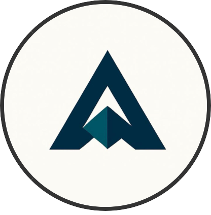

<p align="center">
  

</p>
<h1 align="center">axes: El Control Remoto Universal para tu Ecosistema de Desarrollo</h1>

<p align="center">
  <strong>Cualquier Proyecto. Cualquier Lenguaje. Un Solo Lenguaje de Comandos.</strong>
</p>

<p align="center">
  <a href="#"></a>
  <a href="#"></a>
  <a href="LICENSE"></a>
</p>

¿Alguna vez has sentido esa micro-pausa al cambiar de proyecto? Esa fracción de segundo en la que tu cerebro intenta recordar: *«Espera, ¿en este proyecto el comando para levantar el entorno era `npm run dev`, `docker-compose up`, o `source .venv/bin/activate && flask run`?»*.

Esa es una carga cognitiva que `axes` elimina casi por completo.

`axes` es una herramienta de línea de comandos que actúa como una **capa de abstracción inteligente** sobre todo tu entorno de desarrollo. No busca reemplazar a `make`, `npm`, `just` o `docker-compose`. Al contrario, los utiliza. `axes` es el **director de orquesta** que les dice qué hacer, cuándo y cómo, usando un lenguaje de comandos simple, coherente y poderoso que TÚ defines.

Y lo mejor de todo: la configuración vive en un directorio `.axes` que **viaja con tu repositorio**. Cuando un nuevo miembro del equipo clona el proyecto, ya tiene todos los flujos de trabajo listos para ejecutar. El onboarding nunca fue tan simple.

---

## Del Caos a la Coherencia

Imagina un proyecto web típico con un frontend y un backend.

**El Flujo de Trabajo Tradicional:**

```sh
# Para trabajar en el frontend...
cd frontend && npm run dev

# Ups, ahora necesito la API... (abrir otra terminal)
cd ../backend
source .venv/bin/activate
export DATABASE_URL="..."
uvicorn app.main:app --reload
```

Dos proyectos, dos terminales, cuatro comandos diferentes, y un `cd` propenso a errores. Esto es fricción.

**El Flujo de Trabajo con `axes` (Coherencia Total):**

Con `axes`, defines estos flujos una vez en archivos `axes.toml` que viven junto a tu código.

```toml
# en ./backend/.axes/axes.toml
[scripts]
dev = "source .venv/bin/activate && uvicorn app.main:app --reload"

# en ./frontend/.axes/axes.toml
[scripts]
dev = "npm run dev"
```

Ahora, tu equipo crea un script de orquestación en la raíz:

```toml
# en ./.axes/axes.toml
[scripts]
# El '>' indica ejecución en paralelo
dev = [
    "> axes backend dev",
    "> axes frontend dev"
]
```

A partir de ahora, cualquier miembro del equipo, desde cualquier lugar del sistema, puede levantar todo el entorno de desarrollo con **un solo comando:**

```sh
# `.` se refiere al proyecto del directorio actual o superior.
axes . dev
```

Has convertido el caos en un lenguaje de comandos unificado, auto-documentado y versionado.

---

## Características Clave de un Vistazo

`axes` es simple en la superficie, pero increíblemente potente por debajo.

* **Jerarquía y Herencia:** Organiza tus proyectos en un árbol (`mi-app/api`, `mi-app/frontend`). Los hijos heredan variables y scripts de sus padres, eliminando la duplicación.
* **Scripts como Funciones:** Crea scripts que aceptan argumentos posicionales, flags, y tienen valores por defecto, todo de forma declarativa.

    ```toml
    [scripts]
    test = "pytest <axes::params::file> --marker <axes::params::marker='smoke'>"
    ```

* **Composición y Paralelismo:** Construye flujos de trabajo complejos a partir de piezas simples. Ejecuta tareas en paralelo con el prefijo `>`.
* **Sesiones de Enfoque:** Sumérgete en un sub-proyecto con `axes mi-app/api start`. Tu terminal se configura automáticamente (variables de entorno, entornos virtuales, bases de datos) y te permite ejecutar comandos en ese contexto sin repetir comandos y de forma totalmente orgánica.
* **Agnóstico a la Tecnología:** `axes` no se preocupa si usas Rust, Go, Python, Node.js, Docker o Terraform. Si se puede escribir en una terminal, `axes` puede orquestarlo, incluyendo por supuesto archivos de terminal.

---

## Aprende Más: Sumérgete en la Documentación

Este README es solo la punta del iceberg. Para dominar `axes`, explora nuestra documentación detallada:

* **[Guía de Inicio y Tutorial Completo (`GETTING_STARTED.md`)](./GETTING_STARTED.md):** Un tutorial paso a paso que te guiará desde la instalación hasta la creación de un monorepo complejo.
* **[Referencia Completa de Comandos (`COMMANDS.md`)](./COMMANDS.md):** Una guía exhaustiva de cada comando (`init`, `tree`, `link`, etc.), sus flags y ejemplos de uso.
* **[Dominando el `axes.toml` (`AXES_TOML_GUIDE.md`)](./AXES_TOML_GUIDE.md):** La guía definitiva sobre la sintaxis del `axes.toml`, incluyendo el sistema de scripting, la herencia, y el potente parseo de argumentos.
* **[Guía Técnica y de Contribución (`TECNICAL.md`)](./TECNICAL.md):** Para aquellos que deseen contribuir al código de `axes` o entender su arquitectura interna.

---

## Instalación

`axes` es un único binario sin dependencias.

1. Ve a la página de [**Releases de `axes` en GitHub**](https://github.com/RetypeOS/axes/releases).
2. Descarga el archivo para tu sistema operativo.
3. Descomprímelo y mueve el ejecutable `axes` a un directorio en tu `PATH`.
4. Abre una **nueva terminal** y verifica la instalación con `axes --version`.

---

## Estado Actual: Beta temprana

`axes` se encuentra en **fase Beta**. Aún faltan mejoras importantes que implementar, pero la base de uso para el 90% de los usuarios es robusta y funcional. El núcleo de la herramienta es robusto y está listo para ser probado en proyectos reales. Sin embargo, aún pueden existir bugs y la API podría tener cambios antes de la versión 1.0.

**¡Necesitamos tu ayuda!** La mejor forma de contribuir es usando `axes` en tus flujos de trabajo y reportando cualquier problema o sugerencia.

* **Encuentra un Bug o tienes una Idea:** [**Abre un Issue**](https://github.com/RetypeOS/axes/issues)
* **Quieres Contribuir con Código:** ¡Los Pull Requests son bienvenidos! Revisa nuestra hoja de ruta y guías de contribución.

## Licencia

Este proyecto está licenciado bajo la [Licencia MIT](./LICENSE).
