  <strong>Read this in other languages:</strong> 
  <a href="./TECHNICAL.md">English</a> •
  <a href="./docs/es/TECHNICAL.md">Español</a>

# 1. Introduction and Design Philosophy

This document provides an in-depth technical analysis of the internal architecture of `axes`. Unlike user documentation, its purpose is to detail the design decisions, software patterns, and optimization strategies that allow `axes` to meet its goals of performance and robustness.

## 1.1. The Technical Problem Addressed

Traditional task runners operate on a stateless, text-based model. This approach, while simple, introduces fundamental bottlenecks as project complexity scales:

1. **Hot Path Parsing Overhead:** Every execution requires reading and parsing text configuration files (e.g., `Makefile`, `Justfile`, `package.json`), an operation that is intensive in I/O and CPU and is unnecessarily repeated.
2. **Implicit Dependency Management:** The relationship between different components of a monorepo (e.g., `api` depends on `common-lib`) is not formalized, leading to fragile workflows and a lack of configuration inheritance.
3. **Lack of Persistent Identity:** Identifying a project based on its file system path is inherently volatile. Operations like renaming or moving a directory break workflows and references.

`axes` was designed from the ground up to solve these problems at the architectural level.

### 1.2. The Three Pillars of `axes` Architecture

The architecture of `axes` rests on three fundamental principles that work synergistically to deliver elite performance and structural robustness.

#### 1.2.1. Centralized and Persistent State (`GlobalIndex`)

The core of `axes` is a **global index** (`GlobalIndex`), a compact binary database that acts as the **Single Source of Truth** for the entire project ecosystem. This index maps an **immutable UUID** for each project to its essential metadata, such as its physical path, name, and parent-child relationship.

- **Startup Performance:** By using a binary format (`bincode`), deserializing the entire index into memory is orders of magnitude faster than parsing an equivalent in text format (JSON, TOML). This drastically minimizes cold-start latency.
- **Structural Robustness:** By decoupling logical identity (UUID) from physical location (path), the system becomes resilient to changes in the file system.

#### 1.2.2. Lazy and Concurrent Loading (The `Facade` Pattern)

`axes` operates on the principle of "minimum necessary work." Reading and compiling `axes.toml` files does not happen upfront. Instead, a lightweight in-memory structure, the `ResolvedConfig`, is built, which acts as a **Facade**.

- **On-Demand Resolution:** Configuration data (scripts, variables, etc.) is only loaded from disk and combined when a method like `get_script()` or `get_env()` is invoked for the first time.
- **Optimized Concurrency:** The `ConfigLoader` uses a thread pool (`rayon`) to load and compile the different layers of a project's hierarchy concurrently. Synchronization is managed efficiently using promises (`Arc<OnceLock<...>>`), ensuring that each layer is compiled only once, even under concurrent demand.

#### 1.2.3. Ahead-of-Time (AOT) Compilation and AST Caching

This is the most critical pillar for performance in "hot" executions. `axes` is not an interpreter; it is a workflow compiler with a persistent cache.

- **Compilation to AST:** On the first run ("cold path"), `axes` parses the `axes.toml` files and compiles the scripts and variables into an optimized intermediate representation: an **Abstract Syntax Tree (AST)**, materialized in our `Task` structs.
- **Persistent Binary Cache:** This AST is saved to a binary cache file (`.bin`).
- **Instantaneous Executions ("Hot Path"):** Subsequent executions skip the expensive text parsing entirely. `axes` deserializes the pre-compiled AST from the binary cache—an operation orders of magnitude faster than text parsing—and executes it instantly.

**The result: you pay the orchestration cost once. You get the speed of a simple executor every time after.**

- ⚙️ **[Full Architecture Deep Dive (`TECHNICAL.md`)](./TECNICAL.md):** For those interested in the engineering behind our performance.

### 1.3. Flow Diagram: Cold Path vs. Hot Path

The following diagram illustrates the fundamental difference in workflow between the first execution of a script and subsequent executions.

```mermaid
graph TD
    subgraph "Configuration Lifecycle in `axes`"
        
        A["<br><b>Start</b><br>axes command executed"] --> B{"<br>Does <code>axes.toml</code> hash match<br>the hash in <code>GlobalIndex</code>?"}

        B -- "<b>❄️ No (Cold Path / Cache Miss)</b>" --> C_IO["<br><b>[Disk I/O + CPU]</b><br>1. Read <code>axes.toml</code>"]
        C_IO --> C_CPU["<br><b>[CPU Intensive]</b><br>2. Parse TOML and Compile Scripts to AST (`Task`)"]
        C_CPU --> D_IO["<br><b>[Disk I/O]</b><br>3. Serialize and Write AST to Binary Cache (<code>.bin</code>)"]
        D_IO --> E["<br><b>[In Memory]</b><br>Use the newly compiled AST"]
        
        B -- "<b>🔥 Yes (Hot Path / Cache Hit)</b>" --> H_IO["<br><b>[Minimal Disk I/O]</b><br>1. Read Binary Cache (<code>.bin</code>)"]
        H_IO --> H_CPU["<br><b>[Minimal CPU]</b><br>2. Deserialize AST from binary"]
        H_CPU --> E
        
        E --> F["[Independent of axes]<br><b>Execution</b><br>The `TaskExecutor` operates on the in-memory AST"]
        F --> G["<br><b>End</b><br>"]

    end

    %% Low-cost nodes (in-memory operations, decisions)
    style A fill:#e6f7ff,stroke:#0050b3,stroke-width:1px,color:#055
    style B fill:#e6f7ff,stroke:#0050b3,stroke-width:2px,color:#055
    style E fill:#e6f7ff,stroke:#0050b3,stroke-width:1px,color:#055
    style F fill:#808080,stroke:#0050b3,stroke-width:2px
    style G fill:#f0f0f0,stroke:#595959,stroke-width:1px,color:#055

    %% Hot Path Nodes (Optimized I/O and CPU)
    style H_IO fill:#d9f7be,stroke:#237804,stroke-width:2px,color:#055
    style H_CPU fill:#d9f7be,stroke:#237804,stroke-width:1px,color:#055
    
    %% Cold Path Nodes (High Cost)
    style C_IO fill:#fff1b8,stroke:#d48806,stroke-width:2px,color:#055
    style C_CPU fill:#ffd8bf,stroke:#d46b08,stroke-width:2px,color:#055
    style D_IO fill:#ffccc7,stroke:#cf1322,stroke-width:2px,color:#055
```

This architecture of compilation and caching is what allows us to offer the power of complex orchestration at a speed that rivals that of the simplest executors. Furthermore, the use of hashes for cache filenames allows this cache to be **shared across team members** via a network drive or a distributed caching system, ensuring the compilation cost is paid **only once for the entire team**.

## 2. Command Execution Anatomy: The Lifecycle of a Command

The command execution process in `axes` is rigorously choreographed to maximize speed, safety, and lazy resource consumption.

### 2.1. The Universal Dispatcher and Grammar

The `axes` binary receives all arguments in a vector (`Vec<String>`) and uses a universal grammar (implemented in `bin/axes.rs`) to determine the user's intent. This logic has three primary decision rules (Context, Action, Arguments) and is the point where it is decided which portion of the input will be interpreted as the context (`<ctx>`) and which as commands for the handler (`[args...]`).

### 2.2. Context Resolution and Identity Persistence (`core/context_resolver.rs`)

Before loading any configuration, the system must know which project it is operating on.

1. **Resolution Priority:** The `context_resolver` transforms a text input (e.g., `my-app/api` or `g!`) into the canonical **UUID** of the project. Resolution follows a strict order of priority: Aliases (`g!`, `db!`), Relative Navigation (`.`, `..`, `*`, `**`), and finally Project Names (hierarchical search).
2. **Local Reference (`ProjectRef`):** The system maintains a local reference binary file (`project_ref.bin`) in every project directory (`.axes/`). This file stores the project's own `UUID`, its parent's `UUID`, and its simple name. If the global index gets corrupted, `axes` can reconstruct the project's identity from this local reference, ensuring system self-repair.
3. **`last_used` Optimization:** Every successful context resolution updates the *cache pointers* (`last_used`, `last_used_child`) in the `GlobalIndex` to speed up future lookups (`**` and `*`).

### 2.3. Concurrent Layer Loading (`core/config_loader.rs`)

Once the target project's `UUID` is known, the `ResolvedConfig` facade initiates the loading phase.

The `ConfigLoader` determines the complete inheritance chain (from the target `UUID` up to the root `global` project) and orchestrates the loading of the configuration layers from these chains concurrently to minimize latency.

#### Diagram: Layer Loading Flow

#### Synchronization Mechanisms

1. **`LayerPromise` (`Arc<OnceLock<...>>`):** Each layer loading task is asynchronous. The `ResolvedConfig` obtains a "promise" for the result. The use of `OnceLock` is crucial: if one thread is already calculating the cache for a layer, any other thread needing it simply **blocks and waits** on the same `OnceLock`. This ensures that the expensive `Cache Miss` operation (I/O + Compilation) is never duplicated, even in highly concurrent environments.
2. **`Cache Miss` Handling:** If a `Cache Miss` is detected (the `axes.toml` has changed), the loading task proceeds to compilation and produces an `IndexUpdate`. These *updates* are collected by the main thread and applied to the `GlobalIndex` in a sequential order (before the application terminates), guaranteeing cache safety.

### 2.4. The Command Model: Compilation to AST

Compilation is the step where user text is transformed into an optimized, executable data structure.

1. **From TOML to AST:** `axes` converts the flexible `ProjectConfig` (the text format) into a `CachedProjectConfig`. This process involves transforming every `Command` into a `Task`, which is our materialized, optimized representation of the AST. A `Task` contains a sequence of `CommandExecution`s.
2. **Purpose of `Task`:** To store pre-parsed scripts and resolved tokens (`TemplateComponent`), along with execution metadata (`ignore_errors`, `run_in_parallel`). This eliminates the need for `shlex` and template parsing at runtime.
3. **Model Separation:** The binary cache (`bincode`) only stores the compiled `Task` (and not the intermediate `Command` type), ensuring that binary serialization is safe, fast, and unambiguous.

### 3. The Fundamental Data Structures and Their Design

The performance and robustness of `axes` are not just the result of algorithms, but also the deliberate design of its data structures. Each `struct` has been designed for a specific purpose within the application's lifecycle.

### 3.1. State Duality: `GlobalIndex` vs. `ProjectRef`

`axes` manages state at two levels: one global and one local, creating a resilient and self-repairing system.

- **`GlobalIndex` (The Global Map):**
  - **Structure:** A single binary file (`index.bin`) containing mainly a `HashMap<Uuid, IndexEntry>`.
  - **Purpose:** Acts as the primary index for all search and context resolution operations. It allows UUID-to-metadata resolution (path, name, parent) in constant time O(1).
  - **Alias Optimization:** It maintains a separate `HashMap<String, Uuid>` for aliases. This is a critical design decision: it decouples "shortcuts" from the main hierarchical structure. It allows for many-to-one alias relationships (multiple aliases can point to the same project), a flexibility that would be lost if the alias were a property of the `IndexEntry`.

- **`ProjectRef` (The Local Identity):**
  - **Structure:** A small binary file (`.axes/project_ref.bin`) inside each project directory.
  - **Purpose:** Acts as an immutable "identity tag" for the project. It stores its own `self_uuid`, `name`, and `parent_uuid`.
  - **Robustness and Self-Repair:** This file is the key to `axes`'s resilience. If the `GlobalIndex` is corrupted or deleted, the `axes register` command can traverse the file system and use the `project_ref.bin` files to **rebuild the global index** with complete fidelity. It allows a project to be moved or renamed in the file system and then "re-registered" without losing its historical identity or relationships.

### 3.2. The Command Transformation Chain: From Text to AST

To achieve both flexibility for the user and performance for the executor, `axes` uses a data model transformation chain. This is the key to the serialization robustness we have achieved.

- **`TomlCommand` and `TomlOpenWithConfig`:** These are "read-only" structs designed with maximum user flexibility, using attributes like `#[serde(untagged)]` and `#[serde(flatten)]`. Their sole purpose is to deserialize `axes.toml` without errors, accepting multiple syntax forms.
- **`Command` and `CanonicalCommand`:** They act as a normalization layer. After initial parsing, all `TomlCommand` variants are converted into a `CanonicalCommand`. This simplifies subsequent compilation logic, as it only has to deal with a single, well-defined structure.
- **`Task`, `CommandExecution`, `TemplateComponent` (The AST):** This is the final product of compilation. It is an optimized in-memory representation for execution, which breaks down each command into its logical parts (literals, parameters, dynamic sub-commands). This is the structure serialized with `bincode` in the cache. Being a regular Rust `struct` without "magic" `serde` attributes, its binary serialization and deserialization is deterministic, ultra-fast, and robust.

### 3.3. The Argument Resolver (`ArgResolver`)

The `ArgResolver` is the component that bridges the parameters defined in a `Task` with the arguments provided by the user on the command line.

- **Pre-Parsing and Validation:** Before execution, the system (`run::handle`, `start::handle`, etc.) traverses the flattened `Task` and collects **all** parameter definitions (`ParameterDef`) into a single list. This list represents the complete "contract" of the script.
- **Single-Pass Resolution:** The `ArgResolver` is constructed once with this contract and the user arguments. In its constructor, it performs all validation:
  - Checks that all `required` parameters are present.
  - Detects conflicts, such as simultaneous use of a flag and its alias (`--verbose` and `-v`).
  - Detects unexpected arguments if the script does not use the generic `<params>` token.
- **Immutable Result:** The `ArgResolver` produces an immutable `HashMap` that maps the original token (e.g., `<params::0(required)>`) to its final resolved value. During execution, the `TaskExecutor` simply performs fast lookups in this map, without needing further parsing or validation.

### 3.4. The Caching System

- **Layered Cache:** `axes` does not have a single monolithic cache but a cache for every `axes.toml` in the project hierarchy. This improves granularity and reduces invalidation: a change in `my-app/api/axes.toml` only invalidates the `api` cache, not `my-app` or `global`.
- **Cache Management:** The command `axes <ctx> _cache clear` invalidates a specific layer's cache by deleting its `config_hash` and `cache_dir` from the `GlobalIndex`. The next time that layer is needed, a recompilation is forced. A future `axes cache gc` command will be responsible for cleaning up binary cache files from disk that are no longer referenced by any project in the `GlobalIndex`.

## 4. Additional Optimizations and Performance Conclusions

Beyond the three architectural pillars, `axes` implements a series of micro-architectural optimizations to minimize latency in every operation.

### 4.1. Memoization Pattern in `ResolvedConfig`

The `ResolvedConfig` facade is not only lazy at the disk I/O level but also at the computation level. Operations like merging environment variables across an entire hierarchy (`get_env()`) are costly. To avoid repeating this work, `ResolvedConfig` uses an internal **memoization** pattern.

- **Mechanism:** Each costly method (e.g., `get_env`, `get_options`) uses a `memoized_*` field protected by a `Mutex`.
  - On the **first call**, the `Mutex` locks, the costly calculation (merging `HashMap`s from all layers) is performed, and the result is stored in the `memoized_*` field.
  - On **subsequent calls**, the `Mutex` locks only briefly to check if the result already exists, and returns it instantly.
- **Optimization with `Arc`:** For results that are large collections (like the `HashMap` from `get_env`), the cached value is wrapped in an `Arc` (`Arc<HashMap<...>>`). The method returns a `clone()` of the `Arc`, which is an atomic reference count increment (extremely fast), instead of a full `HashMap` clone (extremely slow). This was a key optimization identified via `flamegraph` to eliminate a severe bottleneck.

### 4.2. Minimizing File System Calls

Disk I/O operations and system calls are the biggest enemies of latency in a CLI tool. `axes` actively minimizes them:

- **Context Resolution in Session:** When a user is inside a session (`AXES_PROJECT_UUID` is defined), context resolution for references like `.` is performed **entirely in memory**. Instead of calling `dunce::canonicalize` to ask the file system for the current directory, `axes` simply uses the session project's path, which is already loaded in the `GlobalIndex`.
- **Cache Validation by Hash:** The caching system does not rely on file `timestamps`, which can be inconsistent. It uses a cryptographic hash (`blake3`) of the `axes.toml` content. This is not only more robust but, on many modern operating systems, reading a small file to hash it can be faster than multiple metadata accesses if the content is already in the OS page cache.

### 4.3. Choice of High-Performance Dependencies

The dependency stack of `axes` has been selected with performance as the primary criterion:

- **`bincode` vs. `serde_json`/`serde_toml`:** For cache and index serialization, `bincode` offers vastly superior deserialization performance compared to text formats, as it does not require a lexical/syntactic analyzer.
- **`rayon`:** For concurrent layer loading, `rayon` provides a world-class "work-stealing" thread pool with minimal overhead, allowing for near-ideal parallelization of I/O and compilation tasks.
- **`clap`:** Used for CLI argument parsing. Its `derive` macro generates highly optimized parsing code at compile time, resulting in very fast argument analysis at runtime.

### 4.4. Conclusion: A Performance-Oriented Architecture

Every design decision in `axes` has been made through the lens of performance optimization, prioritizing speed in the "hot path" (the execution of commands by the user).

- We have **shifted computational costs** from runtime to cache compilation time (`AOT Compilation to AST`).
- We have **eliminated redundancy** through memoization (`ResolvedConfig`).
- We have **minimized slow operations** like I/O and text parsing, replacing them with binary reading and in-memory operations.

The result is a system that not only *feels* fast but is empirically proven to outperform its competitors, providing a solid, high-performance foundation upon which to build the future of workflow orchestration.
