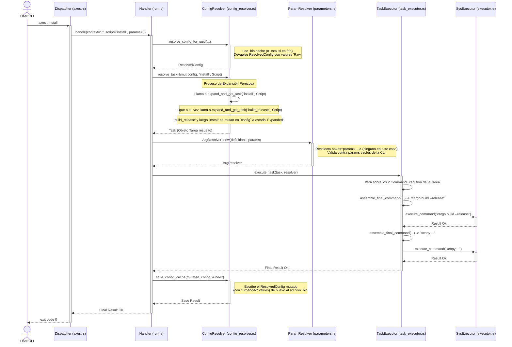

# Principios Arquitectónicos Fundamentales

El diseño de `axes` (post-v0.1.8) no es accidental; se basa en un conjunto de principios clave que priorizan la robustez, la mantenibilidad y una experiencia de usuario predecible y de alto rendimiento. Estos principios informan cada decisión, desde la estructura de datos hasta el motor de ejecución.

## **1. Identidad Inmutable sobre Ubicación Mutable (UUIDs vs. Paths)**

Esta es la decisión de diseño más importante y fundamental de `axes`. Dicta cómo el sistema percibe y gestiona los proyectos, priorizando la estabilidad lógica sobre la transitoriedad de la organización física.

* **El Problema: La Fragilidad de las Rutas Físicas**

    Muchas herramientas de desarrollo utilizan la ruta del sistema de archivos (`/home/user/dev/mi-proyecto`) como el identificador principal de un proyecto. Este enfoque es intuitivo pero inherentemente frágil. Consideremos un escenario común:

    ```text
    mi-monorepo/
    ├── backend/
    └── frontend/
    ```

    Si un desarrollador decide refactorizar y renombra `backend` a `api-service`, cualquier herramienta que dependa de la ruta `/mi-monorepo/backend` para identificar el proyecto hijo perderá la referencia. Las relaciones jerárquicas, configuraciones compartidas y cualquier tipo de "conocimiento" sobre ese proyecto se corrompen o se pierden.

* **La Solución `axes`: Identidad Desacoplada**

    `axes` resuelve este problema desacoplando por completo la **identidad lógica** de un proyecto de su **ubicación física**.

    1. **Identidad (`UUID`):** En el momento de su creación (`axes init`), a cada proyecto se le asigna un Identificador Único Universal (UUID v4). Este `UUID` es la identidad **canónica e inmutable** del proyecto durante toda su vida.
    2. **Referencia Local (`.axes/project_ref.bin`):** Dentro del directorio de cada proyecto, un pequeño archivo binario almacena su propio `UUID`, el `UUID` de su padre y su nombre "simple". Esto permite a `axes` identificar rápidamente en qué proyecto se encuentra (`axes . ...`) sin necesidad de consultar el índice global.
    3. **Índice Global (`~/.config/axes/index.bin`):** Un único archivo binario centralizado actúa como la "fuente de la verdad" para todo el ecosistema. Es un `HashMap` que mapea cada `UUID` de proyecto a sus metadatos: su `UUID` padre, su nombre simple y, crucialmente, su **ruta física actual**.

* **Diagrama de Flujo de la Identidad:**

    ```mermaid
    graph TD
        subgraph "Sistema de Archivos (Mutable)"
            A["/ruta/a/mi-app"]
            B["/ruta/a/mi-app/api"]
        end

        subgraph "Ecosistema `axes` (Lógico y Estable)"
            C(index.bin)
            D["project_ref.bin en 'mi-app'"]
            E["project_ref.bin en 'api'"]
        end

        A -- "Contiene" --> D
        B -- "Contiene" --> E
        
        C -- "Mapea UUID_A a /ruta/a/mi-app<br>Mapea UUID_B a /ruta/a/mi-app/api<br>Define que padre(UUID_B) es UUID_A" --> A & B
        D -- "Mi UUID es UUID_A<br>Mi padre es 'global'" --> C
        E -- "Mi UUID es UUID_B<br>Mi padre es UUID_A" --> C
    ```

* **Beneficios Arquitectónicos:**

  * **Refactorización Segura:** Un usuario puede mover el directorio `/mi-monorepo/api-service` a `/servicios/api/` sin consecuencias. `axes` no notará el cambio hasta la siguiente ejecución. En ese momento, el `context_resolver` fallará al buscar la ruta antigua. Un simple `axes register /servicios/api` (o un futuro comando de `axes repair`) leerá el `project_ref.bin`, encontrará el `UUID` existente y simplemente **actualizará la ruta** en el `index.bin`, preservando toda la historia, herencia y relaciones del proyecto.
  * **Operaciones Atómicas y de Metadatos:** Comandos como `axes mi-app/api rename api-v2` o `axes mi-app/api link otro-padre` son operaciones de metadatos casi instantáneas. Solo modifican los campos `name` o `parent_uuid` en el `index.bin`. No tocan el sistema de archivos, lo que los hace extremadamente rápidos y seguros contra fallos a mitad de operación. Esto es imposible en un sistema basado en rutas, que requeriría complejas y arriesgadas operaciones de movimiento de directorios.

## **2. Estandarización y Aplanamiento Temprano (Flexibilidad Externa, Rigidez Interna)**

Este principio gobierna cómo `axes` procesa y representa la configuración. Se basa en la filosofía de ofrecer la máxima flexibilidad al usuario en el `axes.toml`, mientras que internamente el programa trabaja con una estructura de datos única, estricta y pre-optimizada.

* **El Problema: La Paradoja de la Flexibilidad**

    Ofrecer múltiples formas de definir un comando en TOML es excelente para la experiencia del usuario. Un usuario puede empezar con un simple string y escalar a una estructura más compleja según sus necesidades:

    ```toml
    # Válido
    simple = "echo hello"
    # También válido
    secuencia = ["echo step 1", "echo step 2"]
    # Y también válido
    complejo = { windows = "dir", linux = "ls", desc = "Lista ficheros." }
    ```

    Sin embargo, esta flexibilidad se convierte en una pesadilla para el código del programa. Si el motor de ejecución tuviera que manejar todas estas variantes en cada paso, estaría plagado de `match` anidados, lógica condicional compleja y sería difícil de mantener y optimizar. Además, serializadores binarios de alto rendimiento como `bincode` no pueden manejar de forma fiable `enum`s que dependen de `#[serde(untagged)]` para su deserialización, lo que nos llevó a los errores de caché "corrupto".

* **La Solución `axes`: Un Proceso de Estandarización en Dos Etapas**

    `axes` resuelve esta paradoja tratando la configuración del usuario como una "fuente de datos cruda" que debe ser procesada y transformada en un formato interno canónico antes de que el núcleo lógico del programa la vea.

    **Etapa 1: Deserialización a Forma Canónica (`ProjectConfig`)**

    1. **Wrapper de Deserialización:** `serde` no deserializa directamente a nuestro `enum Command` interno. En su lugar, deserializa a un `enum` temporal y privado llamado `TomlCommand`, que sí utiliza `#[serde(untagged)]` para absorber la sintaxis flexible.
    2. **Conversión Inmediata:** Inmediatamente después de que `serde` crea una instancia de `TomlCommand`, una implementación del `trait From` la convierte en nuestra `struct` interna y estandarizada: `CanonicalCommand`. Esta `struct` tiene campos explícitos para todas las plataformas (`windows`, `linux`, `macos`, `default`) y la descripción (`desc`).

    *Resultado:* El objeto `ProjectConfig` que representa un `axes.toml` en memoria ya no contiene `enum`s ambiguos. Todos sus scripts, hooks y atajos de `open` son del tipo `Command(CanonicalCommand)`, una estructura uniforme.

    **Etapa 2: Aplanamiento por SO (`ResolvedConfig`)**

    1. **Contexto del SO:** Durante la fusión de la herencia para crear la `ResolvedConfig`, el `config_resolver` conoce el sistema operativo en el que se está ejecutando (`std::env::consts::OS`).
    2. **Selección de `Runnable`:** Para cada `CanonicalCommand`, el resolvedor aplica una lógica de cascada para seleccionar el `Runnable` (el `string` o `secuencia` de comandos a ejecutar) correcto: busca primero un `Runnable` específico para el SO actual (ej. `windows`), y si no lo encuentra, recurre al `default`.
    3. **Creación de `FlattenedCommand`:** El resultado de este aplanamiento es una nueva `struct`, `FlattenedCommand`. Esta estructura contiene únicamente las `command_lines: Vec<String>` que se deben ejecutar en el SO actual y la `desc`.
    4. **Estado `Raw` del Caché:** Esta `FlattenedCommand` es lo que se almacena en el `CacheableValue::Raw` dentro de la `ResolvedConfig` y se persiste en el caché binario.

* **Diagrama de Flujo del Proceso:**

    ```mermaid
    graph TD
        subgraph "Usuario"
            A["axes.toml (Sintaxis Flexible)"];
        end

        subgraph "Fase de Carga (serde)"
            B["enum TomlCommand<br><i>(Usa #[serde(untagged)])</i>"];
            C["struct CanonicalCommand<br><i>(Estructura estandarizada)</i>"];
        end
        
        subgraph "Fase de Fusión (config_resolver)"
            D["struct FlattenedCommand<br><i>(Aplanado para el SO actual)</i>"];
        end

        subgraph "Estado Interno (Caché y Ejecución)"
            E["CacheableValue::Raw(FlattenedCommand)"];
        end

        A --"Deserialize"--> B;
        B --"From trait"--> C;
        C --"Aplanamiento por SO"--> D;
        D --"Almacenamiento en Caché"--> E;
    ```

* **Beneficios Arquitectónicos:**
  * **Robustez del Caché:** Al eliminar la dependencia de `#[serde(untagged)]` de nuestras estructuras de datos principales y de caché, el error `Serde(AnyNotSupported)` de `bincode` se elimina por completo. El caché es ahora 100% fiable.
  * **Lógica de Negocio Simplificada:** El motor de expansión y el `task_executor` no necesitan saber si un comando era originalmente un `string`, una secuencia o multiplataforma. Solo reciben y operan sobre un `FlattenedCommand`, una lista de `strings` para el SO actual. Esto reduce drásticamente la complejidad y los posibles bugs en el núcleo lógico.
  * **Lo Mejor de Ambos Mundos:** Se mantiene una experiencia de usuario de alta flexibilidad en el `.toml`, mientras que internamente se disfruta de la seguridad de tipos, la rigidez y el rendimiento de una estructura de datos estandarizada.

## **3. Expansión Perezosa y Persistente (JIT Caching)**

Este principio dicta cómo y cuándo `axes` realiza el trabajo computacionalmente costoso de interpretar y expandir los scripts. En lugar de un enfoque "ansioso" (hacer todo el trabajo al principio), `axes` utiliza una estrategia "perezosa" o "Just-In-Time" (JIT) para maximizar el rendimiento percibido por el usuario.

* **El Problema: El Coste de la Expansión Ansiosa**

    Un proyecto `axes` puede tener decenas o cientos de scripts y variables, a menudo con complejas cadenas de dependencia (`script_A` usa `script_B`, que usa `var_C`, etc.). Si `axes` intentara expandir completamente todos estos valores cada vez que se ejecuta un comando, incluso uno simple como `axes . info`, el tiempo de arranque sería inaceptablemente lento. La mayor parte de este trabajo sería inútil, ya que el usuario solo pretendía ejecutar una pequeña fracción de la configuración total.

* **La Solución `axes`: Un Caché de Múltiples Estados**

    `axes` resuelve esto tratando la expansión como una transición de estado que se guarda en el caché. Cada valor interpolable (script, var, etc.) puede existir en uno de dos estados, representados por el `enum CacheableValue`:

    1. **`CacheableValue::Raw(FlattenedCommand)`:** Este es el estado inicial. Después de la fase de "Estandarización y Aplanamiento", el `ResolvedConfig` contiene todos los valores en este estado. Un `FlattenedCommand` es "crudo" porque, aunque ya está aplanado para el SO actual, sus tokens (`<axes::vars::...>`, `<axes::params::...>`) aún no han sido interpretados. Este estado se guarda en el caché de disco (`.bin`).

    2. **`CacheableValue::Expanded(Task)`:** Este es el estado final, listo para la ejecución. Una `Task` es una estructura de datos rica que contiene una lista de `CommandExecution`. Cada `CommandExecution` tiene su plantilla descompuesta en `TemplateComponent`s (literales, parámetros, etc.) y sus metadatos de ejecución (`ignore_errors`, `run_in_parallel`).

    **El Proceso "Just-In-Time":**

    El paso de `Raw` a `Expanded` solo ocurre cuando un `handler` solicita explícitamente una tarea a través de `config_resolver::resolve_task`.

  * **Disparo (Trigger):** `handlers/run.rs` llama a `resolve_task(&mut config, "mi_script", ...)`
  * **Motor de Expansión (`expand_and_get_task_internal`):**
        a.  Busca `"mi_script"` en `config.scripts`.
        b.  **Comprobación de Caché:** Si el valor ya es `Expanded(task)`, clona la `task` y la devuelve inmediatamente. Fin del proceso.
        c.  **Trabajo de Expansión:** Si el valor es `Raw(flattened_command)`, comienza el trabajo:
            *Itera sobre las `command_lines` del `flattened_command`.
            *   Para cada línea, expande recursivamente todos los tokens compuestos (`<axes::vars::...>`, `<axes::scripts::...>`), llamándose a sí mismo para resolver las dependencias.
            *   Una vez que una línea está "estáticamente plana", expande los tokens simples (`<axes::path>`, etc.) y la parsea a `TemplateComponent`s.
        d.  **Mutación y Cacheo en Memoria:** La `Task` resultante se usa para crear un nuevo `CacheableValue::Expanded(task)`. Este nuevo valor **reemplaza** al antiguo `CacheableValue::Raw` en la `ResolvedConfig` que está en memoria.
  * **Persistencia:** Al final de la ejecución del `handler`, se llama a `save_config_cache(&config, ...)`. Esta función escribe la `ResolvedConfig` mutada de vuelta al archivo `.bin`, **persistiendo el estado `Expanded` en el disco** para futuras ejecuciones.

* **Diagrama de Flujo del Caché (Simplificado):**

    ```mermaid
    graph BR
    Start --> Sub1
    Start --> Sub2

    subgraph Sub1["Ejecución 1 (Caché Frío)"]
        A["axes . mi_script"] --> B["resolve_task('mi_script')"]
        B --> C{"Estado de 'mi_script' en caché?"}
        C -- "Raw" --> D["Expandir recursivamente<br>y crear Tarea"]
        D --> E["MUTAR config en memoria:<br>'mi_script' -> Expanded(Task)"]
        E --> F["Ejecutar Tarea"]
        F --> G["save_config_cache(config mutada)"]
        G --> H["FIN"]
    end

    subgraph Sub2["Ejecución 2 (Caché Caliente)"]
        A2["axes . mi_script"] --> B2["resolve_task('mi_script')"]
        B2 --> C2{"Estado de 'mi_script' en caché?"}
        C2 -- "Expanded" --> I["Clonar Tarea desde caché"]
        I --> F2["Ejecutar Tarea"]
        F2 --> H2["FIN (no se guarda nada)"]
    end
    ```

* **Beneficios Arquitectónicos:**
  * **Rendimiento en la Primera Ejecución:** El tiempo de arranque es mínimo, ya que solo se expande el "camino caliente" del script solicitado y sus dependencias directas.
  * **Rendimiento en Ejecuciones Posteriores:** Es casi instantáneo. El coste se reduce a una lectura de disco y una deserialización de `bincode`, saltándose toda la compleja y costosa lógica de expansión y parseo de strings.
  * **Consistencia:** El estado del caché siempre es válido. Si un `axes.toml` cambia (detectado por su `timestamp`), el caché se invalida por completo, forzando una nueva resolución desde el estado `Raw` y garantizando que los cambios se reflejen.

## **4. Validación Declarativa y Temprana de Parámetros (`ArgResolver`)**

Este principio define cómo `axes` maneja los argumentos pasados a los scripts desde la línea de comandos. En lugar de un enfoque imperativo y reactivo, `axes` utiliza un modelo declarativo que prioriza la robustez, la previsibilidad y la claridad de los errores.

* **El Problema: El Parseo Manual y sus Peligros**

    En los scripts de shell tradicionales, los argumentos se acceden a través de variables como `$1`, `$@`, etc. El script es responsable de:
  * Validar si un argumento requerido está presente.
  * Asignar valores por defecto.
  * Parsear flags (`--verbose`, `-o file.txt`).
  * Manejar conflictos y errores.

    Esta lógica es a menudo repetitiva, propensa a errores (especialmente con espacios y comillas) y los fallos ocurren tarde, a mitad de la ejecución del script, a menudo con mensajes de error crípticos.

* **La Solución `axes`: Un Ciclo de Vida de Resolución en Tres Pasos**

    `axes` externaliza toda esta lógica a un componente central, el `ArgResolver`, que se ejecuta **antes** de que cualquier comando del script sea ejecutado. El ciclo de vida es el siguiente:

    1. **Recolección de Definiciones:** Después de que `config_resolver` ha producido una `Task` completamente expandida, el `handler` (`run.rs`, `start.rs`, etc.) itera sobre todos los `TemplateComponent`s de la tarea y recolecta cada `TemplateComponent::Parameter(def)` en una lista unificada de `ParameterDef`s. Esta lista representa el "contrato" completo de todos los argumentos que la tarea espera.

    2. **Creación del `ArgResolver` (Validación):** Se crea una instancia de `ArgResolver::new(...)` pasándole dos cosas: la lista de `ParameterDef`s (el "contrato") y los argumentos crudos de la línea de comandos (la "entrada del usuario"). En este momento, el `ArgResolver` ejecuta toda la lógica de validación:
        * **Conflictos de Alias:** Comprueba si el usuario ha proporcionado tanto un flag como su alias (ej. `--verbose` y `-v`). Si es así, falla inmediatamente.
        * **Argumentos Requeridos:** Itera sobre todas las definiciones marcadas con `required` y comprueba si se proporcionó un valor correspondiente en la entrada del usuario. Si falta alguno, falla con un error claro.
        * **Argumentos Inesperados:** Al final de la resolución, comprueba si han quedado argumentos de la CLI sin "reclamar" por ninguna definición. Si es así, y la tarea no contenía un token genérico `<axes::params>`, falla con un error listando los argumentos no reconocidos.

    3. **Resolución de Valores:** Durante el mismo proceso de validación, el `ArgResolver` calcula el valor final para cada token de parámetro, siguiendo una estricta precedencia: **Valor de la CLI > Valor por `default` > Cadena vacía**. También aplica las transformaciones de `map`. El resultado es un `HashMap` interno que mapea cada `original_token` a su `String` final.

* **Diagrama de Flujo del `ArgResolver`:**

    ```mermaid
    graph TD
    A["Entrada: `Vec<ParameterDef>` y `Vec<String>` de la CLI"] --> B["ArgResolver::new()"]
    B --> C{"¿Conflicto de Alias?"}

    subgraph "Fase de Validación y Resolución"
        C -- Sí --> Z1["Error: Conflicto de Alias"]
        C -- No --> D{"Mapear entrada de CLI a Definiciones"}
        D --> E{"Para cada Definición..."}
        E --> F{"¿Fue proporcionado en la CLI?"}
        F -- No --> G{"¿Tiene `default`?"}
        F -- Sí --> H["Usar valor de la CLI"]
        G -- No --> I{"¿Es `required`?"}
        G -- Sí --> H
        I -- Sí --> Z2["Error: Parámetro Requerido Faltante"]
        I -- No --> H
        H --> J["Aplicar transformador `map`"]
        J --> K["Almacenar (token -> valor final)"]
        E -- Fin del Bucle --> L{"¿Quedan argumentos de la CLI sin usar?"}
        L -- Sí --> M{"¿La tarea tenía `<axes::params>`?"}
        M -- No --> Z3["Error: Argumentos Inesperados"]
        M -- Sí --> N["Almacenar sobrantes para `<axes::params>`"]
        L -- No --> N
    end

    N --> O["ArgResolver creado con éxito"]
    Z1 & Z2 & Z3 --> Z["FIN (Fallo Temprano)"]
    O --> P["El task_executor usa el ArgResolver para ensamblar los comandos"]
    ```

* **Beneficios Arquitectónicos:**
  * **Fail-Fast (Fallo Rápido):** La validación ocurre antes de cualquier efecto secundario (ejecución de comandos, modificación de archivos). Esto hace que el sistema sea mucho más seguro y predecible. Si falla, falla limpiamente.
  * **Errores de Usuario Superiores:** En lugar de un "comando no encontrado" genérico del shell, el usuario recibe un error contextual de `axes`, como `"Error: Flag '--target' is required but was not provided."`, que es infinitamente más útil.
  * **Lógica Centralizada:** Toda la complejidad del parseo de argumentos está contenida en `parameters.rs`. Los `handlers` y el `task_executor` no necesitan saber cómo funciona `required` o `map`; simplemente piden el valor final resuelto para un token. Esto respeta la Separación de Responsabilidades y mejora la mantenibilidad.

## **5. Ejecución Híbrida Síncrona-Asíncrona**

Este principio es la clave para resolver uno de los desafíos más complejos en herramientas de línea de comandos: cómo esperar eficientemente a los subprocesos y manejar las interrupciones del usuario (`Ctrl+C`) sin sacrificar ni el rendimiento ni la simplicidad del código.

* **El Problema: La Tiranía del Bloqueo Síncrono y la Infección Asíncrona**

    Las herramientas de CLI se enfrentan a un dilema:
    1. **Enfoque Puramente Síncrono:** Usar `std::process::Child::wait()` es simple, pero es una llamada bloqueante. Si quieres comprobar si el usuario ha pulsado `Ctrl+C` mientras esperas, la única opción es un bucle con `try_wait()` y `thread::sleep()`. Como descubrimos, este `sleep` introduce una latencia inaceptable para comandos cortos.
    2. **Enfoque Puramente Asíncrono:** Reescribir toda la aplicación con `async/await` resolvería el problema de la espera, ya que `await` no bloquea el hilo. Sin embargo, esto introduce la "infección `async`": cada función que llama a una función `async` debe ser `async` también. Esto complicaría enormemente nuestra lógica de negocio (como el `config_resolver`), que es inherentemente síncrona (CPU-bound) y no se beneficia de `async`.

* **La Solución `axes`: Un Puente Estratégico hacia el Mundo Asíncrono**

    `axes` adopta un enfoque híbrido que toma lo mejor de ambos mundos. La aplicación es predominantemente síncrona, pero delega la tarea específica de la ejecución de subprocesos a un `runtime` de `tokio` gestionado.

    1. **Runtime Global (`lazy_static!`):** Se inicializa un `tokio::runtime::Runtime` de forma perezosa y global una sola vez durante la vida del programa. Esto evita el coste de crear un nuevo `runtime` para cada comando ejecutado.
    2. **API Síncrona, Ejecución Asíncrona Interna:** El módulo `system::executor` expone una función `execute_command` que es **síncrona** para el resto del programa. Los `handlers` y el `task_executor` la llaman como si fuera una función bloqueante normal.
    3. **El Puente `block_on`:** Dentro de `execute_command`, la primera acción es llamar a `TOKIO_RT.block_on(async { ... })`. Esta llamada bloquea el hilo *actual*, pero dentro del bloque `async` entramos en el mundo de `tokio`.
    4. **`tokio::select!` para la Concurrencia de Eventos:** Dentro del bloque `async`, usamos el macro `tokio::select!`. Este es el corazón de la solución. Permite esperar a **múltiples futuros** concurrentemente y actúa en cuanto el primero se complete. Esperamos dos eventos:
        * `child.wait()`: El futuro que se completa cuando el proceso hijo termina.
        * `tokio::signal::ctrl_c()`: El futuro que se completa cuando el usuario presiona `Ctrl+C`.

* **Diagrama de Flujo del `executor`:**

    ```mermaid
    graph TD
    A["task_executor llama a executor::execute_command(...) (sincrono)"] --> B["executor llama a TOKIO_RT.block_on(async { ... })"]

    subgraph TokioContext["Contexto asincrono de Tokio"]
        B --> C["Lanza subproceso con tokio::process::Command"]
        C --> D{"tokio::select!"}
        D -->|Evento 1| E{"child.wait() se completa"}
        D -->|Evento 2| F{"tokio::signal::ctrl_c() se completa"}
    end

    E --> G["Procesa el codigo de salida; devuelve Ok o Err(NonZeroExitStatus)"]
    F --> H["Llama a child.kill().await; devuelve Err(Interrupted)"]
    G --> I["El bloque async termina; block_on devuelve el Result"]
    H --> I
    I --> J["La funcion sincrona execute_command devuelve el Result al task_executor"]
    ```

* **Beneficios Arquitectónicos:**
  * **Rendimiento Óptimo:** La espera del subproceso es manejada por el `scheduler` de `tokio`. No hay `sleep`s ni consumo de CPU. La respuesta a la finalización del proceso o a `Ctrl+C` es de microsegundos.
  * **Cancelación Precisa y Robusta:** Cuando `Ctrl+C` gana la "carrera" en `select!`, tenemos control total. Podemos intentar matar al proceso hijo de forma limpia (`child.kill()`) y luego devolver un tipo de error específico (`ExecutionError::Interrupted`). El `handler` principal (`main`) puede entonces interceptar este error y salir en silencio, logrando el comportamiento exacto que el usuario espera.
  * **Aislamiento de la Complejidad:** La complejidad de `async/await` y `tokio` está completamente encapsulada dentro de `system/executor.rs`. El resto de la aplicación, que es lógica de negocio síncrona, permanece simple, limpia y fácil de razonar. No hay "infección `async`".

### ## Estructura de Módulos del Crate

El código fuente de `axes` está organizado en módulos con responsabilidades claras y bien definidas, siguiendo la filosofía de Separación de Responsabilidades. Esta estructura facilita la navegación, el mantenimiento y la contribución al proyecto.

```sh
src/
├── bin/axes.rs             # Punto de entrada y dispatcher principal
├── cli/                    # Interfaz de Línea de Comandos (parseo y handlers)
│   ├── handlers/           # Lógica específica para cada comando (run, info, etc.)
│   │   ├── mod.rs
│   │   ├── commons.rs      # Utilidades compartidas por los handlers
│   │   └── ... (run.rs, info.rs, etc.)
│   └── mod.rs
├── core/                   # El "cerebro": lógica de negocio agnóstica a la UI
│   ├── mod.rs
│   ├── config_resolver.rs  # Fusión de configs y motor de expansión perezosa
│   ├── context_resolver.rs # Traducción de contextos string a UUIDs
│   ├── index_manager.rs    # API para el índice global (index.bin)
│   ├── parameters.rs       # ArgResolver: validación declarativa de parámetros
│   └── task_executor.rs    # Orquestador de ejecución de Tareas
├── system/                 # Interacción con el Sistema Operativo
│   ├── mod.rs
│   ├── executor.rs         # Ejecutor de subprocesos de bajo nivel (con Tokio)
│   └── shell.rs            # Lógica para sesiones interactivas (start)
├── models.rs               # Definición de todas las structs y enums de datos
└── lib.rs                  # Raíz del crate (biblioteca)
```

#### **`bin/axes.rs`: El Punto de Entrada y Dispatcher**

* **Responsabilidad:** Es la capa más externa de la aplicación. Su única misión es interpretar la intención inicial del usuario y delegar el control al `handler` correcto.
* **Componentes Clave:**
  * **`fn main()`:** Inicializa el `logger`, gestiona el manejo de errores de alto nivel (como la impresión formateada de errores de `anyhow` y la salida silenciosa para `Ctrl+C`), y llama a `run_cli`.
  * **`COMMAND_REGISTRY`:** Una `array` estática que actúa como una tabla de enrutamiento. Mapea los nombres de los comandos (`"run"`, `"info"`) y sus alias (`"ls"` para `"tree"`) a la función `handle` correspondiente. Es la única fuente de verdad para los comandos de sistema.
  * **`fn run_cli()`:** El dispatcher en sí. Utiliza `clap` para el parseo inicial y aplica la gramática flexible de `axes` para distinguir entre `axes <acción> <contexto>` y `axes <contexto> <acción>`. Determina la acción canónica y empaqueta los argumentos restantes para el `handler`.

#### **`cli/handlers/`: El Corazón de la Lógica de Comandos**

* **Responsabilidad:** Cada módulo dentro de `handlers` implementa la lógica de negocio para un único comando de `axes`. Son autónomos y orquestan las llamadas a los módulos del `core` y `system`.
* **Patrón de Diseño:**
  * **`struct <Accion>Args`:** Cada `handler` define su propia `struct` de argumentos con `#[derive(clap::Parser)]`. Esto encapsula toda la lógica de parseo y validación de los argumentos específicos de ese comando (flags, subcomandos, etc.) de forma declarativa.
  * **`pub fn handle(...)`:** La única función pública, que sirve como punto de entrada desde el `COMMAND_REGISTRY`. Recibe los argumentos crudos, los parsea usando su `struct Args`, y luego ejecuta la lógica del comando.
  * **Ejemplo (`run.rs`):** `RunArgs` define `context`, `script` y `params`. El `handle` usa estos datos para llamar a `config_resolver::resolve_task`, crear un `parameters::ArgResolver`, y finalmente delegar la ejecución a `task_executor::execute_task`.

#### **`core/`: El Cerebro Agnóstico a la UI**

* **Responsabilidad:** Contiene la lógica de negocio fundamental de `axes`. Es un "backend" puro que no sabe nada sobre `clap` o la impresión en consola. Su API opera sobre las `struct`s definidas en `models.rs`.
* **Componentes Clave:**
  * **`config_resolver.rs`:** El componente más complejo. Su API principal (`resolve_task`) implementa la expansión perezosa y persistente de `Raw` a `Expanded`.
  * **`parameters.rs`:** Implementa el `ArgResolver`, que toma un "contrato" de parámetros y una entrada de usuario y produce valores resueltos o un error de validación.
  * **`task_executor.rs`:** Sabe cómo tomar una `Task` y un `ArgResolver` y ejecutarla, manejando la lógica de paralelismo (`>`) y la supresión de errores (`-`).

#### **`system/`: La Capa de Interacción con el SO**

* **Responsabilidad:** Abstrae todas las interacciones directas con el sistema operativo, manteniendo el resto del código agnóstica a la plataforma.
* **Componentes Clave:**
  * **`executor.rs`:** La implementación del "puente híbrido". Proporciona una API síncrona simple (`execute_command`) pero utiliza `tokio` internamente para una ejecución y cancelación de alto rendimiento.
  * **`shell.rs`:** Contiene la lógica para crear y gestionar sesiones de shell interactivas, incluyendo la creación de scripts de inicialización temporales para los hooks `at_start`.

#### **`models.rs`: La Fuente de la Verdad para los Datos**

* **Responsabilidad:** Es el único lugar donde se definen las estructuras de datos de la aplicación. Esto asegura la consistencia en todo el programa.
* **Organización:** Está estructurado en secciones lógicas: modelos para el TOML, modelos internos de ejecución, modelos de persistencia y las conversiones (`impl From`) entre ellos. Esta organización es clave para entender el flujo de datos a través de las diferentes capas de la arquitectura.

### ## El Ciclo de Vida de un Comando: `axes . install`

Para entender cómo colaboran los módulos, sigamos el flujo completo de un comando de composición. Este ejemplo traza la ejecución desde la entrada del usuario hasta la finalización del subproceso, demostrando los principios de resolución perezosa, expansión y ejecución.

**Escenario:**

* **Comando del Usuario:** `axes . install`
* **`axes.toml` Relevante:**

    ```toml
    [scripts]
    build_release = "cargo build --release"
    install = [
        "<axes::scripts::build_release>",
        "xcopy /Y \"<axes::path>\\target\\release\\axes.exe\" \"C:\\scripts\\axes.exe\""
    ]
    ```

#### **Diagrama de Secuencia de Alto Nivel**



#### **Desglose Detallado del Flujo**

1. **`main` y Dispatcher (`axes.rs`):**
    * `clap` parsea la entrada. El `Dispatcher` identifica que `install` no es un comando de sistema y lo enruta al `handler` de `run`, pasándole `context="."`, `script="install"`, y `params=[]`.

2. **`run.rs` (Handler):**
    * Llama a `commons::resolve_config_from_context_or_session` para cargar la `ResolvedConfig` del proyecto actual. Asumamos que es la primera ejecución, por lo que el caché de disco se crea y la `config` en memoria contiene los scripts `install` y `build_release` en estado `CacheableValue::Raw`.
    * El `handler` luego llama a `config_resolver::resolve_task(&mut config, "install", ValueKind::Script)`.

3. **`config_resolver.rs` (El Motor de Expansión):**
    * **Llamada 1: `expand_and_get_task_internal("install", Script, ...)`**
        * Encuentra que `install es`Raw`. Clona su`FlattenedCommand`, que contiene dos líneas:`["<axes::scripts::build_release>", "xcopy..."]`.
        * Comienza a procesar la primera línea: `"<axes::scripts::build_release>"`.
        * El motor de expansión de tokens compuestos encuentra `<axes::scripts::build_release>` y realiza una llamada recursiva:
            * **Llamada 2: `expand_and_get_task_internal("build_release", Script, ...)`**
                * Encuentra que `build_release` es `Raw`. Clona su `FlattenedCommand` (`command_lines: ["cargo build --release"]`).
                * Su única línea de comando no tiene tokens compuestos ni simples. Se parsea directamente a una `Task` que contiene un `CommandExecution` con `template: [Literal("cargo build --release")]`.
                * La `ResolvedConfig` en memoria se **muta**: `config.scripts["build_release"]` ahora es `CacheableValue::Expanded(Task{...})`.
                * Devuelve la `Task` recién creada.
        * De vuelta en la Llamada 1, el resultado de la `sub_task` (`build_release`) se aplana a un `String` (`"cargo build --release"`) y se inyecta en la línea que se está procesando.
        * Se procesa la segunda línea de `install:`"xcopy ... <axes::path> ..."`.
        * El motor de expansión de tokens compuestos no encuentra nada.
        * La pasada final de **expansión de tokens simples** se ejecuta: `<axes::path>` se reemplaza por la ruta física del proyecto.
    * **Resultado:** La `Task` final para `install` se construye con dos `CommandExecution`s, ambos completamente resueltos.
    * La `ResolvedConfig` se **muta de nuevo**: `config.scripts["install"]` ahora es `CacheableValue::Expanded(Task{...})`.
    * `resolve_task` devuelve la `Task` poseída de `install` al `handler`.

4. **`run.rs` (Continuación):**
    * Recibe la `Task` de `install`.
    * Recolecta las definiciones de parámetros (ninguna en este caso).
    * Crea un `ArgResolver` vacío (que valida que no se pasaron `params` inesperados).
    * Llama a `task_executor::execute_task(...)`.

5. **`task_executor.rs` (Ejecutor de Tareas):**
    * Itera sobre los dos `CommandExecution` en la `Task`.
    * Llama a `system::executor::execute_command("cargo build --release", ...)`.

6. **`system::executor.rs` (Ejecutor de Procesos):**
    * Utiliza `TOKIO_RT.block_on` y `tokio::select!` para ejecutar el comando de forma eficiente y segura, esperando su finalización.
    * El `task_executor` continúa con el segundo comando, `xcopy ...`, y repite el proceso.

7. **`run.rs` y `main.rs` (Finalización):**
    * El `task_executor` termina con éxito.
    * El `handler` de `run` llama a `config_resolver::save_config_cache(&config, &index)`. Esto escribe la `ResolvedConfig` (que ahora contiene los valores `Expanded` para `install` y `build_release`) al archivo `.bin`, **persistiendo el trabajo de expansión**.
    * El programa termina con éxito. La próxima vez que se ejecute `axes . install`, el paso 3 será mucho más corto, leyendo directamente del caché.

### ## El Corazón de `axes`: Modelos de Datos

La robustez de `axes` reside en la clara separación y el diseño intencional de sus modelos de datos, definidos en `src/models.rs`. Cada `struct` y `enum` tiene un propósito específico en las distintas fases del ciclo de vida de un comando, desde la lectura del TOML hasta la ejecución.

#### **1. Modelos de Configuración (Lectura del `axes.toml`)**

Estas estructuras están diseñadas para ofrecer la máxima flexibilidad al usuario.

* **`ProjectConfig`:** Es la representación 1:1 de un archivo `axes.toml`. Contiene `HashMap`s para `scripts`, `vars`, etc.
* **`Command(CanonicalCommand)`:** Es la pieza central de la estandarización. Gracias a un `enum` intermediario (`TomlCommand`) que usa `#[serde(untagged)]`, podemos aceptar múltiples sintaxis en el TOML (string, secuencia, tabla) pero siempre deserializar a una única `struct` `CanonicalCommand` estandarizada. Esta `struct` tiene campos explícitos para todas las plataformas (`windows`, `linux`, `macos`, `default`) y una descripción.
  * **Beneficio:** Elimina la ambigüedad del código interno y resuelve el problema de serialización con `bincode`.

#### **2. Modelos Internos y de Tiempo de Ejecución**

Una vez que los `.toml` se han leído y fusionado, `axes` trabaja con un conjunto de modelos de datos optimizados para la ejecución.

* **`ResolvedConfig`:** Es la vista completa y fusionada de la configuración de un proyecto, producto de la herencia. Es el principal objeto de estado con el que operan los `handlers` y el `config_resolver`. No se lee directamente desde el disco, sino que se construye a partir de los `ProjectConfig` o se deserializa desde el caché binario.

* **`FlattenedCommand`:** Es el primer nivel de estandarización. El `config_resolver` convierte cada `Command` de la configuración en un `FlattenedCommand` seleccionando el `runnable` apropiado para el sistema operativo actual. Contiene `command_lines: Vec<String>` y `desc: Option<String>`. Es una representación "plana" y lista para la expansión.

* **`CacheableValue`:** Este `enum` es la clave de la expansión perezosa y persistente.
  * **`Raw(FlattenedCommand)`:** El estado inicial de cualquier script o variable en el caché. Es compacto y no ha sido procesado.
  * **`Expanded(Task)`:** El estado final después de que el motor de expansión ha hecho su trabajo. Contiene la tarea completamente resuelta y lista para ser ejecutada. El caché de disco (`.bin`) guarda este estado para acelerar futuras ejecuciones.

* **`Task`:** La representación final de un script a ejecutar. Es una `struct` que contiene una `Vec<CommandExecution>`.

* **`CommandExecution`:** Representa una única línea de comando dentro de una `Task`. Contiene los metadatos de ejecución (`ignore_errors`, `run_in_parallel`) y la plantilla del comando.

* **`TemplateComponent`:** Descompone una plantilla de comando en sus partes atómicas, distinguiendo entre `Literal(String)`, `Parameter(ParameterDef)` y `GenericParams`. Esto permite al `task_executor` ensamblar el comando final de forma segura y precisa.

* **Diagrama de Flujo de Datos:**

    ```mermaid
    graph TD
        A["`ProjectConfig`<br>(Desde .toml, contiene `Command`)"] -->|Fusión y Aplanamiento por SO<br>en `merge_chain_into_config`| B["`ResolvedConfig`<br>(Contiene `CacheableValue::Raw(FlattenedCommand)`)"];
        B -->|Escritura a Caché de Disco<br>`save_config_cache`| C["`.axes/config.cache.bin`<br>(Contiene `SerializableResolvedConfig`)"];
        C -->|Lectura de Caché<br>`read_and_validate_...`| B;
        B -->|Expansión Perezosa<br>en `resolve_task`| D["`Task`<br>(Contiene `CommandExecution` con `TemplateComponent`s)"];
        D -->|MUTACIÓN| E["`ResolvedConfig`<br>(Ahora con `CacheableValue::Expanded(Task)`)"];
    ```

#### **3. Modelos de Persistencia**

Estos modelos definen la estructura de los datos que se guardan en el disco de forma permanente.

* **`GlobalIndex`:** Define la estructura del índice global (`~/.config/axes/index.bin`). Es un `HashMap` que mapea `UUID`s a `IndexEntry`s. Es la única fuente de verdad sobre la jerarquía y ubicación de los proyectos.
* **`IndexEntry`:** Contiene los metadatos de un proyecto en el índice: `name`, `parent_uuid`, y `path`.
* **`ProjectRef`:** Define la estructura de la referencia local (`.axes/project_ref.bin`), permitiendo a `axes` identificar un proyecto y su padre desde su propio directorio.
* **`Serializable...` Structs:** Un conjunto de `struct`s "sustitutas" (`SerializableResolvedConfig`, etc.) que se utilizan para garantizar un formato de caché binario estable y multiplataforma con `bincode`, especialmente para manejar tipos como `PathBuf` que se convierten a `String` antes de serializar.

// --- TODO: Continue TECNICAL.md
