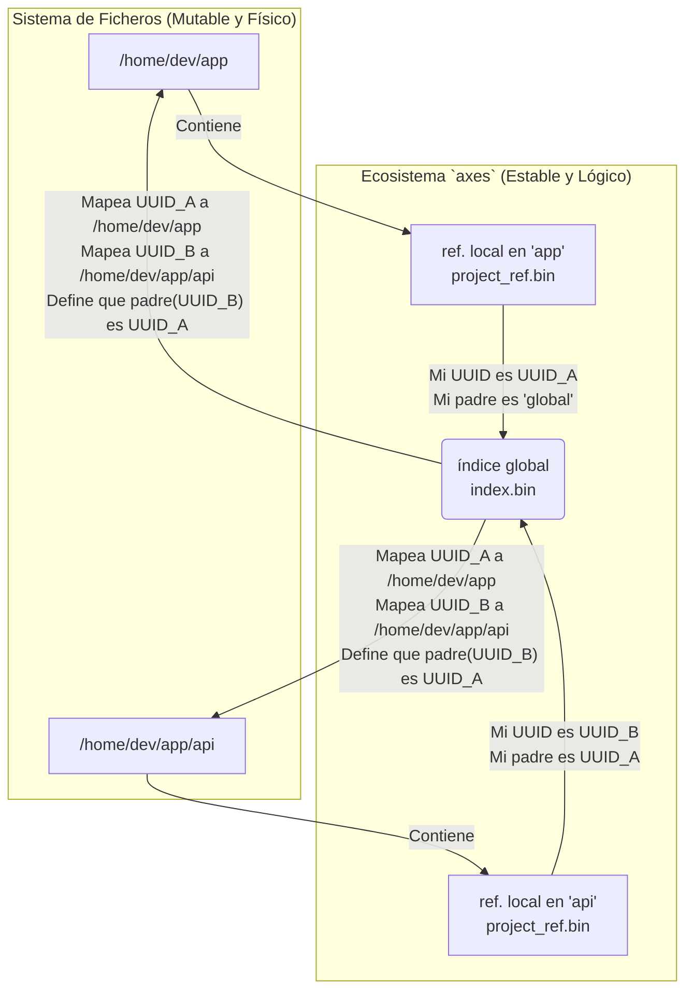
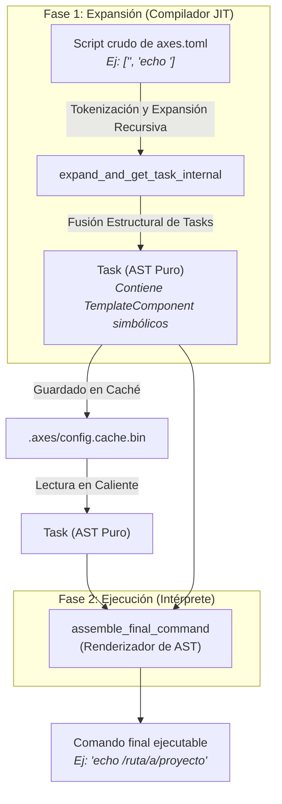
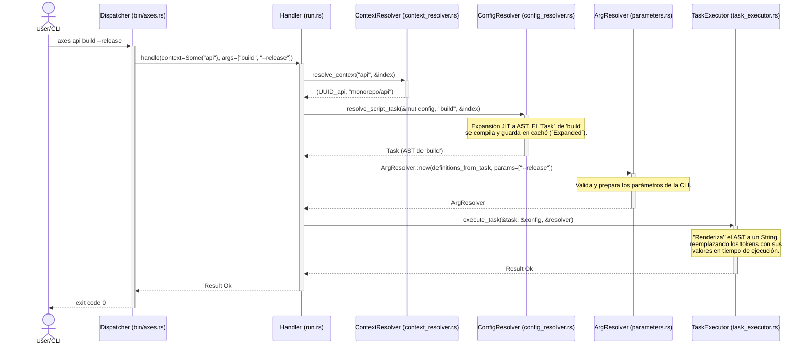
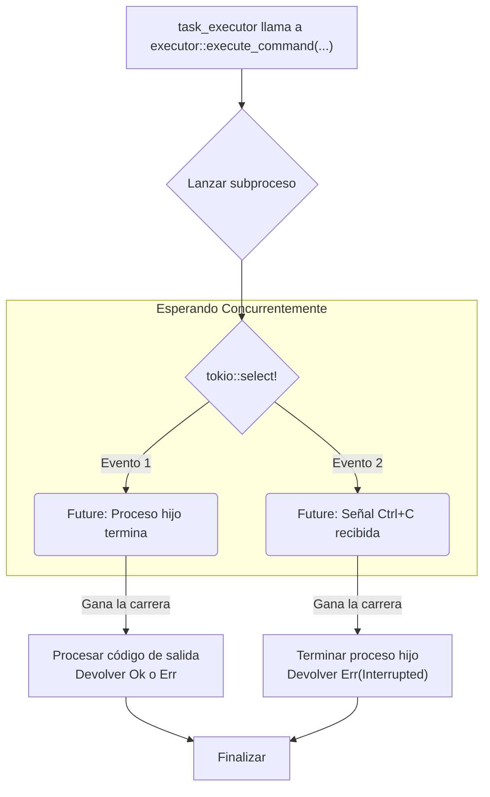

<p align="center">
  <strong>Read this in other languages:</strong><br>
  <a href="./TECNICAL.md">English</a> •
  <a href="./docs/es/TECNICAL.md">Español</a>
</p>

# **Principios Arquitectónicos Fundamentales de `axes`**

El diseño de `axes` se basa en un conjunto de principios fundamentales que priorizan la **Robustez**, el **Rendimiento Máximo** y la **Escalabilidad**. Cada decisión, desde la estructura de datos hasta el motor de ejecución, está informada por estos pilares. Este documento desglosa la arquitectura interna que permite a `axes` ofrecer una funcionalidad avanzada con una velocidad excepcional.

---

## **1. El Principio de Identidad Inmutable: El Grafo de Proyectos Resiliente**

Esta es la decisión de diseño más importante de `axes`. Dicta cómo el sistema percibe y gestiona los proyectos, priorizando la estabilidad lógica sobre la naturaleza transitoria de la organización física en el disco.

### El Problema: La Fragilidad de las Rutas Físicas

La mayoría de las herramientas de desarrollo utilizan la ruta del sistema de ficheros (ej. `/home/user/dev/my-project`) como el identificador principal de un proyecto. Este enfoque es intuitivo pero inherentemente frágil. Si un desarrollador decide refactorizar y mover un directorio, cualquier herramienta que dependa de la ruta original pierde toda referencia. Las relaciones jerárquicas, las configuraciones y el "conocimiento" sobre ese proyecto se corrompen o se pierden.

### La Solución `axes`: Identidad Desacoplada

`axes` resuelve este problema disociando por completo la **identidad lógica** de un proyecto de su **ubicación física**.

1. **Identidad (UUID):** En el momento de su creación (`axes init`), a cada proyecto se le asigna un Identificador Universal Único (UUID v4). Este `UUID` es la identidad **canónica e inmutable** del proyecto durante toda su vida.

2. **Referencia Local (`.axes/project_ref.bin`):** Dentro del directorio de cada proyecto, un pequeño fichero binario almacena su propio `UUID`, el `UUID` de su padre y su nombre simple. Esto permite a `axes` identificarse rápidamente (`axes . ...`) sin necesidad de consultar el índice global.

3. **Índice Global (`~/.config/axes/index.bin`):** Un único fichero binario centralizado actúa como la "fuente de la verdad" para todo el ecosistema. Es un `HashMap` que mapea cada `UUID` de proyecto a sus metadatos: su `UUID` padre, su nombre simple y, crucialmente, su **ruta física actual**.

Esta arquitectura crea un grafo lógico de proyectos que es inmune a los cambios en el sistema de ficheros.

### Diagrama de Flujo de Identidad



### Beneficios Arquitectónicos

* **Refactorización Segura:** Un usuario puede mover el directorio `/home/dev/app/api` a `/servicios/api-v2` sin consecuencias. La próxima vez que se ejecute un comando, `axes` detectará que la ruta ha cambiado y un simple `axes register /servicios/api-v2` leerá el `project_ref.bin` del directorio movido, encontrará el `UUID` existente y simplemente **actualizará la ruta** en el `index.bin`. Toda la historia, herencia y relaciones del proyecto se preservan intactas.

* **Operaciones de Metadatos Atómicas:** Comandos como `axes api rename api-legacy` o `axes api link otro-padre` son operaciones de metadatos casi instantáneas. Solo modifican los campos `name` o `parent_uuid` en el `index.bin`. No tocan el sistema de ficheros, lo que las hace extremadamente rápidas y seguras. Esto es imposible en un sistema basado en rutas, que requeriría operaciones complejas y arriesgadas de movimiento de directorios.

## **2. El "Compilador JIT": La Arquitectura de AST Puro**

El corazón del rendimiento de `axes` reside en su motor de expansión. En lugar de ser un simple sustituidor de texto, actúa como un **compilador Just-In-Time (JIT)** que transforma los scripts definidos por el usuario en una representación intermedia altamente optimizada y lista para ser ejecutada.

### El Anti-Patrón: El Ciclo de Re-Parseo Textual

Las versiones anteriores y muchas otras herramientas caen en una trampa de rendimiento común. Al componer scripts (ej. `<axes::scripts::sub_script>`), siguen un ciclo ineficiente:

1. **Resolver:** Encuentran el contenido de `sub_script`.
2. **Aplanar a Texto:** Convierten el `sub_script` resuelto de nuevo a un `String`.
3. **Inyectar Texto:** Inyectan ese `String` en el script padre.
4. **Re-Parsear:** Vuelven a parsear la cadena completa del script padre desde cero.

Este ciclo de **`Estructura -> String -> Re-Parseo`**, repetido recursivamente, genera una cantidad masiva de alocaciones de memoria y trabajo de CPU redundante, llevando a una degradación del rendimiento de orden cuadrático, como demostraron nuestros análisis con `flamegraph`.

### La Solución `axes`: Composición Estructural y AST Puro

`axes` elimina este anti-patrón por completo al operar siempre en el dominio de las estructuras de datos, no del texto. El motor de expansión implementa una arquitectura de **"AST Puro"** (Árbol de Sintaxis Abstracta).

1. **Tokenización (Una Sola Pasada):** Cuando se expande un script por primera vez, `axes` realiza una **única pasada** sobre cada línea de comando. Utiliza una `Regex` optimizada para "tokenizar" la línea en una secuencia de componentes (`TemplateComponent`).

2. **El `Task` como AST:** El resultado de este proceso no es un `String`, sino un `Task`. Un `Task` es la representación estructural (el AST) del script. Cada línea de comando se convierte en un `CommandExecution`, que contiene un `Vec<TemplateComponent>`. Este `Vec` es el AST de la línea, donde cada parte es un nodo:
    * `Literal(String)`: Texto plano.
    * `Parameter(ParameterDef)`: Un token `<axes::params::...>` simbólico.
    * `Run(RunSpec)`: Un token `<axes::run::(...)>` simbólico.
    * `Path`, `Name`, `Uuid`, `Version`: Tokens estáticos simbólicos.

3. **Composición Estructural Directa:** Cuando el motor encuentra un token de composición como `<axes::scripts::sub_script>`, no lo convierte a texto. En su lugar:
    a. Llama recursivamente para obtener el `Task` (el AST) de `sub_script`.
    b. Realiza una **fusión estructural**: los `CommandExecution`s del `Task` hijo se inyectan directamente en la lista de `commands` del `Task` padre.

El resultado es un único `Task` final que es la representación AST completa y compuesta de todo el flujo de trabajo.

### Diagrama del Flujo de Expansión a AST



### Beneficios Arquitectónicos

* **Rendimiento Máximo:** Al eliminar por completo la manipulación de `String`s intermedios y el re-parseo, la complejidad de la expansión se reduce a un orden lineal (O(n)). Esto resuelve el cuello de botella de rendimiento fundamental.
* **Caché Inteligente y Eficiente:** El `Task` (AST) es la unidad perfecta para cachear. Es una estructura de datos pre-compilada que contiene toda la lógica del script, lista para ser "renderizada" en tiempo de ejecución. En ejecuciones en caliente, `axes` salta por completo la fase de expansión y lee este AST directamente del disco, lo que explica su velocidad superior incluso a la de ejecutores más simples.

## **3. El Ciclo de Vida de un Comando: Un Vistazo Completo**

Para entender cómo colaboran los componentes de `axes`, sigamos el viaje de un comando complejo desde que el usuario presiona "Enter" hasta que el subproceso se ejecuta.

**Escenario:** El usuario ejecuta `axes api build --release` desde el directorio raíz de su `monorepo`. `api` es un sub-proyecto de `monorepo`.

### **Diagrama de Secuencia de Alto Nivel**



### **Fase 1: Despacho y Gramática Universal (`bin/axes.rs`)**

El `dispatcher` aplica un conjunto simple y universal de reglas para interpretar la entrada del usuario.

1. **¿Es el segundo argumento (`build`) una acción de sistema?** No.
2. **¿Es el primer argumento (`api`) una acción de sistema?** No.
3. **Por defecto:** Se asume que es un atajo para el comando `run`.

El `dispatcher` invoca al `handler` de `run` con:

* `contexto = Some("api")`
* `args = ["build", "--release"]`

### **Fase 2: Resolución de Contexto (`context_resolver.rs`)**

El `handler` de `run` necesita saber en qué proyecto operar. Llama al `context_resolver` con el `String` `"api"`.

1. El `resolver` comprueba si hay una sesión activa. En este caso, no.
2. Busca "api" como un hijo del proyecto raíz (`global`). Lo encuentra.
3. Devuelve el `UUID` del proyecto `api` y su nombre cualificado completo, `"monorepo/api"`.

### **Fase 3: Carga de Configuración y Herencia**

Con el `UUID` de `api` en mano, el `handler` pide al `config_resolver` que construya su configuración completa (`ResolvedConfig`).

1. **Cache Check:** `axes` primero busca un fichero `.axes/config.cache.bin` válido. Si existe y los `axes.toml` no han cambiado, **salta directamente al paso 5**.
2. **Construcción desde Cero:** Si no hay caché válido, `axes`:
    a.  Recorre el árbol de herencia hacia arriba desde `api` hasta `monorepo`.
    b.  Lee y parsea `monorepo/.axes/axes.toml` y luego `monorepo/api/.axes/axes.toml`.
    c.  Fusiona las configuraciones. Los valores de `api` (el hijo) sobreescriben a los de `monorepo` (el padre).
    d.  El resultado es una `ResolvedConfig` que contiene todos los scripts y variables en estado `Raw` (texto plano).

### **Fase 4: Expansión a AST (El "Compilador JIT")**

El `handler` de `run` ahora pide expandir el script `"build"`: `resolve_script_task(&mut config, "build", ...)`

1. El motor de expansión encuentra el script `build` en estado `Raw`.
2. Lo "compila", siguiendo la lógica de **Composición Estructural** descrita en la Sección 2, resolviendo recursivamente cualquier `<axes::scripts::...>` o `<axes::vars::...>` que contenga.
3. El resultado es un `Task` (el AST puro) que representa el script `build`.
4. Este `Task` se **guarda en la `config` en memoria**, cambiando el estado de `build` a `Expanded(Task)`.
5. Como el caché se ha modificado (`dirty`), `resolve_script_task` lo guarda en el disco (`.axes/config.cache.bin`) para futuras ejecuciones.
6. Devuelve el `Task` (AST) al `handler`.

### **Fase 5: Resolución de Parámetros en Tiempo de Ejecución (`parameters.rs`)**

El `handler` de `run` tiene ahora el AST del script y los parámetros de la CLI (`--release`).

1. Recorre el `Task` (AST) para recolectar todas las definiciones de parámetros (`TemplateComponent::Parameter`).
2. Crea una instancia de `ArgResolver`, pasándole las definiciones recolectadas y los `args` de la CLI.
3. El `ArgResolver` valida la entrada del usuario contra el "contrato" del script (comprueba si faltan parámetros requeridos, si hay conflictos de alias, etc.). Si algo es incorrecto, falla aquí con un error claro.

### **Fase 6: Ejecución del AST (El "Intérprete")**

Finalmente, el `handler` pasa el `Task` (AST), la `ResolvedConfig` y el `ArgResolver` al `task_executor`.

1. El `task_executor` itera sobre los `CommandExecution`s del `Task`.
2. Para cada uno, llama a `assemble_final_command`, que actúa como un **"renderizador de AST"**.
3. `assemble_final_command` recorre los `TemplateComponent`s:
    * Si es un `Literal`, lo añade al `String` final.
    * Si es un `Path`, `Name`, etc., consulta la `ResolvedConfig` y añade el valor.
    * Si es un `Parameter`, consulta el `ArgResolver` y añade el valor resuelto.
    * Si es un `Run`, ejecuta el subcomando, captura la salida y la añade.
4. Con el `String` de comando final completamente "renderizado", lo pasa al `system::executor` para su ejecución en un subproceso.

## **4. Anatomía del Caché: El Secreto de la Velocidad**

La estrategia de caché de `axes` es el pilar de su rendimiento en el uso diario. En lugar de un único mecanismo, `axes` utiliza un sistema de caché de múltiples capas y tipos, donde cada componente está diseñado para minimizar un tipo específico de trabajo computacional o de I/O.

### **Capa 1: El Índice Global (`index.bin`) — El Mapa del Ecosistema**

Este es el cerebro central que da a `axes` su conocimiento de todo el ecosistema de proyectos.

* **Ubicación:** `~/.config/axes/index.bin`
* **Estructura:** Un único fichero binario que contiene un `HashMap<UUID, IndexEntry>` serializado. Cada `IndexEntry` almacena el `nombre`, el `parent_uuid` y la `path` (ruta física) de un proyecto.
* **Función:**
    1. **Fuente de la Verdad Topológica:** Es la única referencia que `axes` necesita para entender la estructura jerárquica de todos los proyectos registrados, sin importar dónde se encuentren en el sistema de ficheros.
    2. **Resolución de Contexto Rápida:** El `context_resolver` opera casi exclusivamente sobre este mapa en memoria. Traducir un contexto como `mi-app/api` a un `UUID` es una serie de búsquedas rápidas en el `HashMap`, sin necesidad de acceder al sistema de ficheros.
* **Diagrama de Relación:**

    ```mermaid
    graph LR
        subgraph "Disco Duro"
            A["~/.config/axes/index.bin"]
            B["/ruta/a/proyecto_A/.axes/"]
            C["/ruta/a/proyecto_B/.axes/"]
        end

        subgraph "Memoria de `axes`"
            D{"Índice Global<br>(HashMap)"}
        end
        
        A -- Carga al inicio --> D
        D -- "UUID_A -> /ruta/a/proyecto_A" --> B
        D -- "UUID_B -> /ruta/a/proyecto_B" --> C
    ```

### **Capa 2: El Caché de Configuración (`config.cache.bin`) — El "Bytecode" Compilado**

Este es el componente más innovador y la principal fuente de optimización. Cada proyecto tiene su propio caché de configuración.

* **Ubicación:** `./.axes/config.cache.bin` (dentro de cada proyecto).
* **Estructura:** Un fichero binario que contiene la `ResolvedConfig` completa, serializada. Lo más importante es que los `scripts` y `vars` dentro de esta estructura no están como texto, sino en su estado `Expanded(Task)`.
* **Función:**
    1. **Evitar el Trabajo Pesado:** Su propósito es almacenar el resultado del costoso proceso de "compilación JIT" (descrito en la Sección 2). Esto incluye:
        * Leer múltiples ficheros `axes.toml` de la cadena de herencia.
        * Parsear el texto TOML.
        * Fusionar las configuraciones.
        * Expandir recursivamente todos los scripts y variables a su forma de AST (`Task`).
    2. **Ejecución en Caliente Ultrarrápida:** En una ejecución "en caliente", `axes` lee este único fichero, lo deserializa directamente a las estructuras de datos de Rust (un proceso órdenes de magnitud más rápido que parsear texto), y obtiene los `Task` (ASTs) listos para ser ejecutados, saltándose todos los pasos anteriores.

* **Diagrama de Flujo del Caché de Configuración:**

    ```mermaid
    graph TD
        subgraph "Ejecución en Frío (Caché inválido o ausente)"
            A["Leer axes.toml (padre)"] --> C;
            B["Leer axes.toml (hijo)"] --> C;
            C{"Fusionar y Expandir<br>(CPU-intensivo)"} --> D["Task (AST)"];
            D --> E["Escribir<br>config.cache.bin"];
            D --> F{Ejecutar};
        end

        subgraph "Ejecución en Caliente (Caché válido)"
            G["Leer config.cache.bin<br>(I/O rápido)"] --> H{"Deserializar<br>(CPU-eficiente)"};
            H --> I["Task (AST)"];
            I --> F;
        end
    ```

### La Lógica de Invalidación: ¿Cómo Sabe `axes` Cuándo Recompilar?

La velocidad no sirve de nada si los datos no son frescos. `axes` utiliza un mecanismo de invalidación simple pero robusto para asegurar que el caché nunca esté obsoleto.

1. **Almacenamiento de Timestamps:** Dentro de `config.cache.bin`, junto con el AST, `axes` guarda un mapa de las rutas de todos los ficheros `axes.toml` de los que depende y sus **fechas de última modificación (`timestamp`)** en el momento en que se creó el caché.
2. **Verificación Rápida:** Al inicio de cada ejecución, antes de leer el contenido del caché, `axes` realiza una comprobación de metadatos del sistema de ficheros:
    * Compara el `timestamp` actual de cada `axes.toml` en disco con el `timestamp` guardado en el caché.
3. **Decisión:**
    * **Si algún `axes.toml` en disco es más reciente que su `timestamp` guardado**, el caché se considera obsoleto e inválido. `axes` lo ignora y procede con una "Ejecución en Frío", regenerándolo al final.
    * **Si todos los `timestamps` coinciden**, el caché es válido y se utiliza la "Ejecución en Caliente".

Este sistema garantiza la consistencia de los datos con un coste de rendimiento prácticamente nulo.

## **5. El Ejecutor de Subprocesos Híbrido: Robustez y Control**

La forma en que una herramienta CLI lanza y gestiona los comandos externos es fundamental para su rendimiento percibido y su fiabilidad. `axes` aborda este desafío con una arquitectura híbrida síncrona-asíncrona diseñada para obtener lo mejor de ambos mundos: la simplicidad del código síncrono y el rendimiento y control del asíncrono.

### El Problema: El Dilema de la Espera y la Cancelación

Las herramientas de línea de comandos se enfrentan a un problema clásico:

1. **Espera Bloqueante:** La forma más simple de esperar a un subproceso (`Child::wait()`) bloquea el hilo principal. Si el usuario presiona `Ctrl+C` durante esta espera, el proceso principal a menudo termina abruptamente, dejando al subproceso huérfano.
2. **Espera con Sondeo (Polling):** Para manejar `Ctrl+C`, una alternativa es un bucle que comprueba repetidamente el estado del proceso con una pequeña pausa (`sleep`). Como descubrimos en versiones anteriores, este `sleep`, por muy pequeño que sea, introduce una latencia inaceptable para comandos rápidos.
3. **Infección Asíncrona:** Reescribir toda la aplicación en `async/await` resuelve el problema de la espera, pero "infecta" toda la base de código. La lógica de negocio, que es inherentemente síncrona (CPU-bound), se vuelve innecesariamente compleja.

### La Solución `axes`: Un Puente Estratégico al Mundo Asíncrono

`axes` adopta un enfoque híbrido que aísla la complejidad asíncrona en un único lugar: el módulo `system::executor`.

1. **Lógica de Negocio Síncrona:** La mayor parte de `axes` (el `dispatcher`, los `handlers`, el `config_resolver`) es código síncrono, simple y fácil de razonar.
2. **El Puente a Tokio:** El `executor` expone una API síncrona al resto de la aplicación, pero internamente utiliza un `Runtime` de Tokio para gestionar los subprocesos.
3. **Manejo de `Ctrl+C` sin Latencia con `tokio::select!`:** El corazón de la solución es el uso de la macro `tokio::select!`. Para cada comando interactivo, el `executor` espera concurrentemente dos eventos asíncronos:
    * **Evento 1:** La finalización del proceso hijo.
    * **Evento 2:** La recepción de una señal de `Ctrl+C` (`tokio::signal::ctrl_c()`).
    El primer evento que ocurra "gana la carrera", cancelando al otro. Si `Ctrl+C` gana, `axes` tiene la oportunidad de terminar limpiamente el proceso hijo antes de terminar él mismo, evitando procesos huérfanos. Todo esto se hace sin `sleep`s ni sondeos, con una capacidad de respuesta a nivel de microsegundos.

4. **Aislamiento para `<axes::run::(...)>`:** Para las ejecuciones dinámicas, que son no interactivas y pueden ocurrir en medio de otra lógica, el `executor` crea un `Runtime` de Tokio temporal y aislado. Esto garantiza que no pueda haber interbloqueos (`deadlocks`) si una ejecución `run` invoca a su vez otro proceso `axes`, asegurando la máxima robustez.

### Diagrama del Manejo de `Ctrl+C`

Este diagrama ilustra la "carrera" de eventos que gestiona el `executor`.



### Beneficios Arquitectónicos

* **Rendimiento Óptimo:** La espera de procesos es manejada por el planificador del sistema operativo a través de Tokio, sin consumir CPU en bucles de espera.
* **Cancelación Precisa y Robusta:** `axes` tiene control total sobre el flujo de cancelación. Puede terminar los subprocesos de forma limpia y proporcionar un código de salida correcto (130), comportándose exactamente como el usuario espera de una herramienta CLI profesional.
* **Complejidad Aislada:** Toda la complejidad de la programación asíncrona está encapsulada en un único módulo (`system/executor.rs`), manteniendo el resto de la lógica de negocio simple, síncrona y fácil de mantener.

## **Conclusión: Una Arquitectura Holística para el Rendimiento y la Robustez**

La velocidad y la potencia de `axes` no son el resultado de una única optimización, sino la consecuencia de un conjunto de decisiones arquitectónicas que trabajan en sinergia. Cada principio fundamental refuerza a los demás:

* La **Identidad Inmutable (UUIDs)** proporciona la base para un grafo de proyectos robusto, permitiendo que la composición y la herencia funcionen de manera fiable.
* El **Compilador JIT de AST Puro** transforma esta lógica de composición en un artefacto de caché altamente optimizado, eliminando el trabajo redundante.
* El **Caché Persistente** aprovecha este artefacto para hacer que las ejecuciones diarias sean casi instantáneas, pagando el coste de la compilación una sola vez.
* El **Ejecutor Híbrido** garantiza que la ejecución final sea no solo rápida, sino también controlada y resiliente, incluso frente a interrupciones del usuario.

Al diseñar `axes` con estos principios en mente, hemos creado más que un simple ejecutor de tareas. Hemos construido un **sistema de orquestación de flujos de trabajo** cohesivo y de alto rendimiento, capaz de gestionar la complejidad de los proyectos modernos sin sacrificar la velocidad ni la experiencia del desarrollador.

Esta base sólida nos posiciona de manera única para abordar desafíos futuros, como el caching de artefactos y la orquestación distribuida, con la confianza de que estamos construyendo sobre cimientos de roca.
