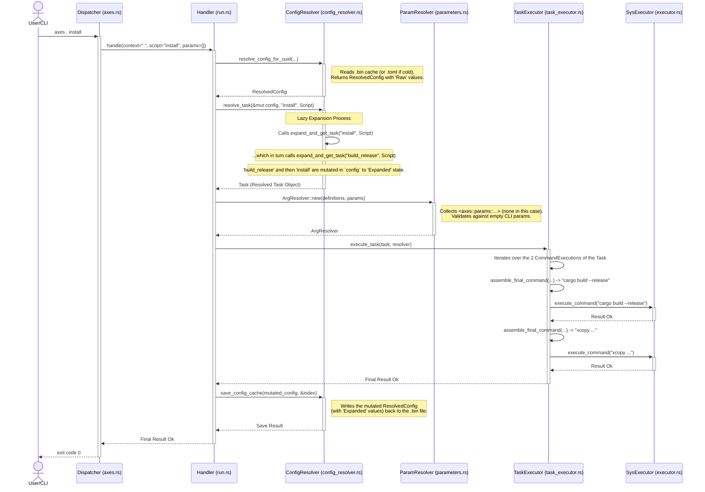

<p align="center">
  <strong>Read this in other languages:</strong><br>
  <a href="./TECNICAL.md">English</a> |
  <a href="./docs/es/TECNICAL.md">Español</a>
</p>

# Fundamental Architectural Principles

The design of `axes` it is based on a set of core principles that prioritize robustness, maintainability, and a predictable, high-performance user experience. These principles inform every decision, from data structure to the execution engine.

## **1. Immutable Identity over Mutable Location (UUIDs vs. Paths)**

This is the single most important and fundamental design decision in `axes`. It dictates how the system perceives and manages projects, prioritizing logical stability over the transience of physical organization.

* **The Problem: The Fragility of Physical Paths**

    Many development tools use the file system path (`/home/user/dev/my-project`) as the primary identifier for a project. This approach is intuitive but inherently fragile. Consider a common scenario:

    ```text
    my-monorepo/
    ├── backend/
    └── frontend/
    ```

    If a developer decides to refactor and rename `backend` to `api-service`, any tool relying on the path `/my-monorepo/backend` to identify the child project will lose the reference. Hierarchical relationships, shared configurations, and any kind of "knowledge" about that project become corrupted or lost.

* **The `axes` Solution: Decoupled Identity**

    `axes` solves this problem by completely decoupling the **logical identity** of a project from its **physical location**.

    1. **Identity (UUID):** At the moment of creation (`axes init`), each project is assigned a Universal Unique Identifier (UUID v4). This `UUID` is the **canonical and immutable** identity of the project throughout its lifetime.
    2. **Local Reference (`.axes/project_ref.bin`):** Inside each project directory, a small binary file stores its own `UUID`, its parent's `UUID`, and its "simple" name. This allows `axes` to quickly identify which project it is in (`axes . ...`) without needing to consult the global index.
    3. **Global Index (`~/.config/axes/index.bin`):** A single centralized binary file acts as the "source of truth" for the entire ecosystem. It is a `HashMap` that maps each project `UUID` to its metadata: its parent `UUID`, its simple name, and, crucially, its **current physical path**.

* **Identity Flow Diagram:**

    ```mermaid
    graph TD
        subgraph "File System (Mutable)"
            A["/path/to/my-app"]
            B["/path/to/my-app/api"]
        end

        subgraph "axes Ecosystem (Logical and Stable)"
            C(index.bin)
            D["project_ref.bin in 'my-app'"]
            E["project_ref.bin in 'api'"]
        end

        A -- "Contains" --> D
        B -- "Contains" --> E
        
        C -- "Maps UUID_A to /path/to/my-app<br>Maps UUID_B to /path/to/my-app/api<br>Defines that parent(UUID_B) is UUID_A" --> A & B
        D -- "My UUID is UUID_A<br>My parent is 'global'" --> C
        E -- "My UUID is UUID_B<br>My parent is UUID_A" --> C
    ```

* **Architectural Benefits:**

  * **Safe Refactoring:** A user can move the `/my-monorepo/api-service` directory to `/services/api/` without consequence. `axes` will not notice the change until the next execution. At that point, the `context_resolver` will fail when searching for the old path. A simple `axes register /services/api` (or a future `axes repair` command) will read the `project_ref.bin`, find the existing `UUID`, and simply **update the path** in the `index.bin`, preserving all history, inheritance, and relationships of the project.
  * **Atomic Metadata Operations:** Commands like `axes my-app/api rename api-v2` or `axes my-app/api link another-parent` are near-instantaneous metadata operations. They only modify the `name` or `parent_uuid` fields in the `index.bin`. They do not touch the file system, making them extremely fast and safe against mid-operation failures. This is impossible in a path-based system, which would require complex and risky directory move operations.

## **2. Early Standardization and Flattening (External Flexibility, Internal Rigidity)**

This principle governs how `axes` processes and represents configuration. It is based on the philosophy of offering maximum flexibility to the user in `axes.toml`, while internally the program works with a single, strict, and pre-optimized data structure.

* **The Problem: The Paradox of Flexibility**

    Offering multiple ways to define a command in TOML is excellent for user experience. A user can start with a simple string and scale up to a more complex structure as needed:

    ```toml
    # Valid
    simple = "echo hello"
    # Also valid
    sequence = ["echo step 1", "echo step 2"]
    # And also valid
    complex = { windows = "dir", linux = "ls", desc = "List files." }
    ```

    However, this flexibility becomes a nightmare for the program code. If the execution engine had to handle all these variants at every step, it would be plagued with nested `match` statements, complex conditional logic, and would be difficult to maintain and optimize. Furthermore, high-performance binary serializers like `bincode` cannot reliably handle `enum`s that rely on `#[serde(untagged)]` for deserialization, which led to the "corrupt" cache errors.

* **The `axes` Solution: A Two-Stage Standardization Process**

    `axes` solves this paradox by treating the user configuration as a "raw data source" that must be processed and transformed into a canonical internal format before the core logical program sees it.

    **Stage 1: Deserialization to Canonical Form (`ProjectConfig`)**

    1. **Deserialization Wrapper:** `serde` does not deserialize directly into our internal `enum Command`. Instead, it deserializes into a temporary, private `enum` called `TomlCommand`, which *does* use `#[serde(untagged)]` to absorb the flexible syntax.
    2. **Immediate Conversion:** Immediately after `serde` creates an instance of `TomlCommand`, an implementation of the `From` trait converts it into our internal, standardized `struct`: `CanonicalCommand`. This `struct` has explicit fields for all platforms (`windows`, `linux`, `macos`, `default`) and the description (`desc`).

    *Result:* The `ProjectConfig` object representing an `axes.toml` in memory no longer contains ambiguous `enum`s. All its scripts, hooks, and `open` shortcuts are of type `Command(CanonicalCommand)`, a uniform structure.

    **Stage 2: OS Flattening (`ResolvedConfig`)**

    1. **OS Context:** During inheritance merging to create the `ResolvedConfig`, the `config_resolver` knows the operating system it is running on (`std::env::consts::OS`).
    2. **`Runnable` Selection:** For each `CanonicalCommand`, the resolver applies cascading logic to select the correct `Runnable` (the `string` or `sequence` of commands to execute): it first looks for a `Runnable` specific to the current OS (e.g., `windows`), and if not found, it falls back to `default`.
    3. **Creation of `FlattenedCommand`:** The result of this flattening is a new `struct`, `FlattenedCommand`. This structure contains only the `command_lines: Vec<String>` that must be executed on the current OS and the `desc`.
    4. **Cache `Raw` State:** This `FlattenedCommand` is what is stored in `CacheableValue::Raw` inside the `ResolvedConfig` and is persisted in the binary cache.

* **Process Flow Diagram:**

    ```mermaid
    graph TD
        subgraph "User"
            A["axes.toml (Flexible Syntax)"];
        end

        subgraph "Load Phase (serde)"
            B["enum TomlCommand<br><i>(Uses #[serde(untagged)])</i>"];
            C["struct CanonicalCommand<br><i>(Standardized structure)</i>"];
        end
        
        subgraph "Merge Phase (config_resolver)"
            D["struct FlattenedCommand<br><i>(Flattened for the current OS)</i>"];
        end

        subgraph "Internal State (Cache and Execution)"
            E["CacheableValue::Raw(FlattenedCommand)"];
        end

        A --"Deserialize"--> B;
        B --"From trait"--> C;
        C --"OS Flattening"--> D;
        D --"Cache Storage"--> E;
    ```

* **Architectural Benefits:**
  * **Cache Robustness:** By removing the dependency on `#[serde(untagged)]` from our core and cache data structures, the `Serde(AnyNotSupported)` error from `bincode` is completely eliminated. The cache is now 100% reliable.
  * **Simplified Business Logic:** The expansion engine and `task_executor` do not need to know if a command was originally a `string`, a sequence, or multi-platform. They only receive and operate on a `FlattenedCommand`, a list of `strings` for the current OS. This drastically reduces complexity and potential bugs in the core logic.
  * **Best of Both Worlds:** A highly flexible user experience is maintained in the `.toml`, while internally enjoying the type safety, rigidity, and performance of a standardized data structure.

## **3. Lazy and Persistent Expansion (JIT Caching)**

This principle dictates how and when `axes` performs the computationally expensive work of interpreting and expanding scripts. Instead of an "eager" approach (doing all the work upfront), `axes` uses a "lazy" or "Just-In-Time" (JIT) strategy to maximize perceived user performance.

* **The Problem: The Cost of Eager Expansion**

    An `axes` project can have dozens or hundreds of scripts and variables, often with complex dependency chains (`script_A` uses `script_B`, which uses `var_C`, etc.). If `axes` attempted to fully expand all these values every time a command was run, even a simple one like `axes . info`, the startup time would be unacceptably slow. Most of this work would be useless, as the user only intended to execute a small fraction of the total configuration.

* **The `axes` Solution: A Multi-State Cache**

    `axes` solves this by treating expansion as a state transition that is saved in the cache. Every interpolable value (script, var, etc.) can exist in one of two states, represented by the `CacheableValue` enum:

    1. **`CacheableValue::Raw(FlattenedCommand)`:** This is the initial state. After the "Standardization and Flattening" phase, the `ResolvedConfig` contains all values in this state. A `FlattenedCommand` is "raw" because, although it is already flattened for the current OS, its tokens (`<axes::vars::...>`, `<axes::params::...>`) have not yet been interpreted. This state is saved in the disk cache (`.bin`).

    2. **`CacheableValue::Expanded(Task)`:** This is the final state, ready for execution. A `Task` is a rich data structure containing a list of `CommandExecution`. Each `CommandExecution` has its template decomposed into `TemplateComponent`s (literals, parameters, etc.) and its execution metadata (`ignore_errors`, `run_in_parallel`).

    **The "Just-In-Time" Process:**

    The transition from `Raw` to `Expanded` only occurs when a `handler` explicitly requests a task via `config_resolver::resolve_task`.

  * **Trigger:** `handlers/run.rs` calls `resolve_task(&mut config, "my_script", ...)`
  * **Expansion Engine (`expand_and_get_task_internal`):**
        a. Searches for `"my_script"` in `config.scripts`.
        b. **Cache Check:** If the value is already `Expanded(task)`, it clones the `task` and returns it immediately. Process ends.
        c. **Expansion Work:** If the value is `Raw(flattened_command)`, the work begins:
            *It iterates over the `command_lines` of the `flattened_command`.
            *   For each line, it recursively expands all compound tokens (`<axes::vars::...>`, `<axes::scripts::...>`), calling itself to resolve dependencies.
            *   Once a line is "statically flat," it expands simple tokens (`<axes::path>`, etc.) and parses it into `TemplateComponent`s.
        d. **Mutation and In-Memory Caching:** The resulting `Task` is used to create a new `CacheableValue::Expanded(task)`. This new value **replaces** the old `CacheableValue::Raw` in the `ResolvedConfig` that is in memory.
  * **Persistence:** At the end of the `handler` execution, `save_config_cache(&config, ...)` is called. This function writes the mutated `ResolvedConfig` back to the `.bin` file, **persisting the Expanded state to disk** for future executions.

* **Cache Flow Diagram (Simplified):**

    ```mermaid
    graph BR
    Start --> Sub1
    Start --> Sub2

    subgraph Sub1["Execution 1 (Cold Cache)"]
        A["axes . my_script"] --> B["resolve_task('my_script')"]
        B --> C{"State of 'my_script' in cache?"}
        C -- "Raw" --> D["Recursively Expand<br>and create Task"]
        D --> E["MUTATE config in memory:<br>'my_script' -> Expanded(Task)"]
        E --> F["Execute Task"]
        F --> G["save_config_cache(mutated_config)"]
        G --> H["END"]
    end

    subgraph Sub2["Execution 2 (Hot Cache)"]
        A2["axes . my_script"] --> B2["resolve_task('my_script')"]
        B2 --> C2{"State of 'my_script' in cache?"}
        C2 -- "Expanded" --> I["Clone Task from cache"]
        I --> F2["Execute Task"]
        F2 --> H2["END (nothing saved)"]
    end
    ```

* **Architectural Benefits:**
  * **First Run Performance:** Startup time is minimal, as only the "hot path" of the requested script and its direct dependencies are expanded.
  * **Subsequent Run Performance:** It is near-instantaneous. The cost is reduced to a disk read and a `bincode` deserialization, skipping all the complex and costly string expansion and parsing logic.
  * **Consistency:** The cache state is always valid. If an `axes.toml` changes (detected by its `timestamp`), the cache is invalidated entirely, forcing a new resolution from the `Raw` state and ensuring changes are reflected.

## **4. Declarative and Early Parameter Validation (`ArgResolver`)**

This principle defines how `axes` handles arguments passed to scripts from the command line. Instead of an imperative and reactive approach, `axes` uses a declarative model that prioritizes robustness, predictability, and error clarity.

* **The Problem: Manual Parsing and Its Dangers**

    In traditional shell scripts, arguments are accessed via variables like `$1`, `$@`, etc. The script is responsible for:
  * Validating if a required argument is present.
  * Assigning default values.
  * Parsing flags (`--verbose`, `-o file.txt`).
  * Handling conflicts and errors.

    This logic is often repetitive, error-prone (especially with spaces and quotes), and failures occur late, mid-script execution, often with cryptic error messages.

* **The `axes` Solution: A Three-Step Resolution Lifecycle**

    `axes` externalizes all this logic to a central component, the `ArgResolver`, which runs **before** any script command is executed. The lifecycle is as follows:

    1. **Definition Collection:** After `config_resolver` has produced a completely expanded `Task`, the `handler` (`run.rs`, `start.rs`, etc.) iterates over all the `TemplateComponent`s of the task and collects every `TemplateComponent::Parameter(def)` into a unified list of `ParameterDef`s. This list represents the full "contract" of all arguments the task expects.

    2. **`ArgResolver` Creation (Validation):** An instance of `ArgResolver::new(...)` is created by passing it two things: the list of `ParameterDef`s (the "contract") and the raw command-line arguments (the "user input"). At this moment, the `ArgResolver` executes all validation logic:
        * **Alias Conflicts:** Checks if the user provided both a flag and its alias (e.g., `--verbose` and `-v`). If so, it fails immediately.
        * **Required Arguments:** Iterates over all definitions marked with `required` and checks if a corresponding value was provided in the user input. If any is missing, it fails with a clear error.
        * **Unexpected Arguments:** At the end of the resolution, it checks if any CLI arguments were "unclaimed" by any definition. If so, and the task did not contain a generic `<axes::params>` token, it fails with an error listing the unrecognized arguments.

    3. **Value Resolution:** During the same validation process, the `ArgResolver` calculates the final value for each parameter token, following a strict precedence: **CLI Value > `default` Value > Empty String**. It also applies `map` transformations. The result is an internal `HashMap` that maps each `original_token` to its final `String`.

* **`ArgResolver` Flow Diagram:**

    ```mermaid
    graph TD
    A["Input: `Vec<ParameterDef>` and `Vec<String>` from CLI"] --> B["ArgResolver::new()"]
    B --> C{"Alias Conflict?"}

    subgraph "Validation and Resolution Phase"
        C -- Yes --> Z1["Error: Alias Conflict"]
        C -- No --> D{"Map CLI input to Definitions"}
        D --> E{"For each Definition..."}
        E --> F{"Was it provided in the CLI?"}
        F -- No --> G{"Does it have `default`?"}
        F -- Yes --> H["Use CLI value"]
        G -- No --> I{"Is it `required`?"}
        G -- Yes --> H
        I -- Yes --> Z2["Error: Missing Required Parameter"]
        I -- No --> H
        H --> J["Apply `map` transformer"]
        J --> K["Store (token -> final value)"]
        E -- End Loop --> L{"Are there unused CLI arguments left?"}
        L -- Yes --> M{"Did the task have `<axes::params>`?"}
        M -- No --> Z3["Error: Unexpected Arguments"]
        M -- Yes --> N["Store leftovers for `<axes::params>`"]
        L -- No --> N
    end

    N --> O["ArgResolver successfully created"]
    Z1 & Z2 & Z3 --> Z["END (Fail Early)"]
    O --> P["The task_executor uses the ArgResolver to assemble the commands"]
    ```

* **Architectural Benefits:**
  * **Fail-Fast:** Validation occurs before any side effects (command execution, file modification). This makes the system much safer and more predictable. If it fails, it fails cleanly.
  * **Superior User Errors:** Instead of a generic "command not found" from the shell, the user receives a contextual `axes` error, such as `"Error: Flag '--target' is required but was not provided."`, which is infinitely more helpful.
  * **Centralized Logic:** All the complexity of argument parsing is contained within `parameters.rs`. The `handlers` and `task_executor` do not need to know how `required` or `map` works; they simply ask for the final resolved value for a token. This respects the Separation of Concerns and improves maintainability.

## **5. Hybrid Synchronous-Asynchronous Execution**

This principle is the key to solving one of the most complex challenges in command-line tools: how to efficiently wait for subprocesses and handle user interruptions (`Ctrl+C`) without sacrificing either performance or code simplicity.

* **The Problem: The Tyranny of Synchronous Blocking and Async Infection**

    CLI tools face a dilemma:
    1. **Purely Synchronous Approach:** Using `std::process::Child::wait()` is simple, but it is a blocking call. If you want to check if the user has pressed `Ctrl+C` while waiting, the only option is a loop with `try_wait()` and `thread::sleep()`. As we discovered, this `sleep` introduces unacceptable latency for short commands.
    2. **Purely Asynchronous Approach:** Rewriting the entire application with `async/await` would solve the waiting problem, as `await` does not block the thread. However, this introduces "async infection": every function that calls an `async` function must be `async` as well. This would greatly complicate our business logic (like the `config_resolver`), which is inherently synchronous (CPU-bound) and does not benefit from `async`.

* **The `axes` Solution: A Strategic Bridge to the Asynchronous World**

    `axes` adopts a hybrid approach that takes the best of both worlds. The application is predominantly synchronous, but it delegates the specific task of subprocess execution to a managed `tokio` runtime.

    1. **Global Runtime (`lazy_static!`):** A `tokio::runtime::Runtime` is initialized lazily and globally only once during the program's life. This avoids the cost of creating a new `runtime` for every executed command.
    2. **Synchronous API, Internal Asynchronous Execution:** The `system::executor` module exposes an `execute_command` function that is **synchronous** to the rest of the program. `handlers` and the `task_executor` call it as if it were a normal blocking function.
    3. **The `block_on` Bridge:** Inside `execute_command`, the first action is to call `TOKIO_RT.block_on(async { ... })`. This call blocks the *current* thread, but within the `async` block, we enter the world of `tokio`.
    4. **`tokio::select!` for Event Concurrency:** Inside the `async` block, we use the `tokio::select!` macro. This is the heart of the solution. It allows waiting for **multiple futures** concurrently and acts as soon as the first one completes. We wait for two events:
        * `child.wait()`: The future that completes when the child process exits.
        * `tokio::signal::ctrl_c()`: The future that completes when the user presses `Ctrl+C`.

* **`executor` Flow Diagram:**

    ```mermaid
    graph TD
    A["task_executor calls executor::execute_command(...) (synchronous)"] --> B["executor calls TOKIO_RT.block_on(async { ... })"]

    subgraph TokioContext["Tokio Asynchronous Context"]
        B --> C["Launches subprocess with tokio::process::Command"]
        C --> D{"tokio::select!"}
        D -->|Event 1| E{"child.wait() completes"}
        D -->|Event 2| F{"tokio::signal::ctrl_c() completes"}
    end

    E --> G["Processes the exit code; returns Ok or Err(NonZeroExitStatus)"]
    F --> H["Calls child.kill().await; returns Err(Interrupted)"]
    G --> I["The async block finishes; block_on returns the Result"]
    H --> I
    I --> J["The synchronous execute_command function returns the Result to the task_executor"]
    ```

* **Architectural Benefits:**
  * **Optimal Performance:** Subprocess waiting is handled by the `tokio` scheduler. There are no `sleep`s or CPU consumption. The response to process completion or `Ctrl+C` is microsecond-level.
  * **Precise and Robust Cancellation:** When `Ctrl+C` wins the "race" in `select!`, we have total control. We can cleanly attempt to kill the child process (`child.kill()`) and then return a specific error type (`ExecutionError::Interrupted`). The main `handler` (`main`) can then intercept this error and exit silently, achieving the exact behavior the user expects.
  * **Complexity Isolation:** The complexity of `async/await` and `tokio` is completely encapsulated within `system/executor.rs`. The rest of the application, which is synchronous business logic, remains simple, clean, and easy to reason about. There is no "async infection."

### ## Crate Module Structure

The `axes` source code is organized into modules with clear, well-defined responsibilities, following the Separation of Concerns philosophy. This structure facilitates navigation, maintenance, and project contribution.

```sh
src/
├── bin/axes.rs             # Entry point and main dispatcher
├── cli/                    # Command Line Interface (parsing and handlers)
│   ├── handlers/           # Specific logic for each command (run, info, etc.)
│   │   ├── mod.rs
│   │   ├── commons.rs      # Utilities shared by handlers
│   │   └── ... (run.rs, info.rs, etc.)
│   └── mod.rs
├── core/                   # The "brain": UI-agnostic business logic
│   ├── mod.rs
│   ├── config_resolver.rs  # Config merging and lazy expansion engine
│   ├── context_resolver.rs # Translation of string contexts to UUIDs
│   ├── index_manager.rs    # API for the global index (index.bin)
│   ├── parameters.rs       # ArgResolver: declarative parameter validation
│   └── task_executor.rs    # Task execution orchestrator
├── system/                 # Operating System Interaction
│   ├── mod.rs
│   ├── executor.rs         # Low-level subprocess executor (with Tokio)
│   └── shell.rs            # Logic for interactive sessions (start)
├── models.rs               # Definition of all data structs and enums
└── lib.rs                  # Crate root (library)
```

#### **`bin/axes.rs`: The Entry Point and Dispatcher**

* **Responsibility:** This is the outermost layer of the application. Its sole mission is to interpret the user's initial intention and delegate control to the correct `handler`.
* **Key Components:**
  * **`fn main()`:** Initializes the `logger`, manages high-level error handling (like formatted printing of `anyhow` errors and silent exit for `Ctrl+C`), and calls `run_cli`.
  * **`COMMAND_REGISTRY`:** A static `array` that acts as a routing table. It maps command names (`"run"`, `"info"`) and their aliases (`"ls"` for `"tree"`) to the corresponding `handle` function. It is the single source of truth for system commands.
  * **`fn run_cli()`:** The dispatcher itself. It uses `clap` for initial parsing and applies `axes`'s flexible grammar to distinguish between `axes <action> <context>` and `axes <context> <action>`. It determines the canonical action and packages the remaining arguments for the `handler`.

#### **`cli/handlers/`: The Heart of Command Logic**

* **Responsibility:** Each module within `handlers` implements the business logic for a single `axes` command. They are self-contained and orchestrate calls to the `core` and `system` modules.
* **Design Pattern:**
  * **`struct <Action>Args`:** Each `handler` defines its own arguments `struct` with `#[derive(clap::Parser)]`. This encapsulates all the parsing and validation logic for that command's specific arguments (flags, subcommands, etc.) declaratively.
  * **`pub fn handle(...)`:** The single public function, serving as the entry point from the `COMMAND_REGISTRY`. It receives the raw arguments, parses them using its `Args` struct, and then executes the command logic.
  * **Example (`run.rs`):** `RunArgs` defines `context`, `script`, and `params`. The `handle` uses this data to call `config_resolver::resolve_task`, create a `parameters::ArgResolver`, and finally delegate execution to `task_executor::execute_task`.

#### **`core/`: The UI-Agnostic Brain**

* **Responsibility:** Contains the fundamental business logic of `axes`. It is a pure "backend" that knows nothing about `clap` or console printing. Its API operates on the `struct`s defined in `models.rs`.
* **Key Components:**
  * **`config_resolver.rs`:** The most complex component. Its main API (`resolve_task`) implements the lazy and persistent expansion.
  * **`parameters.rs`:** Implements the `ArgResolver`, which takes a parameter "contract" and user input and produces resolved values or a validation error.
  * **`task_executor.rs`:** Knows how to take a `Task` and an `ArgResolver` and execute it, handling parallelism logic (`>`) and error suppression (`-`).

#### **`system/`: The OS Interaction Layer**

* **Responsibility:** Abstracts all direct interactions with the operating system, keeping the rest of the code platform-agnostic.
* **Key Components:**
  * **`executor.rs`:** The implementation of the "hybrid bridge." It provides a simple synchronous API (`execute_command`) but uses `tokio` internally for high-performance execution and cancellation.
  * **`shell.rs`:** Contains the logic for creating and managing interactive shell sessions, including the creation of temporary initialization scripts for `at_start` hooks.

#### **`models.rs`: The Source of Truth for Data**

* **Responsibility:** This is the only place where the application's data structures are defined. This ensures consistency throughout the program.
* **Organization:** It is structured into logical sections: models for TOML, internal execution models, persistence models, and the conversions (`impl From`) between them. This organization is key to understanding the data flow through the different architectural layers.

### ## The Command Lifecycle: `axes . install`

To understand how the modules collaborate, let's trace the complete flow of a composition command. This example maps the execution from user input to subprocess completion, demonstrating the principles of lazy resolution, expansion, and execution.

**Scenario:**

* **User Command:** `axes . install`
* **Relevant `axes.toml`:**

    ```toml
    [scripts]
    build_release = "cargo build --release"
    install = [
        "<axes::scripts::build_release>",
        "xcopy /Y \"<axes::path>\\target\\release\\axes.exe\" \"C:\\scripts\\axes.exe\""
    ]
    ```

#### **High-Level Sequence Diagram**



#### **Detailed Flow Breakdown**

1. **`main` and Dispatcher (`axes.rs`):**
    * `clap` parses the input. The `Dispatcher` identifies that `install` is not a system command and routes it to the `run` `handler`, passing it `context="."`, `script="install"`, and `params=[]`.

2. **`run.rs` (Handler):**
    * Calls `commons::resolve_config_from_context_or_session` to load the `ResolvedConfig` for the current project. Assuming it is the first execution, the disk cache is created, and the in-memory `config` contains the `install` and `build_release` scripts in the `CacheableValue::Raw` state.
    * The `handler` then calls `config_resolver::resolve_task(&mut config, "install", ValueKind::Script)`.

3. **`config_resolver.rs` (The Expansion Engine):**
    * **Call 1: `expand_and_get_task_internal("install", Script, ...)`**
        * Finds that `install` is `Raw`. Clones its `FlattenedCommand`, which contains two lines: `["<axes::scripts::build_release>", "xcopy..."]`.
        * Starts processing the first line: `"<axes::scripts::build_release>"`.
        * The compound token expansion engine finds `<axes::scripts::build_release>` and makes a recursive call:
            * **Call 2: `expand_and_get_task_internal("build_release", Script, ...)`**
                * Finds that `build_release` is `Raw`. Clones its `FlattenedCommand` (`command_lines: ["cargo build --release"]`).
                * Its single command line has no compound or simple tokens. It is parsed directly into a `Task` containing a `CommandExecution` with `template: [Literal("cargo build --release")]`.
                * The in-memory `ResolvedConfig` is **mutated**: `config.scripts["build_release"]` is now `CacheableValue::Expanded(Task{...})`.
                * Returns the newly created `Task`.
        * Back in Call 1, the result of the `sub_task` (`build_release`) is flattened to a `String` (`"cargo build --release"`) and injected into the line being processed.
        * The second line of `install` is processed: `"xcopy ... <axes::path> ..."`.
        * The compound token expansion engine finds nothing.
        * The final pass of **simple token expansion** runs: `<axes::path>` is replaced by the physical path of the project.
    * **Result:** The final `Task` for `install` is built with two `CommandExecution`s, both completely resolved.
    * The `ResolvedConfig` is **mutated again**: `config.scripts["install"]` is now `CacheableValue::Expanded(Task{...})`.
    * `resolve_task` returns the owned `Task` for `install` to the `handler`.

4. **`run.rs` (Continuation):**
    * Receives the `Task` for `install`.
    * Collects parameter definitions (none in this case).
    * Creates an empty `ArgResolver` (which validates that no unexpected `params` were passed).
    * Calls `task_executor::execute_task(...)`.

5. **`task_executor.rs` (Task Executor):**
    * Iterates over the two `CommandExecution`s in the `Task`.
    * Calls `system::executor::execute_command("cargo build --release", ...)`.

6. **`system::executor.rs` (Process Executor):**
    * Uses `TOKIO_RT.block_on` and `tokio::select!` to execute the command efficiently and safely, waiting for its completion.
    * The `task_executor` proceeds to the second command, `xcopy ...`, and repeats the process.

7. **`run.rs` and `main.rs` (Completion):**
    * The `task_executor` finishes successfully.
    * The `run` `handler` calls `config_resolver::save_config_cache(&config, &index)`. This writes the `ResolvedConfig` (which now contains the `Expanded` values for `install` and `build_release`) to the `.bin` file, **persisting the expansion work**.
    * The program exits successfully. The next time `axes . install` is run, step 3 will be much shorter, reading directly from the cache.

### ## The Heart of `axes`: Data Models

The robustness of `axes` lies in the clear separation and intentional design of its data models, defined in `src/models.rs`. Each `struct` and `enum` has a specific purpose in the different phases of a command's lifecycle, from reading the TOML to execution.

#### **1. Configuration Models (Reading `axes.toml`)**

These structures are designed to offer maximum user flexibility.

* **`ProjectConfig`:** This is the 1:1 representation of an `axes.toml` file. It contains `HashMap`s for `scripts`, `vars`, etc.
* **`Command(CanonicalCommand)`:** This is the central piece of standardization. Thanks to an intermediate `enum` (`TomlCommand`) that uses `#[serde(untagged)]`, we can accept multiple syntaxes in the TOML (string, sequence, table) but always deserialize into a single standardized `CanonicalCommand` `struct`. This `struct` has explicit fields for all platforms (`windows`, `linux`, `macos`, `default`) and a description.
  * **Benefit:** Eliminates ambiguity from internal code and solves the serialization problem with `bincode`.

#### **2. Internal and Runtime Models**

Once the `.toml` files have been read and merged, `axes` works with a set of data models optimized for execution.

* **`ResolvedConfig`:** This is the complete, merged view of a project's configuration, the product of inheritance. It is the primary state object that `handlers` and the `config_resolver` operate on. It is not read directly from the disk but is built from `ProjectConfig`s or deserialized from the binary cache.

* **`FlattenedCommand`:** This is the first level of standardization. The `config_resolver` converts each `Command` in the configuration into a `FlattenedCommand` by selecting the appropriate `runnable` for the current operating system. It contains `command_lines: Vec<String>` and `desc: Option<String>`. It is a "flat" representation ready for expansion.

* **`CacheableValue`:** This `enum` is the key to lazy and persistent expansion.
  * **`Raw(FlattenedCommand)`:** The initial state of any script or variable in the cache. It is compact and unprocessed.
  * **`Expanded(Task)`:** The final state after the expansion engine has done its work. It contains the fully resolved task ready to be executed. The disk cache (`.bin`) saves this state to speed up future executions.

* **`Task`:** The final representation of a script to be executed. It is a `struct` that contains a `Vec<CommandExecution>`.

* **`CommandExecution`:** Represents a single command line within a `Task`. It contains the execution metadata (`ignore_errors`, `run_in_parallel`) and the command template.

* **`TemplateComponent`:** Decomposes a command template into its atomic parts, distinguishing between `Literal(String)`, `Parameter(ParameterDef)`, and `GenericParams`. This allows the `task_executor` to assemble the final command safely and accurately.

* **Data Flow Diagram:**

    ```mermaid
    graph TD
        A["ProjectConfig<br>(From .toml, contains Command)"] -->|Merge and OS Flattening in merge_chain_into_config| B["ResolvedConfig<br>(Contains CacheableValue::Raw(FlattenedCommand))"];
        B -->|Write to Disk Cache<br>save_config_cache| C[".axes/config.cache.bin<br>(Contains SerializableResolvedConfig)"];
        C -->|Read from Cache<br>read_and_validate_...| B;
        B -->|Lazy Expansion<br>in resolve_task| D["Task<br>(Contains CommandExecution with TemplateComponents)"];
        D -->|MUTATION| E["ResolvedConfig<br>(Now with CacheableValue::Expanded(Task))"];
    ```

#### **3. Persistence Models**

These models define the structure of the data that is saved to disk permanently.

* **`GlobalIndex`:** Defines the structure of the global index (`~/.config/axes/index.bin`). It is a `HashMap` that maps `UUID`s to `IndexEntry`s. It is the single source of truth about the hierarchy and location of projects.
* **`IndexEntry`:** Contains a project's metadata in the index: `name`, `parent_uuid`, and `path`.
* **`ProjectRef`:** Defines the structure of the local reference (`.axes/project_ref.bin`), allowing `axes` to identify a project and its parent from its own directory.
* **`Serializable...` Structs:** A set of "substitute" `struct`s (`SerializableResolvedConfig`, etc.) used to ensure a stable and cross-platform binary cache format with `bincode`, especially for handling types like `PathBuf` which are converted to `String` before serialization.

## Key Data Flows

The logic of `axes` resides in how it transforms a simple user input (like `axes my-app/api build`) into a complete, inherited, expanded, and executable configuration. This process is divided into two main phases, managed by two distinct `core` components.

### **1. Context Resolution (`context_resolver`)**

The `context_resolver` acts as the Domain Name Service (DNS) of `axes`. Its sole responsibility is to translate the **context** provided by the user—an ambiguous `String`—into an unambiguous **identity**: a `UUID`.

* **Input:** A context `&str` (e.g., `"."`, `"my-app/api"`, `"backend!"`, `"../../*"`).
* **Process:**
    1. **Exclusive Index Operation:** It is crucial to understand that this resolver **does not read any `axes.toml` or interact with the file system** (except to resolve `.` or `_`). It operates exclusively on the `GlobalIndex` data structure loaded into memory from `~/.config/axes/index.bin`. This makes it extremely fast.
    2. **Shortcut Analysis (Highest Priority):** First, it checks if the context is a special navigation shortcut:
        * `.`: Searches for the `UUID` of the project in the current directory or the first ancestor.
        * `_`: Searches for the `UUID` of the project whose root directory is *exactly* the current directory.
        * `..`: Navigates to the `UUID` of the parent of the current context.
        * `*`: Resolves to the `UUID` of the last used child of the current context (reads the local `last_used.cache.bin` cache).
        * `alias!`: Searches for the `alias` in the `GlobalIndex` alias `HashMap`.
    3. **Hierarchical Path Resolution:** If it is not a shortcut, it splits the context by `/` (e.g., `my-app/api`).
        * **First Part:** Resolves the first segment (`my-app`) as a direct child of the root project (`global`).
        * **Graph Traversal:** For each remaining segment (`api`), it searches for a child of the current `UUID` with that name.
* **Output:** A `Result<(Uuid, String)>`, where the `String` is the fully qualified name of the resolved project (e.g., `"global/my-app/api"`).

This component ensures that before any heavy lifting is done, we know unequivocally *which project* we are operating on.

#### **2. Configuration Resolution (`config_resolver`)**

Once a `handler` has a `UUID`, the `config_resolver` steps in to build its complete execution environment. This is the component that implements the "Early Standardization and Flattening" principle.

* **Input:** A project `Uuid`.
* **Process (`resolve_config_for_uuid`):**
    1. **Disk Cache Check:** The first step is always to look for a valid `.axes/config.cache.bin` for the project.
        * **Timestamp Validation:** The cache stores the modification dates of all `axes.toml` files in the inheritance chain. It checks if any of the actual files on disk are newer than the stored `timestamp`. If so, the cache is stale and ignored.
        * If the cache is valid, the `ResolvedConfig` (with `Raw` and `Expanded` values already persisted) is decoded and returned almost instantly.
    2. **Building from Scratch (If No Valid Cache):**
        a. **Build Inheritance Chain:** An upward traversal is performed from the target project's `UUID`, following the `parent_uuid`s in the `GlobalIndex` until the root project is reached.
        b. **Read and Merge `ProjectConfig`s:** The inheritance chain is iterated over from the oldest ancestor (root) to the target project. In each step, the `axes.toml` is read, and its `HashMap`s (`scripts`, `vars`, `env`, etc.) are merged, with the child's values **overwriting** the parent's.
        c. **Flatten to `CacheableValue::Raw`:** During the merge, each `Command` (read from the TOML) is converted into a `FlattenedCommand` (selecting the `runnable` for the current OS) and wrapped in a `CacheableValue::Raw`. `vars` are also converted to `CacheableValue::Raw`.
        d. **Create New Disk Cache:** The final `ResolvedConfig`, which now contains only `Raw` values, is serialized to `.axes/config.cache.bin` along with the `timestamps` of its dependencies.
* **Output:** A `Result<ResolvedConfig>` ready to be used by the `handlers`.

This two-phase process ensures that `axes` is both fast (thanks to caching) and correct (thanks to cache invalidation and inheritance merging), providing a complete and self-contained view of a project's configuration at any time.

## Key System Components

While the lifecycle describes the "how," this section describes the "what." These are the modules and design patterns that constitute the core of `axes`'s functionality and performance.

### **1. The Expansion Engine (in `config_resolver.rs`)**

The old `Interpolator` has been replaced by a more sophisticated and high-performance expansion engine, whose logic primarily resides in `config_resolver.rs`.

* **`TaskExpander` Struct:** This `struct` encapsulates the state of a single high-level expansion operation (like the call from `run.rs`). Its purpose is to manage an **in-memory cache** (`ExpansionCache`) that prevents recalculating the same subtask (`var` or `script`) multiple times within the same execution. This is an example of memoization.

* **`expand_and_get_task_internal` Function:** This is the recursive heart of the engine. Its design follows a strict pattern to ensure safety and efficiency:
    1. **Cache Check:** It first queries the in-memory `ExpansionCache`. If the task is already resolved, it returns a clone and ends.
    2. **Immutable Read:** It reads the `CacheableValue::Raw` from the `ResolvedConfig` (which is immutable).
    3. **Compound Expansion:** It iterates over the command template, and for each `<axes::vars::...>` or `<axes::scripts::...>` token, it calls itself recursively.
    4. **Simple Expansion:** Once the compound tokens are resolved, a final pass expands static tokens (`<axes::path>`, etc.) over the literals.
    5. **Cache Insertion:** The newly constructed `Task` is inserted into the in-memory `ExpansionCache`.
    6. **`ResolvedConfig` Mutation:** It also updates the main `ResolvedConfig`, changing the state from `Raw` to `Expanded`. This step is key for disk cache persistence.

* **Safety and Performance:**
  * **Anti-Cycles:** A `HashSet` (`recursion_stack`) is passed through the entire call stack to detect circular dependencies and fail with a clear error.
  * **`lazy_static!` for Regex:** All regular expressions used in the parsing process are compiled only once and stored in `lazy_static!`, eliminating a massive performance bottleneck identified via `flamegraph`.

### **2. The Parameter Resolver (`parameters.rs`)**

This module implements the "Declarative and Early Validation" principle.

* **`ArgResolver` Struct:** This is the main orchestrator. It is not created until a `Task` has been fully expanded.
* **`ArgResolver::new()` Flow:** Its constructor is where all the logic happens:
    1. **Collection:** It receives all `ParameterDef`s from a `Task`.
    2. **CLI Parsing:** It parses the raw command-line arguments into an internal structure with a "consumption" state (`CliInputState`).
    3. **Resolution and Validation:** It executes a single-pass algorithm that iterates over the `ParameterDef`s, "consumes" arguments from the `CliInputState`, and applies the logic of modifiers (`required`, `default`, `map`, `alias`) in a strict order of precedence.
    4. **Leftover Handling:** At the end, it checks if any arguments remain unconsumed. If so, it assigns them to the `<axes::params>` token or throws an error if it was not declared.
* **Result:** If the constructor finishes successfully, the `handler` is guaranteed that all parameters are valid and has access to a `HashMap` with the final values ready to be injected.

### **3. The Task Executor (`task_executor.rs`)**

This module is a high-level abstraction that decouples `handlers` from execution complexity.

* **`execute_task` API:** Its main function takes a `Task` and an `ArgResolver`.
* **Orchestration Logic:**
    1. **Assembly:** It iterates over the `CommandExecution`s in the `Task`. For each one, it calls `assemble_final_command` to build the final command string, using the `ArgResolver` to substitute parameter tokens.
    2. **Parallelism Handling:** It implements the logic of the `>` prefix. It groups consecutive parallel commands into a "batch" and executes them using `rayon::par_iter()`. A sequential command acts as a barrier that forces the execution of the previous parallel batch.
    3. **Delegation:** It delegates the actual execution of each command (with its metadata like `ignore_errors`) to the low-level `executor`.

### **4. The Process Executor (`system/executor.rs`)**

This is the low-level bridge between `axes` and the operating system, designed for maximum performance and control.

* **Hybrid Architecture:** It exposes a synchronous API but uses a global `tokio` runtime (`lazy_static!`) internally.
* **Efficient Waiting with `tokio::select!`:** Instead of a blocking or sleeping wait loop, it uses `tokio::select!` to wait concurrently for two events: subprocess completion (`child.wait()`) or a `Ctrl+C` signal (`tokio::signal::ctrl_c()`).
* **Robust Cancellation:** If `Ctrl+C` is detected, the `executor` actively attempts to kill (`child.kill()`) the child process before returning a specific error type (`ExecutionError::Interrupted`). This prevents orphaned processes and gives the main `handler` control over how to proceed.
* **Robustness on Windows:** It maintains the fallback to `cmd /C` to execute `builtin` commands that are not independent executables.
