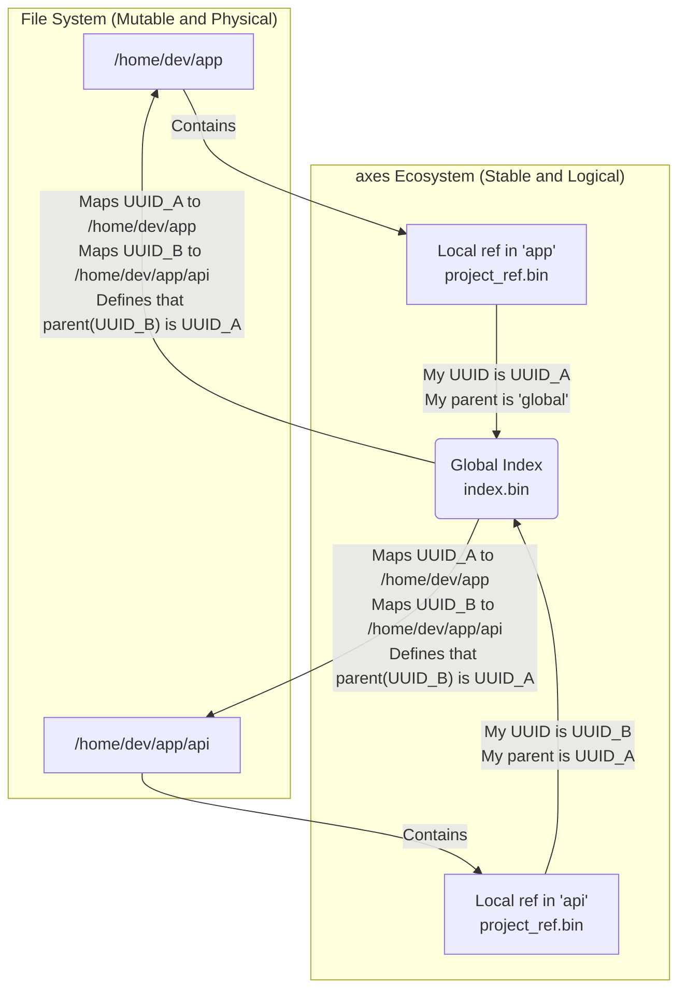
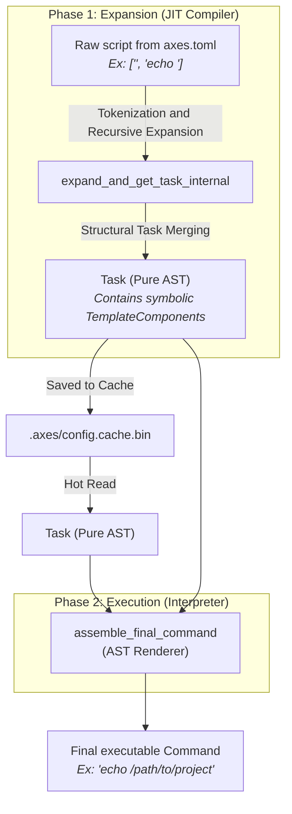
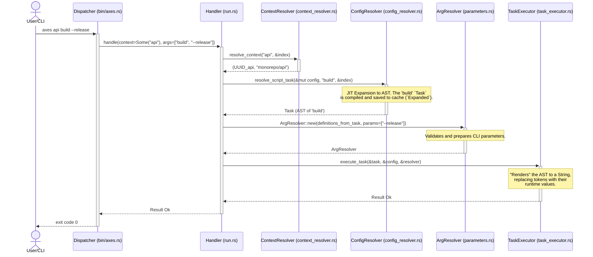
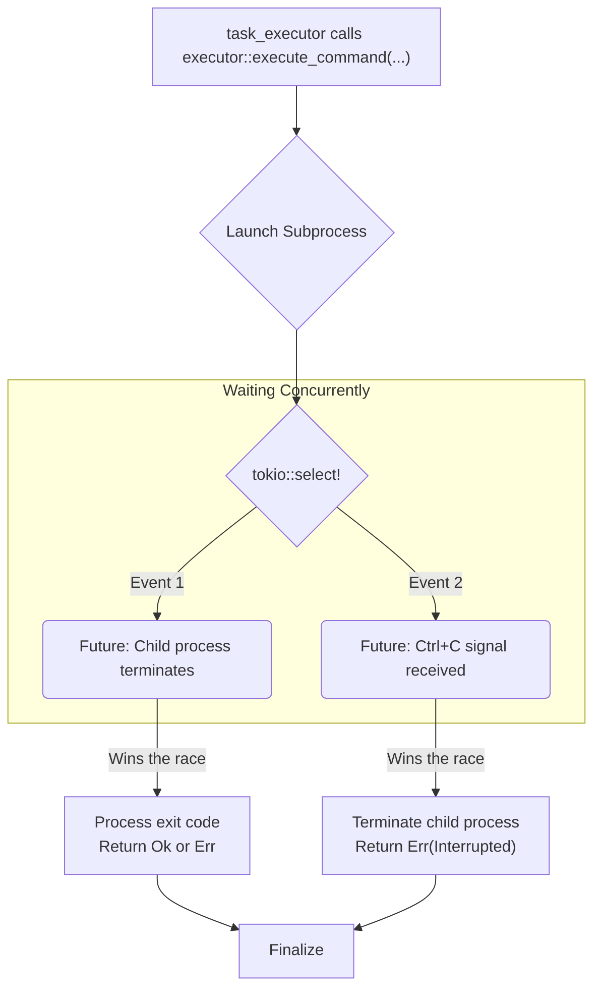

<p align="center">
  <strong>Read this in other languages:</strong><br>
  <a href="./TECNICAL.md">English</a> •
  <a href="./docs/es/TECNICAL.md">Español</a>
</p>

# **Fundamental Architectural Principles of `axes`**

The design of `axes` is based on a set of fundamental principles that prioritize **Robustness**, **Maximum Performance**, and **Scalability**. Every decision, from the data structure to the execution engine, is informed by these pillars. This document breaks down the internal architecture that allows `axes` to offer advanced functionality with exceptional speed.

---

## **1. The Immutable Identity Principle: The Resilient Project Graph**

This is the most important design decision in `axes`. It dictates how the system perceives and manages projects, prioritizing logical stability over the transient nature of physical organization on disk.

### The Problem: The Fragility of Physical Paths

Most development tools use the file system path (e.g., `/home/user/dev/my-project`) as the primary identifier for a project. This approach is intuitive but inherently fragile. If a developer decides to refactor and move a directory, any tool relying on the original path loses all reference. Hierarchical relationships, configurations, and "knowledge" about that project become corrupted or lost.

### The `axes` Solution: Decoupled Identity

`axes` solves this problem by completely dissociating the **logical identity** of a project from its **physical location**.

1. **Identity (UUID):** At the moment of creation (`axes init`), each project is assigned a Universal Unique Identifier (UUID v4). This `UUID` is the **canonical and immutable** identity of the project throughout its lifetime.

2. **Local Reference (`.axes/project_ref.bin`):** Inside each project directory, a small binary file stores its own `UUID`, its parent's `UUID`, and its simple name. This allows `axes` to identify itself quickly (`axes . ...`) without needing to consult the global index.

3. **Global Index (`~/.config/axes/index.bin`):** A single centralized binary file acts as the "source of truth" for the entire ecosystem. It is a `HashMap` that maps each project `UUID` to its metadata: its parent `UUID`, its simple name, and, crucially, its **current physical path**.

This architecture creates a logical project graph that is immune to changes in the file system.

### Identity Flow Diagram



### Architectural Benefits

* **Safe Refactoring:** A user can move the directory `/home/dev/app/api` to `/services/api-v2` without consequence. The next time a command is run, `axes` will detect that the path has changed, and a simple `axes register /services/api-v2` will read the `project_ref.bin` from the moved directory, find the existing `UUID`, and simply **update the path** in the `index.bin`. All project history, inheritance, and relationships are preserved intact.

* **Atomic Metadata Operations:** Commands like `axes api rename api-legacy` or `axes api link another-parent` are near-instantaneous metadata operations. They only modify the `name` or `parent_uuid` fields in the `index.bin`. They do not touch the file system, which makes them extremely fast and safe. This is impossible in a path-based system, which would require complex and risky directory movement operations.

## **2. The "JIT Compiler": The Pure AST Architecture**

The core of `axes`'s performance lies in its expansion engine. Instead of being a simple text substitution engine, it acts as a **Just-In-Time (JIT) compiler** that transforms user-defined scripts into a highly optimized, executable intermediate representation.

### The Anti-Pattern: The Text Re-Parsing Cycle

Previous versions and many other tools fall into a common performance trap. When composing scripts (e.g., `<axes::scripts::sub_script>`), they follow an inefficient cycle:

1. **Resolve:** They find the content of `sub_script`.
2. **Flatten to Text:** They convert the resolved `sub_script` back into a `String`.
3. **Inject Text:** They inject that `String` into the parent script.
4. **Re-Parse:** They re-parse the complete string of the parent script from scratch.

This cycle of **`Structure -> String -> Re-Parse`**, repeated recursively, generates a massive amount of memory allocations and redundant CPU work, leading to quadratic performance degradation, as demonstrated by our `flamegraph` analyses.

### The `axes` Solution: Structural Composition and Pure AST

`axes` completely eliminates this anti-pattern by always operating in the domain of data structures, not text. The expansion engine implements a **"Pure AST"** (Abstract Syntax Tree) architecture.

1. **Tokenization (Single Pass):** When a script is expanded for the first time, `axes` performs a **single pass** over each command line. It uses an optimized `Regex` to "tokenize" the line into a sequence of components (`TemplateComponent`).

2. **The `Task` as AST:** The result of this process is not a `String`, but a `Task`. A `Task` is the structural representation (the AST) of the script. Each command line becomes a `CommandExecution`, which contains a `Vec<TemplateComponent>`. This `Vec` is the line's AST, where each part is a node:
    * `Literal(String)`: Plain text.
    * `Parameter(ParameterDef)`: A symbolic `<axes::params::...>` token.
    * `Run(RunSpec)`: A symbolic `<axes::run::(...)>` token.
    * `Path`, `Name`, `Uuid`, `Version`: Symbolic static tokens.

3. **Direct Structural Composition:** When the engine encounters a composition token like `<axes::scripts::sub_script>`, it does not convert it to text. Instead:
    a. It recursively calls to get the `Task` (the AST) of `sub_script`.
    b. It performs a **structural merge**: the `CommandExecution`s of the child `Task` are injected directly into the `commands` list of the parent `Task`.

The result is a single final `Task` that is the complete, composed AST representation of the entire workflow.

### Expansion to AST Flow Diagram



### Architectural Benefits

* **Maximum Performance:** By completely eliminating intermediate `String` manipulation and re-parsing, the complexity of expansion is reduced to a linear order (O(n)). This solves the fundamental performance bottleneck.
* **Smart and Efficient Cache:** The `Task` (AST) is the perfect unit for caching. It is a pre-compiled data structure that contains all the script logic, ready to be "rendered" at runtime. In hot executions, `axes` completely skips the expansion phase and reads this AST directly from disk, which explains its superior speed even compared to simpler executors.

## **3. The Command Lifecycle: A Comprehensive View**

To understand how the `axes` components collaborate, let's follow the journey of a complex command from the moment the user presses "Enter" until the subprocess executes.

**Scenario:** The user runs `axes api build --release` from the root directory of their `monorepo`. `api` is a sub-project of `monorepo`.

### **High-Level Sequence Diagram**



### **Phase 1: Dispatch and Universal Grammar (`bin/axes.rs`)**

The `dispatcher` applies a simple, universal set of rules to interpret the user's input.

1. **Is the second argument (`build`) a system action?** No.
2. **Is the first argument (`api`) a system action?** No.
3. **Default:** It is assumed to be a shortcut for the `run` command.

The `dispatcher` invokes the `run` `handler` with:

* `context = Some("api")`
* `args = ["build", "--release"]`

### **Phase 2: Context Resolution (`context_resolver.rs`)**

The `run` `handler` needs to know which project to operate on. It calls the `context_resolver` with the `String` `"api"`.

1. The `resolver` checks if there is an active session. In this case, no.
2. It searches for "api" as a child of the root project (`global`). It finds it.
3. It returns the `UUID` of the `api` project and its full qualified name, `"monorepo/api"`.

### **Phase 3: Configuration Loading and Inheritance**

With the `api` `UUID` in hand, the `handler` asks the `config_resolver` to build its full configuration (`ResolvedConfig`).

1. **Cache Check:** `axes` first looks for a valid `.axes/config.cache.bin` file. If it exists and the `axes.toml` files have not changed, **it skips directly to Phase 5**.
2. **Building from Scratch:** If no valid cache exists, `axes`:
    a. Traverses the inheritance tree upwards from `api` to `monorepo`.
    b. Reads and parses `monorepo/.axes/axes.toml` and then `monorepo/api/.axes/axes.toml`.
    c. Merges the configurations. The values from `api` (the child) overwrite those from `monorepo` (the parent).
    d. The result is a `ResolvedConfig` that contains all scripts and variables in a `Raw` state (plain text).

### **Phase 4: Expansion to AST (The "JIT Compiler")**

The `run` `handler` now asks to expand the script `"build"`: `resolve_script_task(&mut config, "build", ...)`

1. The expansion engine finds the `build` script in the `Raw` state.
2. It "compiles" it, following the **Structural Composition** logic described in Section 2, recursively resolving any `<axes::scripts::...>` or `<axes::vars::...>` it contains.
3. The result is a `Task` (the pure AST) representing the `build` script.
4. This `Task` is **saved in the in-memory `config`**, changing the state of `build` to `Expanded(Task)`.
5. Since the cache has been modified (`dirty`), `resolve_script_task` saves it to disk (`.axes/config.cache.bin`) for future executions.
6. It returns the `Task` (AST) to the `handler`.

### **Phase 5: Runtime Parameter Resolution (`parameters.rs`)**

The `run` `handler` now has the script's AST and the CLI parameters (`--release`).

1. It traverses the `Task` (AST) to collect all parameter definitions (`TemplateComponent::Parameter`).
2. It creates an `ArgResolver` instance, passing it the collected definitions and the CLI `args`.
3. The `ArgResolver` validates the user input against the script's "contract" (checks for missing required parameters, alias conflicts, etc.). If something is incorrect, it fails here with a clear error.

### **Phase 6: AST Execution (The "Interpreter")**

Finally, the `handler` passes the `Task` (AST), the `ResolvedConfig`, and the `ArgResolver` to the `task_executor`.

1. The `task_executor` iterates over the `CommandExecution`s of the `Task`.
2. For each one, it calls `assemble_final_command`, which acts as an **"AST renderer"**.
3. `assemble_final_command` traverses the `TemplateComponent`s:
    * If it is a `Literal`, it adds it to the final `String`.
    * If it is a `Path`, `Name`, etc., it queries the `ResolvedConfig` and adds the value.
    * If it is a `Parameter`, it queries the `ArgResolver` and adds the resolved value.
    * If it is a `Run`, it executes the subcommand, captures the output, and adds it.
4. With the final command `String` completely "rendered," it passes it to the `system::executor` for subprocess execution.

## **4. Anatomy of the Cache: The Secret to Speed**

The caching strategy of `axes` is the pillar of its performance in daily use. Instead of a single mechanism, `axes` uses a multi-layered and multi-type caching system, where each component is designed to minimize a specific type of computational or I/O work.

### **Layer 1: The Global Index (`index.bin`) — The Ecosystem Map**

This is the central brain that gives `axes` its knowledge of the entire project ecosystem.

* **Location:** `~/.config/axes/index.bin`
* **Structure:** A single binary file containing a serialized `HashMap<UUID, IndexEntry>`. Each `IndexEntry` stores the project's `name`, `parent_uuid`, and `path` (physical path).
* **Function:**
    1. **Source of Topological Truth:** It is the only reference `axes` needs to understand the hierarchical structure of all registered projects, regardless of where they are located in the file system.
    2. **Fast Context Resolution:** The `context_resolver` operates almost exclusively on this in-memory map. Translating a context like `my-app/api` to a `UUID` is a series of quick `HashMap` lookups, without needing to access the file system.
* **Relationship Diagram:**

    ```mermaid
    graph LR
        subgraph "Hard Drive"
            A["~/.config/axes/index.bin"]
            B["/path/to/project_A/.axes/"]
            C["/path/to/project_B/.axes/"]
        end

        subgraph "`axes` Memory"
            D{"Global Index<br>(HashMap)"}
        end
        
        A -- Loads at startup --> D
        D -- "UUID_A -> /path/to/project_A" --> B
        D -- "UUID_B -> /path/to/project_B" --> C
    ```

### **Layer 2: The Configuration Cache (`config.cache.bin`) — The Compiled "Bytecode"**

This is the most innovative component and the main source of optimization. Each project has its own configuration cache.

* **Location:** `./.axes/config.cache.bin` (inside each project).
* **Structure:** A binary file containing the complete, serialized `ResolvedConfig`. Most importantly, the `scripts` and `vars` within this structure are not stored as text but in their `Expanded(Task)` state.
* **Function:**
    1. **Avoid Heavy Lifting:** Its purpose is to store the result of the costly "JIT compilation" process (described in Section 2). This includes:
        * Reading multiple `axes.toml` files from the inheritance chain.
        * Parsing the TOML text.
        * Merging the configurations.
        * Recursively expanding all scripts and variables into their AST form (`Task`).
    2. **Ultra-Fast Hot Execution:** In a "hot" execution, `axes` reads this single file, deserializes it directly into Rust data structures (a process orders of magnitude faster than text parsing), and gets the `Task`s (ASTs) ready for execution, skipping all previous steps.

* **Configuration Cache Flow Diagram:**

    ```mermaid
    graph TD
        subgraph "Cold Execution (Cache invalid or missing)"
            A["Read axes.toml (parent)"] --> C;
            B["Read axes.toml (child)"] --> C;
            C{"Merge and Expand<br>(CPU-intensive)"} --> D["Task (AST)"];
            D --> E["Write<br>config.cache.bin"];
            D --> F{Execute};
        end

        subgraph "Hot Execution (Valid Cache)"
            G["Read config.cache.bin<br>(Fast I/O)"] --> H{"Deserialize<br>(CPU-efficient)"};
            H --> I["Task (AST)"];
            I --> F;
        end
    ```

### The Invalidation Logic: How Does `axes` Know When to Recompile?

Speed is useless if the data is not fresh. `axes` uses a simple but robust invalidation mechanism to ensure the cache is never stale.

1. **Timestamp Storage:** Inside `config.cache.bin`, along with the AST, `axes` stores a map of the paths of all `axes.toml` files it depends on and their **last modification timestamps** at the moment the cache was created.
2. **Quick Verification:** At the beginning of each execution, before reading the cache contents, `axes` performs a file system metadata check:
    * It compares the current `timestamp` of each `axes.toml` on disk with the `timestamp` stored in the cache.
3. **Decision:**
    * **If any `axes.toml` on disk is newer than its stored `timestamp`**, the cache is considered stale and invalid. `axes` ignores it and proceeds with a "Cold Execution," regenerating it at the end.
    * **If all `timestamps` match**, the cache is valid and "Hot Execution" is used.

This system guarantees data consistency with virtually no performance cost.

## **5. The Hybrid Subprocess Executor: Robustness and Control**

How a CLI tool launches and manages external commands is fundamental to its perceived performance and reliability. `axes` addresses this challenge with a synchronous-asynchronous hybrid architecture designed to get the best of both worlds: the simplicity of synchronous code and the performance and control of asynchronous code.

### The Problem: The Dilemma of Waiting and Cancellation

Command-line tools face a classic problem:

1. **Blocking Wait:** The simplest way to wait for a subprocess (`Child::wait()`) blocks the main thread. If the user presses `Ctrl+C` during this wait, the main process often terminates abruptly, leaving the subprocess orphaned.
2. **Polling Wait:** To handle `Ctrl+C`, an alternative is a loop that repeatedly checks the process status with a small pause (`sleep`). As we discovered in earlier versions, this `sleep`, no matter how small, introduces unacceptable latency for fast commands.
3. **Async Infection:** Rewriting the entire application in `async/await` solves the waiting problem but "infects" the entire codebase. The business logic, which is inherently synchronous (CPU-bound), becomes unnecessarily complex.

### The `axes` Solution: A Strategic Bridge to the Asynchronous World

`axes` adopts a hybrid approach that isolates asynchronous complexity in a single place: the `system::executor` module.

1. **Synchronous Business Logic:** Most of `axes` (the `dispatcher`, `handlers`, `config_resolver`) is synchronous code, simple and easy to reason about.
2. **The Tokio Bridge:** The `executor` exposes a synchronous API to the rest of the application, but internally uses a Tokio `Runtime` to manage subprocesses.
3. **Latency-Free `Ctrl+C` Handling with `tokio::select!`:** The heart of the solution is the use of the `tokio::select!` macro. For each interactive command, the `executor` concurrently waits for two asynchronous events:
    * **Event 1:** The completion of the child process.
    * **Event 2:** The receipt of a `Ctrl+C` signal (`tokio::signal::ctrl_c()`).
    The first event to occur "wins the race," canceling the other. If `Ctrl+C` wins, `axes` has the opportunity to cleanly terminate the child process before terminating itself, preventing orphaned processes. All of this is done without `sleep`s or polling, with microsecond-level responsiveness.

4. **Isolation for `<axes::run::(...)>`:** For dynamic executions, which are non-interactive and can occur in the middle of other logic, the `executor` creates a temporary, isolated Tokio `Runtime`. This ensures that there can be no deadlocks if a `run` execution in turn invokes another `axes` process, ensuring maximum robustness.

### `Ctrl+C` Handling Diagram

This diagram illustrates the event "race" managed by the `executor`.



### Architectural Benefits

* **Optimal Performance:** Process waiting is handled by the operating system scheduler via Tokio, without consuming CPU in wait loops.
* **Precise and Robust Cancellation:** `axes` has full control over the cancellation flow. It can cleanly terminate subprocesses and provide a correct exit code (130), behaving exactly as the user expects from a professional CLI tool.
* **Isolated Complexity:** All the complexity of asynchronous programming is encapsulated in a single module (`system/executor.rs`), keeping the rest of the business logic simple, synchronous, and easy to maintain.

## **Conclusion: A Holistic Architecture for Performance and Robustness**

The speed and power of `axes` are not the result of a single optimization but the consequence of a set of architectural decisions that work in synergy. Each fundamental principle reinforces the others:

* **Immutable Identity (UUIDs)** provides the foundation for a robust project graph, allowing composition and inheritance to work reliably.
* The **Pure AST JIT Compiler** transforms this composition logic into a highly optimized cache artifact, eliminating redundant work.
* The **Persistent Cache** leverages this artifact to make daily executions almost instantaneous, paying the compilation cost only once.
* The **Hybrid Executor** ensures that the final execution is not only fast but also controlled and resilient, even against user interruptions.

By designing `axes` with these principles in mind, we have created more than just a task runner. We have built a cohesive and high-performance **workflow orchestration system**, capable of managing the complexity of modern projects without sacrificing speed or developer experience.

This solid foundation uniquely positions us to address future challenges, such as artifact caching and distributed orchestration, with the confidence that we are building on a rock-solid base.
