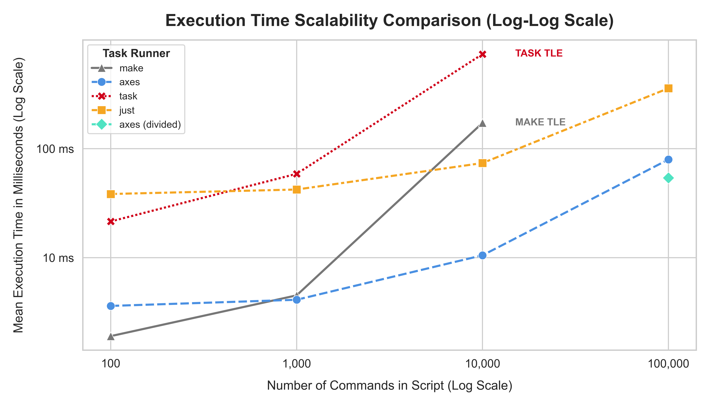
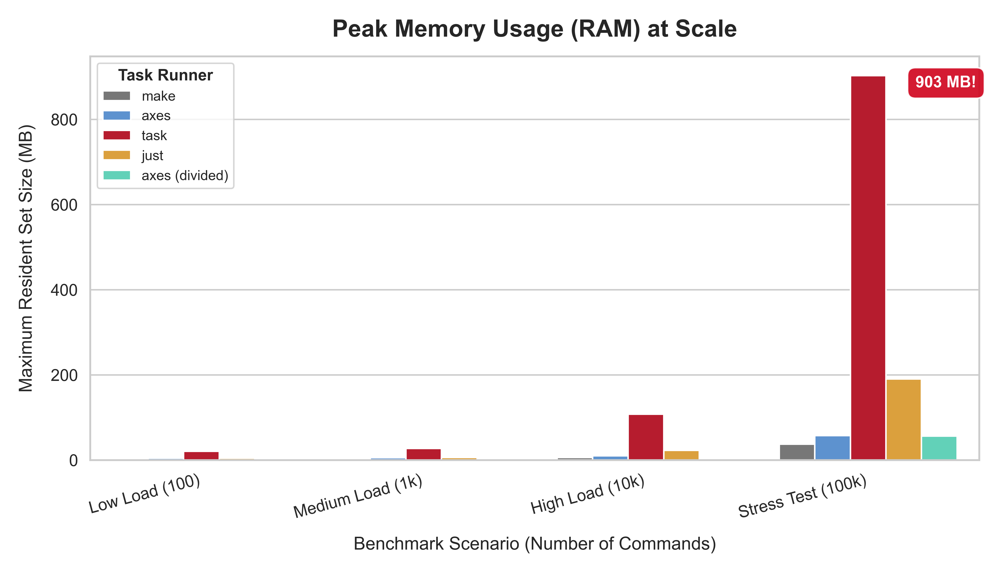

# Benchmarks de Rendimiento de `axes`

Este documento proporciona un análisis exhaustivo del rendimiento de `axes` en comparación con otros ejecutores de tareas populares. El objetivo es validar empíricamente nuestra filosofía de diseño: **ofrecer orquestación avanzada a una velocidad y eficiencia líderes en su clase.**

Todos los benchmarks se ejecutaron utilizando `hyperfine` para la precisión estadística y `/usr/bin/time -v` para el análisis detallado del uso de recursos.

## Entorno de Prueba

* **SO:** Linux (a través de WSL2 en Windows 11)
* **Hardware:** Intel Core i7-1165G7, 16GB RAM, NVMe SSD
* **Herramientas:**
  * `axes`: v0.3.0-beta
  * `just`: 1.43.0
  * `make`: GNU Make 4.3
  * `task`: v3.45.4

## El Arnés de Benchmarks: Usando `axes` en la Práctica

Para asegurar que nuestros benchmarks sean reproducibles y fáciles de ejecutar, hemos creado un potente arnés de benchmarks **utilizando el propio `axes`**. La configuración reside en [`examples/stress_tests/.axes/axes.toml`](../../examples/stress_tests/.axes/axes.toml) y es un ejemplo perfecto de las características avanzadas de `axes`.

### Cómo Ejecutar los Benchmarks Usted Mismo

1. **Navegue al directorio de ejemplos:**

    ```sh
    cd examples/
    ```

2. **Use el script `hyperfine`:** El proyecto `stress_tests` define un script `hyperfine` que actúa como un wrapper flexible. Puede seleccionar qué pruebas ejecutar usando flags.

    ```sh
    # Ejecuta un benchmark comparativo para el escenario de "carga alta"
    # -ah: axes-high, -jh: just-high, -mh: make-high, -th: task-high
    # --high: Usa la configuración de alta intensidad de hyperfine (100 ejecuciones)
    axes stress_tests/hyperfine -ah -jh -mh -th --high
    ```

3. **Use el script `time`:** Para obtener un uso detallado de memoria y recursos para una sola ejecución.

    ```sh
    # Obtener el uso de recursos para axes en la prueba de "carga alta"
    axes stress_tests/time -ah
    ```

## 1. Latencia de Inicio

El tiempo de inicio es crítico para la "sensación" de una herramienta CLI. Este benchmark mide el tiempo que se tarda en simplemente imprimir la versión (`--version`).

| Herramienta | Tiempo Promedio (Media ± σ) | Velocidad Relativa |
| :--- | :---: | :---: |
| `make` | **813.1 µs ± 54.7 µs** | **1.21x Más Rápido** |
| `just` | 980.6 µs ± 127.2 µs | 1.00x |
| **`axes`** | **982.9 µs ± 94.5 µs** | **1.00x** (Línea Base) |
| `task` | 13.7 ms ± 0.5 ms | 13.9x Más Lento |

### Análisis

`axes` logra un tiempo de inicio inferior al milisegundo, haciéndolo sentir instantáneo. Esto es un resultado directo de nuestra arquitectura de **inicialización explícita**, donde las operaciones costosas como cargar el índice global se difieren hasta que se ejecuta un comando que realmente las necesita. Para comandos simples como `--version`, no ocurre ninguna E/S de disco.

---

## 2. Rendimiento de Ejecución y Eficiencia de Memoria a Escala

Esta es la verdadera prueba de la arquitectura de un ejecutor de tareas. Medimos tanto el tiempo de ejecución como el pico de uso de memoria en cuatro cargas de trabajo diferentes, desde un script simple hasta una prueba de estrés extrema.

| Escenario de Benchmark |    Herramienta   | Tiempo (Media)  |  Pico de Memoria |
|:-----------------------|:----------------:|:---------------:|:---------------:|
|    **Carga Baja**      |   `make`   | **~1.9 ms** | **~2.4 MB**     |
|    (100 comandos)      | **`axes`** |   ~3.6 ms     |   ~4.6 MB     |
|                        |   `task`   |   ~21.5 ms    |   ~20.4 MB    |
|                        |   `just`   |   ~38.4 ms    |   ~4.5 MB     |
|     ―――――――――          |     ――     |    ――――――     |    ――――――     |
|  **Carga Media**       | **`axes`** | **~4.1 ms** | **~5.5 MB**     |
|    (1k comandos)       |   `make`   |   ~4.5 ms     |   ~2.7 MB     |
|                        |   `just`   |   ~42.2 ms    |   ~6.1 MB     |
|                        |   `task`   |   ~58.8 ms    |   ~27.5 MB    |
|     ―――――――――          |     ――     |    ――――――     |    ――――――     |
|   **Carga Alta**       | **`axes`** | **~10.5 ms**| **~10.0 MB**    |
|    (10k comandos)      |   `just`   |   ~73.9 ms    |   ~23.1 MB    |
|                        |   `make`   |   ~172.8 ms   |   ~5.9 MB     |
|                        |   `task`   |   ~740.2 ms   |   ~107.6 MB   |
|     ―――――――――          |     ――     |    ――――――     |    ――――――     |
|  **Prueba de Estrés**  |   `axes`   |   ~79.6 ms    |   ~57.6 MB    |
|   (100k comandos)      | **`axes`(dividido)** | **~54.0 ms**| **~56.2 MB**    |
|                        |   `just`   |   ~359.1 ms   |   ~190.7 MB   |
|                        |   `make`   | *TLE (>90s)*  |   ~37.6 MB    |
|                        |   `task`   | *TLE (>90s)*  |   ~903.1 MB   |

* **TLE:** Límite de Tiempo Excedido (Time Limit Exceeded). La herramienta no pudo completar el benchmark.

### Lo que Dicen los Datos

#### **La Curva de Escalabilidad**





Los benchmarks revelan un estado claro sobre el diseño arquitectónico:

1. **Tareas Simples (`Carga Baja`):** `make`, escrito en C, es el campeón indiscutible de la sobrecarga mínima. Su velocidad de ejecución pura es fenomenal para scripts triviales. `axes` es altamente competitivo, mientras que `just` y `task` muestran una significativa sobrecarga de inicio/parseo incluso para tareas simples.

2. **El Punto de Cruce (`Carga Media`):** A mil comandos, la arquitectura de `axes` comienza a dar sus frutos. El costo único de deserializar su AST binario es ahora menor que el costo de `make` al parsear su `Makefile` basado en texto. **`axes` toma la delantera.**

3. **Dominio a Escala (`Carga Alta` y `Prueba de Estrés`):** A medida que aumenta la complejidad, el rendimiento de las herramientas que parsean texto en cada ejecución (`make`, `just`) se degrada significativamente. El rendimiento y el uso de memoria de `task` colapsan por completo, probablemente debido a una representación interna ineficiente del script. En contraste, el rendimiento de `axes` escala de manera casi lineal. Su modelo **AOT + JIT** demuestra ser drásticamente superior:
    * **Tiempo:** En la prueba más extrema, `axes` es **4.5 veces más rápido** que su competidor más cercano y órdenes de magnitud más rápido que las herramientas que no lograron completarla.
    * **Memoria:** `axes` demuestra una eficiencia de memoria excepcional. Utiliza **15.7 veces menos memoria** que `task`, que se dispara a casi un gigabyte de RAM. Esto es un resultado directo de nuestro motor de parámetros de cero copia y la representación compacta del AST.

## Conclusión: Una Arquitectura Construida para la Complejidad

Estos benchmarks validan empíricamente los principios de diseño centrales de `axes`:

* **La Compilación AOT es Superior:** Pagar el costo del parseo una vez en un formato binario es arquitectónicamente superior a volver a parsear texto en cada ejecución, especialmente a escala.
* **La Eficiencia de Memoria Importa:** Un enfoque en operaciones de cero copia y estructuras de datos eficientes permite a `axes` manejar cargas de trabajo masivas que hacen que otras herramientas fallen.
* **La Escalabilidad es una Característica:** `axes` no es solo rápido—está diseñado para *permanecer* rápido a medida que sus proyectos crecen de un puñado de scripts a miles de comandos orquestados.

`axes` proporciona las características de un orquestador de alto nivel con el rendimiento y la eficiencia de recursos de un ejecutor de bajo nivel, ofreciendo una solución sin compromisos.
