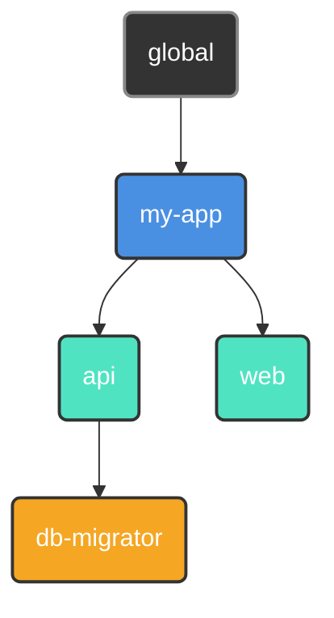

<p align="center">
  
</p>

<p align="center">
  <a href="#"></a>
  <a href="https://github.com/retypeos/axes/releases"></a>
  <a href="https://deepwiki.com/RetypeOS/axes"></a>
  <a href="https://github.com/retypeos/axes/blob/main/LICENSE"></a>

</p>

<p align="center">
  <strong>Read this in other languages:</strong><br>
  <a href="../../README.md">English</a> •
  <a href="./README.md">Español</a>
</p>

> **Nota:** Esta traducción es mantenida principalmente por la comunidad y podría no estar completamente sincronizada con la [versión en inglés](../../README.md), que es la fuente canónica de la documentación.


<h1 align="center">axes: La Capa de Orquestación Universal para tu Flujo de Desarrollo</h1>

<p align="center">
  <strong>El poder de un orquestador, la velocidad de un ejecutor. Construido en Rust.</strong>
</p>

<p align="center">
  <strong>axes</strong> es un orquestador de flujos de trabajo de alto rendimiento que unifica proyectos complejos y políglotas bajo una interfaz de línea de comandos simple, consistente y ultrarrápida. Actúa como una capa de abstracción sobre tus herramientas existentes —desde <code>npm</code> y <code>docker</code> hasta otros <i>task runners</i>— proveyendo un lenguaje de comandos universal para todo tu ecosistema.
</p>

---

### El Problema: Fragmentación de Comandos

A medida que los proyectos crecen, el número y la variedad de comandos necesarios para operarlos explotan. Esta "fragmentación de comandos" crea una fricción constante:

- **Comandos Inconsistentes:** ¿En esta parte del monorepo usamos `npm test`, `pytest`, `cargo test` o `go test ./...`?
- **Gestión de Entornos:** ¿Qué entorno virtual (`venv`, `nvm`) debe activarse? ¿Qué archivo `.env` debe cargarse?
- **Scripts Frágiles:** Depender de scripts de `bash` o `PowerShell` para la lógica de negocio y el parseo de argumentos es una pesadilla de mantenimiento que no es portable entre sistemas operativos.

Esta carga cognitiva constante rompe el flujo de trabajo y ralentiza a los equipos. Los ejecutores de tareas simples ofrecen atajos, pero no resuelven el problema de orquestación subyacente. **`axes` está diseñado para resolverlo desde la raíz.**

### La Solución: Rendimiento y Orquestación, Unificados

Durante años, los desarrolladores se han enfrentado a un falso dilema: usar un ejecutor simple y rápido con características limitadas, o un orquestador potente pero lento y complejo. **`axes` elimina este compromiso.**

Ofrecemos capacidades avanzadas de orquestación a una velocidad que no solo es competitiva, sino líder en su clase. Nuestra arquitectura está diseñada para escalar con la complejidad de tu proyecto, manteniendo un rendimiento de élite donde otras herramientas flaquean.

| Comando (Inicio Mínimo)             | Tiempo Promedio (Media ± σ) | Velocidad Relativa |
|:------------------------------------|:---------------------------:|:------------------:|
| **`axes --version`**                | **17.1 ms ± 0.9 ms**        | **1.00**           |
| `just --version`                    | 32.7 ms ± 2.8 ms            | 1.92x Más Lento    |
| `task --version`                    | 107.1 ms ± 11.8 ms          | 6.28x Más Lento    |

| Comando (Ejecución Caliente, Alta Carga) | Tiempo Promedio (Media ± σ) | Velocidad Relativa |
|:-----------------------------------------|:---------------------------:|:------------------:|
| **`axes <script>`**                      | **40.2 ms ± 1.1 ms**        | **1.00**           |
| `just <script>`                          | 73.6 ms ± 2.7 ms            | 1.83x Más Lento    |
| `task <script>`                          | 855.1 ms ± 50.2 ms          | 21.28x Más Lento   |

*En una prueba de estrés extrema con más de 100.000 comandos, `axes` completa en **~118 ms**, mientras que `task` tarda más de **33 segundos**—una diferencia de rendimiento de casi **300x**.*

> Benchmarks ejecutados con `hyperfine` en Windows 11 (i7-1165G7, 16GB RAM, NVMe SSD).
> La prueba de "Alta Carga" involucra un script con 10.000 comandos. La metodología completa y los resultados para todas las plataformas se encuentran en nuestro archivo
> [BENCHMARKS.md](./examples/BENCHMARKS.md).

Este nivel de rendimiento es el resultado directo de una **arquitectura obsesionada con la eficiencia**:

1. **Carga Perezosa y Paralela:** `axes` lee y compila solo la configuración que necesita, y lo hace de forma concurrente, aprovechando todos los núcleos de CPU disponibles.

2. **Compilación Anticipada (AOT) a un AST Universal:** En la primera ejecución, tus archivos `axes.toml` se compilan en un **Árbol de Sintaxis Abstracta (AST)** altamente optimizado y agnóstico a la plataforma. Este AST universal se guarda luego en una caché binaria compacta, que es **100% portable entre sistemas operativos** (Windows, macOS, Linux).

3. **Ejecución Optimizada Just-in-Time (JIT):** Cada ejecución posterior ("caliente") omite por completo el parseo lento de texto. `axes` deserializa el AST universal desde la caché binaria, realiza una **especialización "JIT"** ultrarrápida en memoria para tu SO actual y ejecuta la lista de comandos plana resultante al instante.

**El resultado es una garantía de ingeniería: pagas el coste de la orquestación una vez. Obtienes el máximo rendimiento escalable en cada ejecución posterior.**

- ⚙️ **[Análisis de Arquitectura en Profundidad (`TECHNICAL.md`)](./TECNICAL.md):** Para aquellos interesados en la ingeniería detrás de nuestro rendimiento.

---

### La Filosofía `axes`: Principios de Diseño para Flujos de Trabajo Modernos

`axes` se basa en una fundación que las herramientas simples ignoran.

#### 1. Orquestación sobre Ejecución

Los proyectos no viven aislados; tienen relaciones. `axes` te permite organizar tus proyectos en un **árbol lógico**, donde los hijos heredan y pueden anular la configuración de sus padres (scripts, variables, entorno).



*Un script `deploy` definido en `my-app` está disponible para `api` y `web`, pero `db-migrator` puede tener su propia versión especializada.*

#### 2. Ergonomía sobre Atajos

Tus scripts se convierten en aplicaciones de línea de comandos de primera clase, completas con documentación, parámetros, valores por defecto y validación, todo declarado en tu `axes.toml`.

```toml
# en .axes/toml
[scripts]
# 1. Parámetro posicional requerido.
test = "pytest --env <params::0(required)>"

# 2. Parámetro nombrado con un valor por defecto y mapeo solo de valor.
build = "docker build . -t my-app:<params::tag(alias='-t', map='', default='latest')>"

# 3. Script multilínea con un parámetro posicional requerido, entrecomillado, y una rama opcional.
push = [
  "git add .",
  "git commit <params::0(map='-m ', required, literal)>",
  "git push origin <params::branch(alias='-b', map='', default='main')>"
]
```

```sh
# --- Script: test ---
axes test production   # -> Ejecuta: pytest --env production
axes test              # -> ERROR: El argumento posicional en el índice 0 es requerido.

# --- Script: build ---
axes build                 # -> Ejecuta: docker build . -t my-app:latest
axes build --tag v1.2.0    # -> Ejecuta: docker build . -t my-app:v1.2.0
axes build -t v1.2.0       # -> Ejecuta: docker build . -t my-app:v1.2.0

# --- Script: push ---
axes push "Nueva característica" # Ejecuta 'git push origin main' (usa la rama por defecto)
axes push "Arreglar bug" -b fix # Ejecuta 'git push origin fix' (usa el alias de rama)
axes push                       # ERROR: El argumento posicional en el índice 0 (mensaje de commit) es requerido.
```

Di adiós a los scripts `bash` frágiles para parsear argumentos.

#### 3. Robustez por Diseño

`axes` identifica los proyectos por un `UUID` inmutable, no por una ruta de archivo volátil. Renombra o mueve tus directorios de proyecto libremente—`axes` nunca perderá el rastro de tus proyectos. Esto hace que la refactorización de grandes monorepos sea trivial y segura.

---

### `axes` en Acción: Un Vistazo al Poder

#### 1. Comandos Universales y Conscientes del Contexto

Ejecuta un script en el directorio actual. La sintaxis es simple y predecible.

```sh
# Ejecuta el script 'build' definido en el axes.toml más cercano
$ axes build --release

# Ejecuta el script 'test' en un subproyecto específico.
$ axes my-app/api test
```

#### 2. Flujos de Trabajo Multiplataforma y DRY

Define constantes como variables y reutilízalas en tus scripts.

```toml
[vars]
host = "http://localhost:8080" # Definido una vez.

[scripts.browse]
desc    = "Abre la documentación local en el navegador."
windows = "start <vars::host>" # Reutiliza la variable.
macos   = "open <vars::host>"
linux   = "xdg-open <vars::host>"
```

#### 3. Valores Dinámicos en Tiempo Real

Ejecuta comandos y usa su salida instantáneamente como variables.

```toml
[scripts]
# Etiqueta una imagen Docker con el hash git corto actual
tag_release = "docker tag my-app:latest my-app:<run('git rev-parse --short HEAD')>"
```

#### 4. Sesiones de Enfoque Inmersivo

Sumérgete en un subproyecto. `axes` configura y desmonta tu entorno por ti.

```toml
# en my-app/api/.axes/axes.toml
[options]
at_start = "source .venv/bin/activate" # Se ejecuta al entrar en la sesión.
at_exit  = "docker-compose down"       # Se ejecuta al salir.
```

```sh
$ axes my-app/api start  # Inicia una sesión. `at_start` se ejecuta automáticamente.

(axes: my-app/api) $ axes test  # Ya no necesitas repetir el contexto.
(axes: my-app/api) $ exit       # `at_exit` se ejecuta al salir.
```

**Tu entorno de desarrollo, bajo demanda.**

### Ejemplo Avanzado: Orquestando un Monorepo Políglota

Imagina un monorepo con un backend Python (`Poetry`) y un frontend React (`npm`). `axes` unifica la experiencia de desarrollo.

**Estructura del Proyecto:**

```sh
mi-monorepo/
├── web/                 (Aplicación React)
│   ├── ...
│   └── .axes/axes.toml
├── api/                 (Aplicación Python/FastAPI)
│   ├── ...
│   └── .axes/axes.toml
└── .axes/axes.toml      (Raíz/Configuración Heredada)
```

**`mi-monorepo/.axes/axes.toml` (Raíz)**

```toml
[vars]
DOCKER_REGISTRY = "registry.my-company.com"
APP_NAME = "mi-monorepo"

[scripts]
# Un script 'lint' que delega la ejecución en paralelo y modo silencioso.
lint = [
    "@> axes web lint",
    "@> axes api lint",
]
```

**`mi-monorepo/api/.axes/axes.toml` (Backend)**

```toml
[scripts]
lint = "poetry run ruff check ."
run = "poetry run uvicorn app.main:app --reload"
build = "docker build . -t <vars::DOCKER_REGISTRY>/<vars::APP_NAME>-api:latest"
```

**`mi-monorepo/web/.axes/axes.toml` (Frontend)**

```toml
[scripts]
lint = "npm run lint"
run = "npm run dev"
build = "docker build . -t <vars::DOCKER_REGISTRY>/<vars::APP_NAME>-web:latest"
```

El comando `axes lint`, ejecutado desde la raíz, ahora ejecutará los linters de ambos subproyectos **simultáneamente**, mostrando solo la salida de los linters mismos.

### Modificadores de Comando: Control Total sobre la Ejecución

`axes` te da un control granular sobre cómo se ejecuta cada comando usando prefijos simples:

- `# Mensaje...`: **Comentario/Impresión.** Imprime el texto en la consola en lugar de ejecutarlo. Perfecto para mostrar mensajes de estado.
  - En lugar de usar: `echo 'Iniciando construcción...'` - Lento, ineficiente y puede requerir un parseo especial.
  - Puedes usar: `# Iniciando construcción...` - Más simple y respeta el contenido en sí.

- `@ <comando>`: **Modo Silencioso.** El comando se ejecuta, pero `axes` no imprimirá el comando en sí en la consola. Útil para tareas de limpieza o scripts ruidosos.
  - `@ rm -rf ./cache`

- `- <comando>`: **Ignorar Errores.** Si el comando falla (código de salida distinto de cero), `axes` continuará con el siguiente comando en el script en lugar de detenerse.
  - `- docker stop old-container`

- `> <comando>`: **Ejecución Paralela.** Agrupa este comando con los comandos `>` subsiguientes en un lote que se ejecuta concurrentemente. `axes` espera a que termine todo el lote antes de continuar.

```toml
[scripts.test-all]
run = [
    "# --- Iniciando todas las pruebas en paralelo ---",
    "> axes api test",
    "> axes web test",
    "> axes integration test",
    "# --- Todas las pruebas completadas ---"
]
```

Los modificadores se pueden combinar en cualquier orden (ej., `@-` o `->@`) para una orquestación potente y precisa.

**El Flujo de Trabajo Unificado:**

- `axes lint`: Desde la raíz, ejecuta el linting en **ambos** subproyectos en paralelo.
- `axes api run`: Inicia solo el servidor API.
- `axes web build`: Construye solo la imagen Docker del frontend, utilizando variables globales.

`axes` crea un **lenguaje cohesivo** sobre un conjunto de herramientas heterogéneas, haciendo que la experiencia de desarrollo sea predecible y simple, sin importar la complejidad del stack.

## Instalación y Garantía Arquitectónica

`axes` es un único binario sin dependencias diseñado para la **confianza arquitectónica**. La misma experiencia de alto rendimiento está garantizada en **Windows, macOS y Linux**.

1. **Descargar:** Ve a la [**página de Releases de `axes`**](https://github.com/retypeos/axes/releases) y descarga el binario para tu sistema.
2. **Colocar en PATH:** Extrae el ejecutable y muévelo a un directorio en el `PATH` de tu sistema.
3. **Verificar:** Abre una **nueva terminal** y ejecuta `axes --version`.

Nuestra arquitectura única **AOT + JIT** produce una **caché binaria agnóstica a la plataforma**. Esto significa que tu equipo puede subir el directorio `.axes-cache` al control de versiones. Si un desarrollador en Windows compila la configuración, sus compañeros en macOS y Linux se beneficiarán instantáneamente de las ejecuciones "calientes", omitiendo el coste inicial de compilación.

---

## Confianza Arquitectónica

`axes` está diseñado con **confianza arquitectónica** gracias a su fundación en Rust y su sistema de caché único.

- **Garantía de Ingeniería:** La lógica central, el **Compilador AST** y el motor de ejecución están diseñados para ser **agnósticos a la plataforma**. La velocidad superior que obtienes de la **Compilación Anticipada (AOT)** es consistente en todos los sistemas operativos.

- **Característica de Colaboración en Equipo:** `axes` crea una caché binaria optimizada que puede ser **compartida entre diferentes sistemas operativos** (ej., a través de una unidad de red o una carpeta de proyecto compartida). Si un desarrollador compila el flujo de trabajo en Windows, otro desarrollador en Linux se beneficia instantáneamente de la **Ruta de Ejecución Caliente**, omitiendo el costoso parseo inicial.

Probamos y mejoramos continuamente la experiencia en todas las plataformas. Si encuentras algún problema específico de la plataforma, por favor [**Abre un Issue**](https://github.com/retypeos/axes/issues).

---

### Próximos Pasos: Dirige Tu Propia Orquesta

La fricción que sientes cada día no es un requisito. Es un problema con solución. `axes` es esa solución.

- ➡️ **[Guía de Inicio Rápido (`GETTING_STARTED.md`)](./GETTING_STARTED.md):** Construye tu primer monorepo orquestado en 15 minutos.
- 📖 **[Dominando `axes.toml` (`AXES_TOML_GUIDE.md`)](./AXES_TOML_GUIDE.md):** La referencia definitiva para cada característica y sintaxis.
- ⌨️ **[Referencia de Comandos (`COMMANDS.md`)](./COMMANDS.md):** Una guía completa de todos los comandos de la CLI (`init`, `register`, `tree`, etc.).

---

### Es Hora de Mejorar Tus Flujos de Trabajo y Ser Productivo de Nuevo

`axes` es más que una herramienta; es un proyecto de código abierto dedicado a restaurar el control, la consistencia y el rendimiento en el desarrollo. Tu voz y apoyo son cruciales.

- **Encontraste un Bug o Tienes una Gran Idea:** [**Abre un Issue**](https://github.com/retypeos/axes/issues). Valoramos cada pieza de feedback.
- **¿Quieres Contribuir con Código?:** Los Pull Requests son siempre bienvenidos. Consulta nuestras [Guías de Contribución](./CONTRIBUTING.md) para empezar.

#### Apoya el Desarrollo de `axes`

Estamos obsesionados con el rendimiento, la robustez y una excelente experiencia de desarrollador. Tu apoyo financiero nos permite dedicar tiempo y recursos para mantener este nivel de excelencia y acelerar nuestra hoja de ruta.

Los fondos se utilizan directamente para:

- **Compensar a los desarrolladores principales** por su dedicación al mantenimiento y desarrollo de nuevas características.
- **Cubrir los costes de infraestructura CI/CD**, incluyendo la futura adición de runners de macOS y Linux.
- **Priorizar características arquitectónicas mayores**, como el caché de artefactos.

Cada contribución, desde un agradecimiento simbólico hasta el patrocinio corporativo, es combustible esencial para nuestro motor de desarrollo.

➡️ **[Apóyanos en Open Collective](https://opencollective.com/retypeos)**

*(Estamos en proceso de solicitar GitHub Sponsors. ¡Gracias por hacer posible `axes`!)*

---

**Instala `axes` hoy. Deja de recordar comandos. Empieza a construir.**
