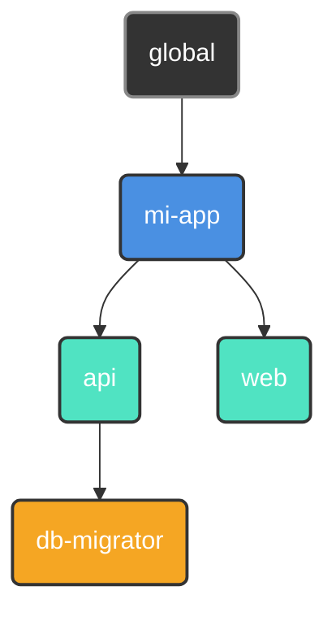

<p align="center">
  
</p>

<p align="center">
  <a href="#"></a>
  <a href="https://github.com/retypeos/axes/releases"></a>
  <a href="https://deepwiki.com/RetypeOS/axes"></a>
  <a href="https://github.com/retypeos/axes/blob/main/LICENSE"></a>

</p>

<p align="center">
  <strong>Read this in other languages:</strong><br>
  <a href="../../README.md">English</a> •
  <a href="./README.md">Español</a>
</p>

> **Nota:** Esta traducción es mantenida principalmente por la comunidad y podría no estar completamente sincronizada con la [versión en inglés](../../README.md), que es la fuente canónica de la documentación.


<h1 align="center">axes: La Capa de Orquestación Universal para tu Flujo de Desarrollo</h1>

<p align="center">
  <strong>El poder de un orquestador, la velocidad de un ejecutor. Construido en Rust.</strong>
</p>

<p align="center">
  <strong>axes</strong> es un orquestador de tareas en flujos de trabajo de alto rendimiento que unifica proyectos complejos y políglotas bajo una interfaz de línea de comandos simple, consistente y ultrarrápida. Actúa como una capa de abstracción sobre tus herramientas existentes —desde <code>npm</code> y <code>docker</code> hasta otros <i>task runners</i>— proveyendo un lenguaje de comandos universal para todo tu ecosistema.
</p>

---

### El Problema: Fragmentación de Comandos

A medida que los proyectos crecen, el número y la variedad de comandos necesarios para operarlos explotan. Esta "fragmentación de comandos" crea fricción constante:

- **Comandos Inconsistentes:** En esta parte del monorepo, ¿usamos `npm test`, `pytest`, `cargo test`, o `go test ./...`?
- **Gestión de Entorno:** ¿Qué entorno virtual (`venv`, `nvm`) necesita ser activado? ¿Qué archivo `.env` necesita ser cargado?
- **Scripts Frágiles:** Depender de scripts de `bash` o `PowerShell` para la lógica de negocio y el parseo de argumentos es una pesadilla de mantenimiento que no es portátil entre sistemas operativos.

Esta carga cognitiva constante rompe el flujo de trabajo y ralentiza a los equipos. Los simples ejecutores de tareas ofrecen atajos, pero no resuelven el problema subyacente de la orquestación. `axes` está diseñado para resolverlo desde la raíz.

### La Solución: Rendimiento y Orquestación, Unificados

Durante años, los desarrolladores se han enfrentado a un falso dilema: usar un ejecutor simple y rápido, o un orquestador potente pero lento. **`axes` elimina este compromiso.**

Nuestra arquitectura está diseñada no solo para la velocidad, sino para la **escalabilidad**. `axes` mantiene un rendimiento de élite y un uso mínimo de recursos incluso cuando la complejidad del proyecto crece, un dominio donde otras herramientas flaquean. Los siguientes benchmarks, ejecutados en Linux (WSL2), demuestran este principio.

#### **Rendimiento de Ejecución y Eficiencia de Memoria a Escala**

A medida que aumenta el número de comandos en un script, las ventajas arquitectónicas de `axes` se vuelven claras.

| Escenario de Benchmark |    Herramienta   | Tiempo (Media)  |  Pico de Memoria |
|:-----------------------|:----------------:|:---------------:|:---------------:|
|    **Carga Baja**      |   `make`   | **~1.9 ms** | **~2.4 MB**     |
|    (100 comandos)      | **`axes`** |   ~3.6 ms     |   ~4.6 MB     |
|                        |   `task`   |   ~21.5 ms    |   ~20.4 MB    |
|                        |   `just`   |   ~38.4 ms    |   ~4.5 MB     |
|     ―――――――――          |     ――     |    ――――――     |    ――――――     |
|  **Carga Media**       | **`axes`** | **~4.1 ms** | **~5.5 MB**     |
|    (1k comandos)       |   `make`   |   ~4.5 ms     |   ~2.7 MB     |
|                        |   `just`   |   ~42.2 ms    |   ~6.1 MB     |
|                        |   `task`   |   ~58.8 ms    |   ~27.5 MB    |
|     ―――――――――          |     ――     |    ――――――     |    ――――――     |
|   **Carga Alta**       | **`axes`** | **~10.5 ms**| **~10.0 MB**    |
|    (10k comandos)      |   `just`   |   ~73.9 ms    |   ~23.1 MB    |
|                        |   `make`   |   ~172.8 ms   |   ~5.9 MB     |
|                        |   `task`   |   ~740.2 ms   |   ~107.6 MB   |
|     ―――――――――          |     ――     |    ――――――     |    ――――――     |
|  **Prueba de Estrés**  |   `axes`   |   ~79.6 ms    |   ~57.6 MB    |
|   (100k comandos)      | **`axes`(dividido)** | **~54.0 ms**| **~56.2 MB**    |
|                        |   `just`   |   ~359.1 ms   |   ~190.7 MB   |
|                        |   `make`   | *TLE (>90s)*  |   ~37.6 MB    |
|                        |   `task`   | *TLE (>90s)*  |   ~903.1 MB   |

> Nota: "`axes`(dividido)" significa que los scripts se dividieron, 50k para sí mismo y 50k para su primer ancestro. Esto demuestra que cuanto más se dividan las tareas entre proyectos padre superiores, mejor será la velocidad.

<p align="center">
  <sub>
    <b>TLE:</b> Límite de Tiempo Excedido (Time Limit Exceeded). La herramienta no pudo completar el benchmark en un tiempo razonable.<br>
    Benchmarks ejecutados con <code>hyperfine</code> y <code>/usr/bin/time -v</code> en Linux (WSL2 en Windows 11, i7-1165G7, 16GB RAM).<br>
    La metodología y resultados completos están en nuestro <a href="./BENCHMARKS.md"><code>BENCHMARKS.md</code></a>.
  </sub>
</p>

Los datos revelan una clara ventaja arquitectónica:

- **Escalabilidad:** Aunque `make` es el más rápido para tareas triviales, su rendimiento se degrada exponencialmente con la complejidad. `axes` exhibe un escalado casi lineal, haciéndolo dramáticamente más rápido y la única opción confiable para la orquestación a gran escala.
- **Eficiencia de Memoria:** `axes` es excepcionalmente ligero. En la prueba más exigente, usa **3.3 veces menos memoria** que `just` y una asombrosa **15.7 veces menos memoria** que `task`, el cual consume casi un gigabyte de RAM antes de fallar.

Este nivel de rendimiento es el resultado directo de una **arquitectura obsesionada con la eficiencia**:

1. **Compilación Anticipada (AOT) a un AST Universal:** Sus archivos `axes.toml` se compilan una sola vez en un caché binario agnóstico a la plataforma.
2. **Ejecución Optimizada Just-in-Time (JIT):** Las ejecuciones subsiguientes deserializan el caché y realizan una especialización ultrarrápida en memoria para su SO, eliminando la sobrecarga de parseo y toma de decisiones de la ruta caliente.

**El resultado es una garantía de ingeniería: usted obtiene rendimiento escalable y la mejor eficiencia de memoria de su clase, sin importar cuán complejos se vuelvan sus flujos de trabajo.**

- ⚙️ **[Análisis Arquitectónico en Profundidad (`TECHNICAL.md`)](./TECHNICAL.md):** Para aquellos interesados en la ingeniería detrás de nuestro rendimiento.

---

### La Filosofía `axes`: Principios de Diseño para Flujos de Trabajo Modernos

`axes` se construye sobre una base que las herramientas simples ignoran.

#### 1. Orquestación sobre Ejecución

Los proyectos no viven aislados; tienen relaciones. `axes` le permite organizar sus proyectos en un **árbol lógico**, donde los hijos heredan y pueden anular la configuración de sus padres (scripts, variables, entorno).



*Un script `deploy` definido en `mi-app` está disponible para `api` y `web`, pero `db-migrator` puede tener su propia versión especializada.*

#### 2. Ergonomía sobre Atajos

Sus scripts se convierten en aplicaciones de línea de comandos de primera clase, completas con documentación, parámetros, valores por defecto y validación—todo declarado en su `axes.toml`.

```toml
# en .axes/toml
[scripts]
# 1. Parámetro posicional requerido.
test = "pytest --env <params::0(required)>"

# 2. Parámetro nombrado con un valor por defecto y mapeo de solo valor.
build = "docker build . -t mi-app:<params::tag(alias='-t', map='', default='latest')>"

# 3. Script multilínea con un parámetro posicional requerido y entrecomillado y una rama opcional.
push = [
  "git add .",
  "git commit <params::0(map='-m ', required, literal)>",
  "git push origin <params::branch(alias='-b', map='', default='main')>"
]
```

```sh
# --- Script: test ---
axes test production   # -> Ejecuta: pytest --env production
axes test              # -> ERROR: El argumento posicional en el índice 0 es requerido.

# --- Script: build ---
axes build                 # -> Ejecuta: docker build . -t mi-app:latest
axes build --tag v1.2.0    # -> Ejecuta: docker build . -t mi-app:v1.2.0
axes build -t v1.2.0       # -> Ejecuta: docker build . -t mi-app:v1.2.0

# --- Script: push ---
axes push "Nueva característica" # Ejecuta 'git push origin main' (usa la rama por defecto)
axes push "Arreglar bug" -b fix # Ejecuta 'git push origin fix' (usa el alias de rama)
axes push                  # ERROR: El argumento posicional en el índice 0 (mensaje de commit) es requerido.
```

Diga adiós a los scripts frágiles de `bash` para el parseo de argumentos.

#### 3. Robustez por Diseño

`axes` identifica los proyectos por un `UUID` inmutable, no por una ruta de archivo volátil. Renombre o mueva sus directorios de proyecto libremente—`axes` nunca perderá el rastro de sus proyectos. Esto hace que la refactorización de monorepos grandes sea trivial y segura.

---

### `axes` en Acción: Un Vistazo al Poder

#### 1. Comandos Universales y Conscientes del Contexto

Ejecute un script en el directorio actual. La sintaxis es simple y predecible.

```sh
# Ejecuta el script 'build' definido en el axes.toml más cercano
$ axes build --release

# Ejecuta el script 'test' en un sub-proyecto específico.
$ axes mi-app/api/test
```

#### 2. Flujos de Trabajo Multiplataforma y DRY

Defina constantes como variables y reutilícelas en sus scripts.

```toml
[vars]
host = "http://localhost:8080" # Definido una vez.

[scripts.browse]
desc    = "Abre la documentación local en el navegador."
windows = "start <vars::host>" # Reutiliza la variable.
macos   = "open <vars::host>"
linux   = "xdg-open <vars::host>"
```

#### 3. Valores Dinámicos en Tiempo Real

Ejecute comandos y use su salida instantáneamente como variables.

```toml
[scripts]
# Etiqueta una imagen de Docker con el hash corto de git actual
tag_release = "docker tag my-app:latest my-app:<run('git rev-parse --short HEAD')>"
```

#### 4. Sesiones de Enfoque Inmersivo

Sumérjase en un sub-proyecto. `axes` configura y desmantela su entorno por usted.

```toml
# en mi-app/api/.axes/axes.toml
[options]
at_start = "source .venv/bin/activate" # Se ejecuta al entrar a la sesión.
at_exit  = "docker-compose down"       # Se ejecuta al salir.
```

```sh
$ axes mi-app/api start  # Inicia una sesión. `at_start` se ejecuta automáticamente.

(axes: mi-app/api) $ axes test  # Ya no necesita repetir el  y el enrutado ahora es relativo.
(axes: mi-app/api) $ exit       # `at_exit` se ejecuta al salir.
```

**Su entorno de desarrollo, bajo demanda.**

### Ejemplo Avanzado: Orquestando un Monorepo Políglota

Imagine un monorepo con un backend Python (`Poetry`) y un frontend React (`npm`). `axes` unifica la experiencia de desarrollo.

**Estructura del Proyecto:**

```sh
mi-monorepo/
├── web/                 (Aplicación React)
│   ├── ...
│   └── .axes/axes.toml
├── api/                 (Aplicación Python/FastAPI)
│   ├── ...
│   └── .axes/axes.toml
└── .axes/axes.toml      (Raíz/Config. Heredada)
```

**`mi-monorepo/.axes/axes.toml` (Raíz)**

```toml
[vars]
DOCKER_REGISTRY = "registry.my-company.com"
APP_NAME = "mi-monorepo"

[scripts]
# Un script 'lint' que delega la ejecución en paralelo y modo silencioso.
lint = [
    "@> axes web/lint",
    "@> axes api/lint",
]
```

**`mi-monorepo/api/.axes/axes.toml` (Backend)**

```toml
[scripts]
lint = "poetry run ruff check ."
run = "poetry run uvicorn app.main:app --reload"
build = "docker build . -t <vars::DOCKER_REGISTRY>/<vars::APP_NAME>-api:latest"
```

**`mi-monorepo/web/.axes/axes.toml` (Frontend)**

```toml
[scripts]
lint = "npm run lint"
run = "npm run dev"
build = "docker build . -t <vars::DOCKER_REGISTRY>/<vars::APP_NAME>-web:latest"
```

El comando `axes lint`, ejecutado desde la raíz, ahora ejecutará los linters de ambos subproyectos **simultáneamente**, mostrando solo la salida de los linters mismos.

### Modificadores de Comando: Control Total sobre la Ejecución

`axes` le da un control granular sobre cómo se ejecuta cada comando utilizando prefijos simples:

- `# Mensaje...`: **Comentario/Impresión.** Imprime el texto en la consola en lugar de ejecutarlo. Perfecto para mostrar mensajes de estado.

- `@ <comando>`: **Modo Silencioso.** El comando se ejecuta, pero `axes` no imprimirá el comando en sí en la consola. Útil para tareas de limpieza o scripts ruidosos.
  - `@ rm -rf ./cache`

- `- <comando>`: **Ignorar Errores.** Si el comando falla (código de salida no cero), `axes` continuará con el siguiente comando en el script en lugar de detenerse.
  - `- docker stop old-container`

- `> <comando>`: **Ejecución Paralela.** Agrupa este comando con los comandos subsiguientes con `>` en un lote que se ejecuta concurrentemente. `axes` espera a que todo el lote termine antes de avanzar.

```toml
[scripts.test-all]
run = [
    "# --- Iniciando todas las pruebas en paralelo ---",
    "> axes api/test",
    "> axes web/test",
    "> axes integration run test", # Forma base con `run`.
    "# --- Todas las pruebas completadas ---"
]
```

Los modificadores pueden combinarse en cualquier orden (ej. `@-` o `->@`) para una orquestación potente y precisa.

**El Flujo de Trabajo Unificado:**

- `axes lint`: Desde la raíz, ejecuta el linting en **ambos** subproyectos en paralelo.
- `axes api/run`: Inicia solo el servidor de la API.
- `axes web/build`: Construye solo la imagen Docker del frontend, utilizando variables globales.

`axes` crea un **lenguaje cohesivo** sobre un conjunto de herramientas heterogéneas, haciendo que la experiencia de desarrollo sea predecible y simple, sin importar la complejidad del stack.

## Instalación y Garantía Arquitectónica

`axes` es un único binario sin dependencias diseñado para la **confianza arquitectónica**. La misma experiencia de alto rendimiento está garantizada en **Windows, macOS y Linux**.

1. **Descargar:** Vaya a la [**página de Releases de `axes`**](https://github.com/retypeos/axes/releases) y obtenga el binario para su sistema.
2. **Colocar en PATH:** Extraiga el ejecutable y muévalo a un directorio en el `PATH` de su sistema.
3. **Verificar:** Abra una **nueva terminal** y ejecute `axes --version`.

Nuestra arquitectura única **AOT + JIT** produce un **caché binario agnóstico a la plataforma**. Esto significa que su equipo puede hacer commit del directorio `.axes-cache` al control de versiones. Si un desarrollador en Windows compila la configuración, sus compañeros en macOS y Linux se beneficiarán instantáneamente de las ejecuciones "calientes", saltándose el costo inicial de compilación.

Continuamente probamos y mejoramos la experiencia en todas las plataformas. Si encuentra algún problema específico de la plataforma, por favor [**Abra un Issue**](https://github.com/retypeos/axes/issues).

---

### Próximos Pasos: Dirija Su Propia Orquesta

La fricción que siente cada día no es un requisito. Es un problema con una solución. `axes` es esa solución.

- ➡️ **[Guía de Inicio Rápido (`GETTING_STARTED.md`)](./GETTING_STARTED.md):** Construya su primer monorepo orquestado en 15 minutos.
- 📖 **[Dominando el `axes.toml` (`AXES_TOML_GUIDE.md`)](./AXES_TOML_GUIDE.md):** La referencia definitiva para cada característica y sintaxis.
- ⌨️ **[Referencia de Comandos (`COMMANDS.md`)](./COMMANDS.md):** Una guía completa de todos los comandos CLI (`init`, `register`, `tree`, etc.).

---

### Es Hora de Mejorar sus Flujos de Trabajo y Volver a ser Productivo

`axes` es más que una herramienta; es un proyecto de código abierto dedicado a restaurar el control, la consistencia y el rendimiento en el desarrollo. Su voz y apoyo son cruciales.

- **Encuentre un Bug o Tenga una Idea Genial:** [**Abra un Issue**](https://github.com/retypeos/axes/issues). Valoramos cada fragmento de feedback.
- **¿Quiere Contribuir con Código?:** Los Pull Requests son siempre bienvenidos. Consulte nuestras [Pautas de Contribución](./CONTRIBUTING.md) para empezar.

#### Apoye el Desarrollo de `axes`

Estamos obsesionados con el rendimiento, la robustez y una excelente experiencia para el desarrollador. Su apoyo financiero nos permite dedicar tiempo y recursos para mantener este nivel de excelencia y acelerar nuestra hoja de ruta.

Los fondos se utilizan directamente para:

- **Compensar a los desarrolladores principales** por su dedicación al mantenimiento y desarrollo de nuevas características.
- **Cubrir los costos de infraestructura CI/CD**, incluyendo la futura adición de runners de macOS y Linux.
- **Priorizar características arquitectónicas mayores**, como el caché de artefactos.

Cada contribución, desde un agradecimiento simbólico hasta un patrocinio corporativo, es combustible esencial para nuestro motor de desarrollo.

➡️ **[Apóyenos en Open Collective](https://opencollective.com/retypeos)**

*(Estamos en proceso de solicitar GitHub Sponsors. ¡Gracias por hacer posible `axes`!)*

---

**Instale `axes` hoy. Deje de recordar comandos. Empiece a construir.**
