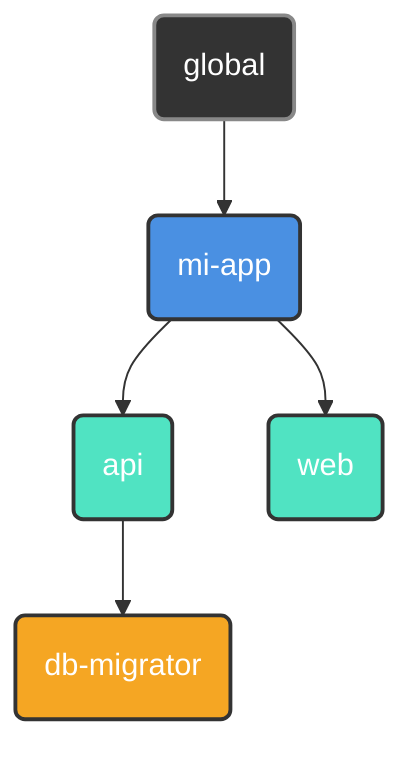

<p align="center">
  
</p>

<p align="center">
  <a href="#"></a>
  <a href="https://github.com/retypeos/axes/releases"></a>
  <a href="https://deepwiki.com/RetypeOS/axes"></a>
  <a href="https://github.com/retypeos/axes/blob/main/LICENSE"></a>

</p>

<p align="center">
  <strong>Read this in other languages:</strong><br>
  <a href="../../README.md">English</a> •
  <a href="./README.md">Español</a>
</p>

> **Nota:** Esta traducción es mantenida principalmente por la comunidad y podría no estar completamente sincronizada con la [versión en inglés](../../README.md), que es la fuente canónica de la documentación.


<h1 align="center">axes: La Capa de Orquestación Universal para tu Flujo de Desarrollo</h1>

<p align="center">
  <strong>El poder de un orquestador, la velocidad de un ejecutor. Construido en Rust.</strong>
</p>

<p align="center">
  <strong>axes</strong> es un orquestador de flujos de trabajo de alto rendimiento que unifica proyectos complejos y políglotas bajo una interfaz de línea de comandos simple, consistente y ultrarrápida. Actúa como una capa de abstracción sobre tus herramientas existentes —desde <code>npm</code> y <code>docker</code> hasta otros <i>task runners</i>— proveyendo un lenguaje de comandos universal para todo tu ecosistema.
</p>

---

### El Problema: La Fragmentación de Comandos

A medida que los proyectos crecen, la cantidad y variedad de comandos necesarios para operarlos se dispara. Esta "fragmentación de comandos" crea una fricción constante:

- **Comandos Inconsistentes:** ¿En esta parte del monorepo se usa `npm test`, `pytest`, `cargo test` o `go test ./...`?
- **Gestión de Entornos:** ¿Qué entorno virtual (`venv`, `nvm`) debe activarse? ¿Qué archivo `.env` necesita ser cargado?
- **Scripts Frágiles:** Depender de scripts de `bash` o `PowerShell` para la lógica de negocio y el parseo de argumentos es una pesadilla de mantenimiento que no es portable entre sistemas operativos.

Esta carga cognitiva constante interrumpe el flujo de trabajo y ralentiza a los equipos. Los ejecutores de tareas simples ofrecen atajos, pero no resuelven el problema de orquestación subyacente. `axes` está diseñado para solucionarlo desde la raíz.

### La Solución: Rendimiento y Orquestación, Unificados

Durante años, la elección ha sido un falso dilema: usar un ejecutor simple y rápido con funcionalidades limitadas, o un orquestador potente pero lento y complejo. **`axes` elimina este compromiso.**

Ofrecemos capacidades de orquestación avanzadas a una velocidad que rivaliza, y a menudo supera, a los ejecutores más populares del ecosistema Rust.

| Comando (Ejecución en Caliente) | Media [ms] (± σ) | Mín … Máx [ms] | Velocidad Relativa |
|:---|:---:|:---:|:---:|
| **`axes <script>`** | **41.8 ± 1.9** | 38.1 … 45.9 | **1.00** |
| `just <script>` | 44.7 ± 4.0 | 38.0 … 57.9 | 1.07x más lento |
| `task <script>` | 79.9 ± 9.3 | 60.9 … 99.2 | 1.91x más lento |
| --- | --- | --- | --- |
| **`axes --version` (Arranque)** | **19.6 ± 1.8** | 16.6 … 25.3 | **1.00** |
| `just --version` (Arranque) | 24.4 ± 3.5 | 18.7 … 35.1 | 1.25x más lento |
| `task --version` (Arranque) | 69.0 ± 9.0 | 54.9 … 90.8 | 3.52x más lento |

*Benchmarks realizados con `hyperfine` en una máquina de desarrollo con especificaciones: (Aspire A315-58, Windows 11, 11th Gen Intel(R) Core(TM) i7-1165G7 @ 2.80GHz (2.80 GHz), Intel(R) Iris(R) Xe Graphics (128mb), 16GB RAM, SSD NVMe). Cada comando se ejecutó 50 veces tras un calentamiento de 5 ejecuciones.*

Este rendimiento no es casualidad, es el resultado de una **arquitectura obsesionada con la eficiencia**:

1. **Carga Perezosa y Paralela:** `axes` solo carga del disco la configuración que necesita, y lo hace en paralelo.
2. **Caché de AST Pre-compilado:** En la primera ejecución, tus archivos `axes.toml` se compilan a un **Árbol de Sintaxis Abstracta (AST)** optimizado. Este AST se guarda en una caché binaria compacta.
3. **Ejecuciones en Caliente Instantáneas:** Las siguientes ejecuciones omiten por completo el costoso parseo de texto. `axes` deserializa el AST pre-compilado desde la caché binaria —una operación órdenes de magnitud más rápida— y lo ejecuta al instante.

**El resultado: pagas el coste de la orquestación una sola vez. Obtienes la velocidad de un ejecutor simple en cada ejecución posterior.**

- ⚙️ **[Análisis a Fondo de la Arquitectura (`TECHNICAL.md`)](./TECNICAL.md):** Para aquellos interesados en la ingeniería detrás de nuestro rendimiento.

---

### La Filosofía `axes`: Principios de Diseño para Flujos de Trabajo Modernos

`axes` se construye sobre una base de principios que las herramientas simples ignoran.

#### 1. Orquestación sobre Ejecución

Los proyectos no viven aislados; tienen relaciones. `axes` te permite organizar tus proyectos en un **árbol lógico**, donde los hijos heredan y pueden sobreescribir la configuración (scripts, variables, entorno) de sus padres.



*Un script `deploy` definido en `mi-app` está disponible para `api` y `web`, pero `db-migrator` puede tener su propia versión especializada.*

#### 2. Ergonomía sobre Atajos

Tus scripts se convierten en aplicaciones de línea de comandos de primera clase, con documentación, parámetros, valores por defecto y validación, todo de forma declarativa.

```toml
# en .axes/axes.toml
[scripts]
# 1. Parámetro posicional requerido:
#    Falla si no se provee un entorno.
test = "pytest --env <params::0(required)>"

# 2. Parámetro nombrado con valor por defecto:
#    Usa '--tag latest' si no se especifica.
build = "docker build . -t my-app:<params::tag(map='', default='latest')>"
```

```sh
axes test production   # Pasa --env production a pytest
axes test              # ERROR: El parámetro 0 es requerido.

axes build --tag v1.2.0  # Construye la imagen my-app:v1.2.0
axes build               # Construye la imagen my-app:latest
```

Di adiós a los frágiles scripts de `bash` para parsear argumentos.

#### 3. Robustez por Diseño

`axes` identifica los proyectos mediante un **UUID** inmutable, no una ruta de archivo volátil. Renombra o mueve los directorios de tus proyectos con total libertad: el índice de `axes` es auto-reparable y nunca perderá la pista de tus proyectos. Esto hace que la refactorización de grandes monorepos sea trivial y segura.

### `axes` en Acción: Un Vistazo al Poder

#### 1. Gramática Universal y Consciente del Contexto

La sintaxis es simple y predecible.

```sh
# Ejecuta el script 'build' en el contexto del proyecto actual.
$ axes build --release

# Ejecuta el script 'test' en un sub-proyecto específico.
$ axes mi-app/api test
```

#### 2. Flujos de Trabajo Multiplataforma y DRY

Define constantes como variables y reutilízalas en tus scripts.

```toml
[vars]
host = "http://localhost:8080" # Definido una sola vez.

[scripts.browse]
desc    = "Abre la documentación local en el navegador."
windows = "start <vars::host>" # Reutiliza la variable.
macos   = "open <vars::host>"
linux   = "xdg-open <vars::host>"
```

#### 3. Valores Dinámicos en Tiempo Real

Ejecuta comandos y utiliza su salida como variables al instante.

```toml
[scripts]
# Etiqueta una imagen de Docker con el hash corto del commit actual de git.
tag_release = "docker tag mi-app:latest mi-app:<run('git rev-parse --short HEAD')>"
```

#### 4. Sesiones de Trabajo Inmersivas

Sumérgete en un sub-proyecto. `axes` configura y desmonta tu entorno por ti.

```toml
# en mi-app/api/.axes/axes.toml
[options]
at_start = "source .venv/bin/activate" # Se ejecuta al entrar en la sesión.
at_exit  = "docker-compose down"       # Se ejecuta al salir.
```

```sh
$ axes my-app/api start  # Inicia una sesión. `at_start` se ejecuta.

(axes: mi-app/api) $ axes test  # Ya no necesitas repetir el contexto.
(axes: mi-app/api) $ exit       # `at_exit` se ejecuta al salir.
```

**Tu entorno de desarrollo, bajo demanda.**

### Ejemplo Avanzado: Orquestando un Monorepo Políglota

Imagina un monorepo con un backend en Python (`Poetry`) y un frontend en React (`npm`). `axes` unifica la experiencia de desarrollo.

**Estructura del Proyecto:**

```sh
mi-monorepo/
├── web/                 (React App)
│   ├── ...
│   └── .axes/axes.toml
├── api/                 (Python/FastAPI App)
│   ├── ...
│   └── .axes/axes.toml
└── .axes/axes.toml      (Configuración Raíz/Heredada)
```

**`mi-monorepo/.axes/axes.toml` (Raíz)**

```toml
[vars]
DOCKER_REGISTRY = "registry.mi-empresa.com"
APP_NAME = "mi-monorepo"

[scripts]
# Un script 'lint' que delega la ejecución en paralelo y en modo silencioso.
lint = [
    "@> axes web lint",
    "@> axes api lint",
]
```

**`mi-monorepo/api/.axes/axes.toml` (Backend)**

```toml
[scripts]
lint = "poetry run ruff check ."
run = "poetry run uvicorn app.main:app --reload"
build = "docker build . -t <vars::DOCKER_REGISTRY>/<vars::APP_NAME>-api:latest"
```

**`mi-monorepo/web/.axes/axes.toml` (Frontend)**

```toml
[scripts]
lint = "npm run lint"
run = "npm run dev"
build = "docker build . -t <vars::DOCKER_REGISTRY>/<vars::APP_NAME>-web:latest"
```

El comando `axes lint` ejecutado desde la raíz ahora correrá los linters de ambos sub-proyectos **simultáneamente**, mostrando solo la salida de los propios linters.

### Modificadores de Comandos: Control Total sobre la Ejecución

`axes` te da un control granular sobre cómo se ejecuta cada comando mediante prefijos simples:

- `# <texto>`: **Comentario/Impresión.** Imprime el texto en la consola en lugar de ejecutarlo. Perfecto para mostrar mensajes de estado.
  - envés de usar: `echo 'Iniciando construcción...'` - Lento, ineficiente y puede requerir parsing especial.
  - Puedes usar: `# Iniciando construcción...`        - Más simple y respeta el contenido.

- `@ <comando>`: **Modo Silencioso.** El comando se ejecuta, pero `axes` no imprimirá el propio comando en la consola. Útil para tareas de limpieza o scripts ruidosos.
  - `@ rm -rf ./cache`

- `- <comando>`: **Ignorar Errores.** Si el comando falla (código de salida no cero), `axes` continuará con el siguiente comando en el script en lugar de detenerse.
  - `- docker stop contenedor-antiguo`

- `> <comando>`: **Ejecución en Paralelo.** `axes` agrupará todos los comandos subsecuentes marcados con (`>`) en un batch donde los ejecutará simultáneamente, esperando a que todos terminen antes de continuar con el siguiente comando secuencial.
  - `# --- Iniciando tests ---`
  - `> axes api test`
  - `> axes web test`
  - `# --- Todos los tests completados ---`

Estos modificadores pueden combinarse, como en el ejemplo `lint` (`@>`), para una orquestación potente y precisa.

**El Flujo de Trabajo Unificado:**

- `axes lint`: Desde la raíz, ejecuta el linting en **ambos** sub-proyectos de forma paralela.
- `axes api run`: Inicia solo el servidor de la API.
- `axes web build`: Construye solo la imagen Docker del frontend, usando las variables globales.

`axes` crea un **lenguaje cohesivo** sobre un conjunto de herramientas heterogéneas, haciendo que la experiencia de desarrollo sea predecible y simple, sin importar la complejidad del stack.

### Instalación

`axes` es un único binario sin dependencias.

#### Windows

La instalación en Windows es la vía recomendada y soportada oficialmente.

1. Ve a la página de [**Releases de `axes` en GitHub**](https://github.com/retypeos/axes/releases).
2. Descarga el archivo `.zip` para Windows (ej. `axes-x86_64-pc-windows-msvc.zip`).
3. Descomprime el archivo y mueve el ejecutable `axes.exe` a un directorio incluido en tu `PATH` del sistema.
4. Abre una **nueva terminal** y verifica la instalación con `axes --version`.

#### macOS y Linux (Soporte Experimental)

Actualmente, no ofrecemos binarios pre-compilados para macOS o Linux debido a la falta de infraestructura de CI y testeo para estas plataformas. En teoría, `axes` debería funcionar correctamente, ya que está construido con Rust, pero **no podemos garantizar su estabilidad**.

La comunidad es bienvenida a probarlo y reportar cualquier problema. La única vía de instalación por el momento es compilar desde el código fuente.

**Compilación desde el Código Fuente:**

1. Asegúrate de tener instalada la [cadena de herramientas de Rust](https://rustup.rs/) (`rustc`, `cargo`).
2. Clona el repositorio:

    ```sh
    git clone https://github.com/retypeos/axes.git
    cd axes
    ```

3. (Opcional) Seleccionar Idioma: `axes` incluye traducciones. Puedes incrustar un idioma específico en el binario estableciendo la variable de entorno `AXES_LANG` antes de compilar, si no se especifica se usa el inglés por defecto.

    ```sh
    # Para compilar con la interfaz en español
    export AXES_LANG='es' 
    ```

4. Compila en modo `release` para obtener el máximo rendimiento:

    ```sh
    cargo build --release
    ```

5. El binario final se encontrará en `target/release/axes`. Cópialo a una ubicación en tu `PATH` (ej. `/usr/local/bin`).

---

### Siguientes Pasos: Conduce tu Propia Orquesta

La fricción que sientes cada día no es un requisito. Es un problema con una solución. `axes` es esa solución.

- ➡️ **[Guía de Inicio Rápido (`GETTING_STARTED.md`)](./GETTING_STARTED.md):** Construye tu primer monorepo orquestado en 15 minutos.
- 📖 **[Dominando `axes.toml` (`AXES_TOML_GUIDE.md`)](./AXES_TOML_GUIDE.md):** La referencia definitiva para cada característica y sintaxis.
- ⌨️ **[Referencia de Comandos (`COMMANDS.md`)](./COMMANDS.md):** Una guía completa de todos los comandos CLI (`init`, `register`, `tree`, etc.).

---

### Es momento de mejorar tus Flujos de Trabajo y volver a ser productivos

`axes` es más que una herramienta; es un proyecto de código abierto dedicado a restaurar el control, la consistencia y el rendimiento en el desarrollo de software. Tu voz y tu apoyo son cruciales.

- **Encuentra un Bug o Tienes una Gran Idea:** [**Abre un Issue**](https://github.com/retypeos/axes/issues). Valoramos cada pieza de feedback.
- **¿Quieres Contribuir con Código?:** Los Pull Requests son siempre bienvenidos. Consulta nuestras [Guías de Contribución](./CONTRIBUTING.md) para empezar.

#### Apoya el Desarrollo de `axes`

Estamos obsesionados con el rendimiento, la robustez y una excelente experiencia de desarrollador. Tu apoyo financiero nos permite dedicar tiempo y recursos para mantener este nivel de excelencia y acelerar nuestro roadmap.

Los fondos se utilizan directamente para:

- **Compensar a los desarrolladores principales** por su dedicación al mantenimiento y al desarrollo de nuevas características.
- **Cubrir los costes de infraestructura de CI/CD**, incluyendo la futura adición de runners para macOS y Linux.
- **Priorizar características arquitecturales mayores**, como el cacheo de artefactos.

Cada contribución, desde un agradecimiento simbólico hasta un patrocinio corporativo, es combustible esencial para nuestro motor de desarrollo.

➡️ **[Apóyanos en Open Collective](https://opencollective.com/retypeos)**

*(Estamos en proceso de aplicar para GitHub Sponsors. ¡Gracias por hacer posible `axes`!)*

---

**Instala `axes` hoy. Deja de recordar comandos. Empieza a construir.**
