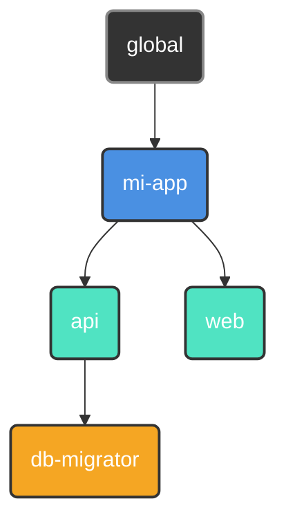

<p align="center">
  
</p>

<p align="center">
  <a href="#"></a>
  <a href="https://github.com/retypeos/axes/releases"></a>
  <a href="https://deepwiki.com/RetypeOS/axes"></a>
  <a href="https://github.com/retypeos/axes/blob/main/LICENSE"></a>

</p>

<p align="center">
  <strong>Read this in other languages:</strong><br>
  <a href="../../README.md">English</a> •
  <a href="./README.md">Español</a>
</p>

> **Nota:** Esta traducción es mantenida principalmente por la comunidad y podría no estar completamente sincronizada con la [versión en inglés](../../README.md), que es la fuente canónica de la documentación.


<h1 align="center">axes: La Capa de Orquestación Universal para tu Flujo de Desarrollo</h1>

<p align="center">
  <strong>El poder de un orquestador, la velocidad de un ejecutor. Construido en Rust.</strong>
</p>

<p align="center">
  <strong>axes</strong> es un orquestador de flujos de trabajo de alto rendimiento que unifica proyectos complejos y políglotas bajo una interfaz de línea de comandos simple, consistente y ultrarrápida. Actúa como una capa de abstracción sobre tus herramientas existentes —desde <code>npm</code> y <code>docker</code> hasta otros <i>task runners</i>— proveyendo un lenguaje de comandos universal para todo tu ecosistema.
</p>

---

### El Problema: Fragmentación de Comandos

A medida que los proyectos crecen, la cantidad y variedad de comandos necesarios para operarlos explota. Esta "fragmentación de comandos" crea fricción constante:

- **Comandos Inconsistentes:** ¿En esta parte del monorepo usamos `npm test`, `pytest`, `cargo test` o `go test ./...`?
- **Gestión del Entorno:** ¿Qué entorno virtual (`venv`, `nvm`) necesita activarse? ¿Qué archivo `.env` necesita cargarse?
- **Scripts Frágiles:** Confiar en *scripts* de `bash` o `PowerShell` para la lógica de negocio y el análisis de argumentos es una pesadilla de mantenimiento que no es portable entre sistemas operativos.

Esta carga cognitiva constante rompe el flujo de trabajo y ralentiza a los equipos. Los simples *task runners* ofrecen atajos, pero no resuelven el problema subyacente de la orquestación. `axes` está diseñado para resolverlo desde la raíz.

### La Solución: Rendimiento y Orquestación, Unificados

Durante años, la elección fue un falso dilema: usar un *runner* simple y rápido con características limitadas, u un orquestador potente pero lento y complejo. **`axes` elimina este compromiso.**

Ofrecemos capacidades avanzadas de orquestación a una velocidad que rivaliza, y a menudo supera, a los ejecutores más populares del ecosistema Rust.

| Comando (Ejecución en Caché) | Promedio [ms] (± σ) | Mín … Máx [ms] | Velocidad Relativa |
|:---|:---:|:---:|:---:|
| **`axes <script>`** | **41.8 ± 1.9** | 38.1 … 45.9 | **1.00** |
| `just <script>` | 44.7 ± 4.0 | 38.0 … 57.9 | 1.07x más lento |
| `task <script>` | 79.9 ± 9.3 | 60.9 … 99.2 | 1.91x más lento |
| --- | --- | --- | --- |
| **`axes --version` (Inicio)** | **19.6 ± 1.8** | 16.6 … 25.3 | **1.00** |
| `just --version` (Inicio) | 24.4 ± 3.5 | 18.7 … 35.1 | 1.25x más lento |
| `task --version` (Inicio) | 69.0 ± 9.0 | 54.9 … 90.8 | 3.52x más lento |

*Benchmarks ejecutados con `hyperfine` en una máquina de desarrollo estándar con especificaciones: (Aspire A315-58, Windows 11, Intel(R) Core(TM) i7-1165G7 @ 2.80GHz (2.80 GHz), Intel(R) Iris(R) Xe Graphics (128mb), 16GB RAM, SSD NVMe). Cada comando fue ejecutado 50 veces después de un calentamiento de 5 ejecuciones.*

Este rendimiento no es accidental; es el resultado de una **arquitectura obsesionada con la eficiencia**:

1. **Carga Perezosa y Paralela:** `axes` solo carga la configuración que necesita desde el disco, y lo hace en paralelo.
2. **Caché de AST Precompilado:** En la primera ejecución, tus archivos `axes.toml` se compilan en un **Árbol de Sintaxis Abstracta (AST)** altamente optimizado. Este AST se guarda en una caché binaria compacta.
3. **Ejecuciones en Caché Instantáneas:** Cada ejecución posterior omite por completo el costoso análisis de texto. `axes` deserializa el AST precompilado desde la caché binaria—una operación órdenes de magnitud más rápida que el análisis de texto—y lo ejecuta instantáneamente.

**El resultado: pagas el coste de la orquestación una vez. Obtienes la velocidad de un ejecutor simple cada vez después.**

- ⚙️ **[Análisis Detallado de la Arquitectura (`TECHNICAL.md`)](./TECNICAL.md)**: Para aquellos interesados en la ingeniería detrás de nuestro rendimiento.

---

### La Filosofía de `axes`: Principios de Diseño para Flujos de Trabajo Modernos

`axes` se construye sobre una base que las herramientas simples ignoran.

#### 1. Orquestación sobre Ejecución

Los proyectos no viven aislados; tienen relaciones. `axes` te permite organizar tus proyectos en un **árbol lógico**, donde los hijos heredan y pueden anular la configuración de sus padres (scripts, variables, entorno).



*Un *script* `deploy` definido en `my-app` está disponible para `api` y `web`, pero `db-migrator` puede tener su propia versión especializada.*

#### 2. Ergonomía sobre Atajos

Tus *scripts* se convierten en aplicaciones de línea de comandos de primera clase, completas con documentación, parámetros, valores por defecto y validación, todo de forma declarativa.

```toml
# en .axes/axes.toml
[scripts]
# 1. Parámetro posicional requerido:
#    Falla si no se proporciona un entorno.
test = "pytest --env <params::0(required)>"

# 2. Parámetro nombrado con valor por defecto:
#    Usa '--tag latest' si no se especifica.
build = "docker build . -t my-app:<params::tag(map='', default='latest')>"
```

```sh
axes test production   # Pasa --env production a pytest
axes test              # ERROR: El parámetro 0 es requerido.

axes build --tag v1.2.0  # Construye la imagen my-app:v1.2.0
axes build               # Construye la imagen my-app:latest
```

Di adiós a los *scripts* de `bash` frágiles para analizar argumentos.

#### 3. Robustez por Diseño

`axes` identifica los proyectos mediante un `UUID` inmutable, no una ruta de archivo volátil. Renombra o mueve libremente los directorios de tus proyectos—`axes` nunca perderá la pista de tus proyectos. Esto hace que la refactorización de monorepos grandes sea trivial y segura.

---

### `axes` en Acción: Un Vistazo al Poder

#### 1. Comandos Universales y Conscientes del Contexto

Ejecuta un *script* en el directorio actual. La sintaxis es simple y predecible.

```sh
# Ejecuta el script 'build' definido en el axes.toml más cercano
$ axes build --release

# Ejecuta el script 'test' en un sub-proyecto específico.
$ axes my-app/api test
```

#### 2. Flujos de Trabajo Multiplataforma y DRY

Define constantes como variables y reutilízalas en tus *scripts*.

```toml
[vars]
host = "http://localhost:8080" # Definido una vez.

[scripts.browse]
desc    = "Abre la documentación local en el navegador."
windows = "start <vars::host>" # Reutiliza la variable.
macos   = "open <vars::host>"
linux   = "xdg-open <vars::host>"
```

#### 3. Valores Dinámicos en Tiempo Real

Ejecuta comandos y usa su salida instantáneamente como variables.

```toml
[scripts]
# Etiqueta una imagen Docker con el hash corto de git actual
tag_release = "docker tag my-app:latest my-app:<run('git rev-parse --short HEAD')>"
```

#### 4. Sesiones de Enfoque Inmersivas

Sumérgete en un sub-proyecto. `axes` configura y desmantela tu entorno por ti.

```toml
# en my-app/api/.axes/axes.toml
[options]
at_start = "source .venv/bin/activate" # Se ejecuta al entrar en la sesión.
at_exit  = "docker-compose down"       # Se ejecuta al salir.
```

```sh
$ axes my-app/api start  # Inicia una sesión. `at_start` se ejecuta automáticamente.

(axes: my-app/api) $ axes test  # Ya no necesitas repetir el contexto.
(axes: my-app/api) $ exit       # `at_exit` se ejecuta al salir.
```

**Tu entorno de desarrollo, bajo demanda.**

### Ejemplo Avanzado: Orquestando un Monorepo Políglota

Imagina un monorepo con un *backend* de Python (`Poetry`) y un *frontend* de React (`npm`). `axes` unifica la experiencia de desarrollo.

**Estructura del Proyecto:**

```sh
mi-monorepo/
├── web/                 (Aplicación React)
│   ├── ...
│   └── .axes/axes.toml
├── api/                 (Aplicación Python/FastAPI)
│   ├── ...
│   └── .axes/axes.toml
└── .axes/axes.toml      (Configuración Raíz/Heredada)
```

**`mi-monorepo/.axes/axes.toml` (Raíz)**

```toml
[vars]
DOCKER_REGISTRY = "registry.my-company.com"
APP_NAME = "mi-monorepo"

[scripts]
# Un script 'lint' que delega la ejecución en paralelo y en modo silencioso.
lint = [
    "@> axes web lint",
    "@> axes api lint",
]
```

**`mi-monorepo/api/.axes/axes.toml` (Backend)**

```toml
[scripts]
lint = "poetry run ruff check ."
run = "poetry run uvicorn app.main:app --reload"
build = "docker build . -t <vars::DOCKER_REGISTRY>/<vars::APP_NAME>-api:latest"
```

**`mi-monorepo/web/.axes/axes.toml` (Frontend)**

```toml
[scripts]
lint = "npm run lint"
run = "npm run dev"
build = "docker build . -t <vars::DOCKER_REGISTRY>/<vars::APP_NAME>-web:latest"
```

El comando `axes lint`, ejecutado desde la raíz, ejecutará ahora los linters de ambos sub-proyectos **simultáneamente**, mostrando solo la salida de los propios linters.

### Modificadores de Comando: Control Total sobre la Ejecución

`axes` te da un control granular sobre cómo se ejecuta cada comando usando prefijos simples:

- `# <texto>`: **Comentario/Imprimir.** Imprime el texto en la consola en lugar de ejecutarlo. Perfecto para mostrar mensajes de estado.
  - En lugar de usar: `echo 'Iniciando build...'` - Lento, ineficiente y puede requerir un análisis especial.
  - Puedes usar: `# Iniciando build...` - Más simple y respeta el contenido en sí mismo.

- `@ <comando>`: **Modo Silencioso.** El comando se ejecuta, pero `axes` no imprimirá el comando en sí en la consola. Útil para tareas de limpieza o *scripts* ruidosos.
  - `@ rm -rf ./cache`

- `- <comando>`: **Ignorar Errores.** Si el comando falla (código de salida distinto de cero), `axes` continuará con el siguiente comando en el *script* en lugar de detenerse.
  - `- docker stop old-container`

- `> <comando>`: **Ejecución Paralela.** `axes` agrupará todos los comandos subsiguientes prefijados con (`>`) en un lote donde se ejecutan simultáneamente, esperando a que todos terminen antes de proceder al siguiente comando secuencial.
  - `# --- Iniciando tests ---`
  - `> axes api test`
  - `> axes web test`
  - `# --- Todos los tests completados ---`

Estos modificadores se pueden combinar, como en el ejemplo de `lint` (`@>`), para una orquestación potente y precisa.

**El Flujo de Trabajo Unificado:**

- `axes lint`: Desde la raíz, ejecuta el *linting* de ambos sub-proyectos en paralelo.
- `axes api run`: Inicia solo el servidor de la API.
- `axes web build`: Construye solo la imagen Docker del *frontend*, usando variables globales.

`axes` crea un **lenguaje cohesivo** sobre un conjunto de herramientas heterogéneas, haciendo que la experiencia de desarrollo sea predecible y simple, sin importar la complejidad del *stack*.

## Instalación

`axes` se distribuye como un único binario de alto rendimiento sin dependencias externas, lo que garantiza una experiencia de instalación sin fricciones en todos los sistemas operativos principales.

---

### Soporte de Primera Clase: Windows, macOS y Linux

Estamos comprometidos a ofrecer la misma experiencia robusta y rápida en todas partes. Los binarios ahora se prueban y proporcionan para **Windows**, **macOS** y **Linux**.

1. **Descargar el Binario:** Ve a la página oficial de [**Releases de `axes` en GitHub**](https://github.com/retypeos/axes/releases).

2. **Seleccionar tu Sistema:** Descarga el archivo comprimido (`.zip` o `.tar.gz`) apropiado para tu sistema operativo y arquitectura:

    - `axes-x86_64-pc-windows-msvc.zip` (Windows)

    - `axes-x86_64-apple-darwin.tar.gz` (macOS)

    - `axes-x86_64-unknown-linux-gnu.tar.gz` (Linux)

3. **Colocar en PATH:**

    - **Descomprimir/Extraer** el archivo.

    - Mueve el ejecutable `axes` (o `axes.exe` en Windows) a un directorio incluido en el **`PATH`** de tu sistema (ej. `/usr/local/bin` en Linux/macOS, o un directorio personalizado que añadas a tu PATH en Windows).

4. **Verificar Instalación:** Abre una **nueva terminal** y ejecuta el siguiente comando para verificar la instalación:

    ```sh
    axes --version
    ```

---

## Confianza Arquitectónica y Caché Multiplataforma

`axes` está diseñado con **confianza arquitectónica** gracias a su base en Rust y su sistema de caché único.

- **Garantía de Ingeniería:** La lógica central, el **Compilador AST** y el motor de ejecución están diseñados para ser **agnósticos a la plataforma**. La velocidad superior que obtienes de la **Compilación AOT (Ahead-of-Time)** es consistente en todos los sistemas operativos.

- **Característica de Colaboración en Equipo:** `axes` crea una caché binaria optimizada que puede **compartirse entre diferentes sistemas operativos** (ej. a través de una unidad de red o una carpeta de proyecto compartida). Si un desarrollador compila el flujo de trabajo en Windows, otro desarrollador en Linux se beneficia instantáneamente de la **Ruta de Ejecución Caliente**, omitiendo el costoso análisis inicial.

Probamos y mejoramos continuamente la experiencia en todas las plataformas. Si encuentras algún problema específico de la plataforma, por favor [**Abre un *Issue***](https://github.com/retypeos/axes/issues).

---

### Próximos Pasos: Dirige Tu Propia Orquesta

La fricción que sientes cada día no es un requisito. Es un problema con solución. `axes` es esa solución.

- ➡️ **[Guía de Inicio Rápido (`GETTING_STARTED.md`)](./GETTING_STARTED.md)**: Construye tu primer monorepo orquestado en 15 minutos.
- 📖 **[Dominando `axes.toml` (`AXES_TOML_GUIDE.md`)](./AXES_TOML_GUIDE.md)**: La referencia definitiva para cada característica y sintaxis.
- ⌨️ **[Referencia de Comandos (`COMMANDS.md`)](./COMMANDS.md)**: Una guía completa de todos los comandos de la CLI (`init`, `register`, `tree`, etc.).

---

### Es Hora de Mejorar tus Flujos de Trabajo y Volver a Ser Productivo

`axes` es más que una herramienta; es un proyecto de código abierto dedicado a devolver el control, la consistencia y el rendimiento al desarrollo. Tu voz y apoyo son cruciales.

- **Encuentra un *Bug* o Tienes una Gran Idea:** [**Abre un *Issue***](https://github.com/retypeos/axes/issues). Valoramos cada comentario.
- **¿Quieres Contribuir con Código?:** ¡Los *Pull Requests* son siempre bienvenidos! Consulta nuestras [Directrices de Contribución](./CONTRIBUTING.md) para empezar.

#### Apoya el Desarrollo de `axes`

Estamos obsesionados con el rendimiento, la robustez y una excelente experiencia de desarrollador. Tu apoyo financiero nos permite dedicar tiempo y recursos a mantener este nivel de excelencia y acelerar nuestra hoja de ruta.

Los fondos se utilizan directamente para:

- **Compensar a los desarrolladores principales** por su dedicación al mantenimiento y al desarrollo de nuevas características.
- **Cubrir los costes de infraestructura de CI/CD**, incluida la futura adición de *runners* de macOS y Linux.
- **Priorizar características arquitectónicas importantes**, como el *caching* de artefactos.

Cada contribución, desde un agradecimiento simbólico hasta un patrocinio corporativo, es combustible esencial para nuestro motor de desarrollo.

➡️ **[Apóyanos en Open Collective](https://opencollective.com/retypeos)**

*(Estamos en proceso de solicitar GitHub Sponsors. ¡Gracias por hacer posible `axes`!)*

---

**Instala `axes` hoy. Deja de recordar comandos. Empieza a construir.**
