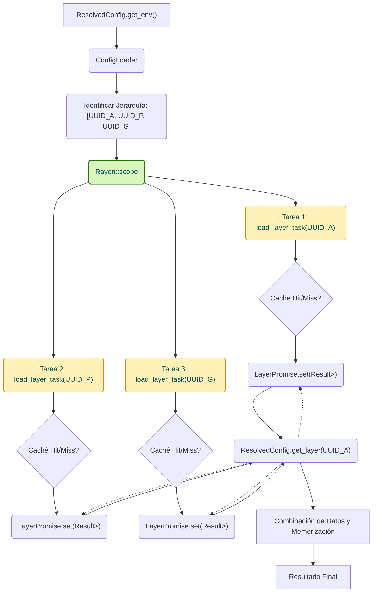

  <strong>Read this in other languages:</strong> 
  <a href="../../TECHNICAL.md">English</a> • 
  <a href="./TECHNICAL.md">Español</a>

> **Nota:** Esta traducción es mantenida por la comunidad y podría no estar completamente sincronizada con la [versión en inglés](../../TECNICAL.md), que es la fuente canónica de la documentación.

# 1. Introducción y Filosofía de Diseño

Este documento proporciona un análisis técnico profundo de la arquitectura interna de `axes`. A diferencia de la documentación de usuario, su propósito es detallar las decisiones de diseño, patrones de software y estrategias de optimización que permiten a `axes` alcanzar sus objetivos de rendimiento y robustez.

## 1.1. El Problema Técnico Abordado

Los ejecutores de tareas tradicionales operan sobre un modelo sin estado y basado en texto. Este enfoque, aunque simple, introduce cuellos de botella fundamentales a medida que la complejidad del proyecto escala:

1. **Sobrecarga de Parseo en la Ruta Caliente:** Cada ejecución requiere leer y parsear archivos de configuración de texto (ej. `Makefile`, `Justfile`, `package.json`), una operación intensiva en I/O y CPU que se repite innecesariamente.
2. **Gestión de Dependencias Implícita:** La relación entre diferentes componentes de un monorepo (ej. `api` depende de `common-lib`) no está formalizada, lo que conduce a flujos de trabajo frágiles y a la falta de herencia de configuración.
3. **Falta de Identidad Persistente:** La identificación de un proyecto basada en su ruta en el sistema de archivos es inherentemente volátil. Operaciones como renombrar o mover un directorio rompen los flujos de trabajo y las referencias.

`axes` fue diseñado desde cero para resolver estos problemas a nivel arquitectural.

### 1.2. Los Tres Pilares de la Arquitectura `axes`

La arquitectura de `axes` se sustenta en tres principios fundamentales que trabajan en sinergia para ofrecer un rendimiento de élite y una robustez estructural.

#### 1.2.1. Estado Centralizado y Persistente (`GlobalIndex`)

El núcleo de `axes` es un **índice global** (`GlobalIndex`), una base de datos binaria y compacta que actúa como la única fuente de verdad (`Single Source of Truth`) para todo el ecosistema de proyectos. Este índice mapea un **UUID inmutable** para cada proyecto a sus metadatos esenciales, como su ruta física, su nombre y su relación padre-hijo.

- **Rendimiento de Arranque:** Al utilizar un formato binario (`bincode`), la deserialización del índice completo en memoria es órdenes de magnitud más rápida que el parseo de un equivalente en formato de texto (JSON, TOML). Esto minimiza drásticamente la latencia de arranque en frío.
- **Robustez Estructural:** Al desacoplar la identidad lógica (UUID) de la ubicación física (ruta), el sistema se vuelve resiliente a cambios en el sistema de archivos.

#### 1.2.2. Carga Perezosa y Concurrente (El Patrón `Facade`)

`axes` opera bajo el principio de "trabajo mínimo indispensable". La lectura y compilación de los archivos `axes.toml` no ocurre al inicio. En su lugar, se construye una estructura ligera en memoria, la `ResolvedConfig`, que actúa como una **fachada** (`Facade Pattern`).

- **Resolución Bajo Demanda:** Los datos de configuración (scripts, variables, etc.) solo se cargan del disco y se combinan cuando un método como `get_script()` o `get_env()` es invocado por primera vez.
- **Concurrencia Optimizada:** El `ConfigLoader` utiliza un pool de hilos (`rayon`) para cargar y compilar las diferentes capas de la jerarquía de un proyecto de forma concurrente. La sincronización se gestiona eficientemente mediante promesas (`Arc<OnceLock<...>>`), asegurando que cada capa se compile una sola vez, incluso bajo demanda concurrente.

#### 1.2.3. Compilación Anticipada (AOT) y Caché de AST

Este es el pilar más crítico para el rendimiento en ejecuciones "calientes". `axes` no es un intérprete, es un compilador de flujos de trabajo con una caché persistente.

- **Compilación a AST:** En la primera ejecución ("ruta fría"), `axes` parsea los archivos `axes.toml` y compila los scripts y variables a una representación intermedia optimizada: un **Árbol de Sintaxis Abstracta (AST)**, materializado en nuestras `struct`s `Task`.
- **Caché Binaria por Capa:** Este AST, que ya es una estructura de datos nativa de Rust, se serializa a un archivo de caché binario (`.bin`). La clave de esta caché es un hash del contenido del archivo `axes.toml` original.
- **Ejecuciones Instantáneas ("Ruta Caliente"):** En ejecuciones subsecuentes, si el hash del `axes.toml` no ha cambiado, `axes` omite por completo el parseo de texto. Carga directamente el AST pre-compilado desde la caché binaria, eliminando el principal cuello de botella de rendimiento.

### 1.3. Diagrama de Flujo: Ruta Fría vs. Ruta Caliente

El siguiente diagrama ilustra la diferencia fundamental en el flujo de trabajo entre la primera ejecución de un script y las ejecuciones posteriores.

```mermaid
graph TD
    subgraph "Ciclo de Vida de la Configuración en `axes`"
        
        A["<br><b>Inicio</b><br>Comando `axes` ejecutado"] --> B{"<br>¿Hash de <code>axes.toml</code> coincide<br>con el hash en <code>GlobalIndex</code>?"}

        B -- "<b>❄️ No (Ruta Fría / Cache Miss)</b>" --> C_IO["<br><b>[I/O Disco + CPU]</b><br>1. Leer <code>axes.toml</code>"]
        C_IO --> C_CPU["<br><b>[CPU Intensivo]</b><br>2. Parsear TOML y Compilar Scripts a AST (`Task`)"]
        C_CPU --> D_IO["<br><b>[I/O Disco]</b><br>3. Serializar y Escribir AST en Caché Binaria (<code>.bin</code>)"]
        D_IO --> E["<br><b>[En Memoria]</b><br>Usar el AST recién compilado"]
        
        B -- "<b>🔥 Sí (Ruta Caliente / Cache Hit)</b>" --> H_IO["<br><b>[I/O Disco Mínimo]</b><br>1. Leer Caché Binaria (<code>.bin</code>)"]
        H_IO --> H_CPU["<br><b>[CPU Mínimo]</b><br>2. Deserializar AST desde binario"]
        H_CPU --> E
        
        E --> F["[No depende de `axes`]<br><b>Ejecución</b><br>El `TaskExecutor` opera sobre el AST en memoria"]
        F --> G["<br><b>Fin</b><br>"]

    end

    %% Nodos de bajo coste (operaciones en memoria, decisiones)
    style A fill:#e6f7ff,stroke:#0050b3,stroke-width:1px,color:#055
    style B fill:#e6f7ff,stroke:#0050b3,stroke-width:2px,color:#055
    style E fill:#e6f7ff,stroke:#0050b3,stroke-width:1px,color:#055
    style F fill:#808080,stroke:#0050b3,stroke-width:2px
    style G fill:#f0f0f0,stroke:#595959,stroke-width:1px,color:#055

    %% Nodos de la Ruta Caliente (I/O y CPU optimizados)
    style H_IO fill:#d9f7be,stroke:#237804,stroke-width:2px,color:#055
    style H_CPU fill:#d9f7be,stroke:#237804,stroke-width:1px,color:#055
    
    %% Nodos de la Ruta Fría (Coste alto)
    style C_IO fill:#fff1b8,stroke:#d48806,stroke-width:2px,color:#055
    style C_CPU fill:#ffd8bf,stroke:#d46b08,stroke-width:2px,color:#055
    style D_IO fill:#ffccc7,stroke:#cf1322,stroke-width:2px,color:#055
```

Esta arquitectura de compilación y cacheo es lo que nos permite ofrecer la potencia de un orquestador con la velocidad de un simple ejecutor. Además, el uso de hashes para los nombres de archivo de caché permite que esta sea **compartida entre miembros de un equipo** a través de una unidad de red o un sistema de caché distribuido, asegurando que el coste de compilación se pague **una sola vez para todo el equipo**.

## 2. Anatomía de una Ejecución: El Ciclo de Vida de un Comando

El proceso de ejecución de un comando en `axes` está rigurosamente coreografiado para maximizar la velocidad, la seguridad y el consumo perezoso de recursos.

### 2.1. El Despachador Universal y la Gramática

El binario `axes` recibe todos los argumentos en un vector (`Vec<String>`) y utiliza una gramática universal (implementada en `bin/axes.rs`) para determinar la intención del usuario. Esta lógica tiene tres reglas de decisión primarias (Contexto, Acción, Argumentos) y es el punto donde se decide qué porción del input se interpretará como contexto (`<ctx>`) y cuál como comandos para el manejador (`[args...]`).

### 2.2. Resolución de Contexto y Persistencia de Identidad (`core/context_resolver.rs`)

Antes de cargar cualquier configuración, el sistema debe saber sobre qué proyecto se está operando.

1. **Prioridad de Resolución:** El `context_resolver` transforma una entrada de texto (ej., `mi-app/api` o `g!`) en el **UUID** canónico del proyecto. La resolución sigue un estricto orden de prioridad: Alias (`g!`, `db!`), Navegación Relativa (`.`, `..`, `*`, `**`), y finalmente Nombres de Proyecto (búsqueda jerárquica).
2. **Referencia Local (`ProjectRef`):** El sistema mantiene un archivo de referencia binario local (`project_ref.bin`) en cada directorio de proyecto (`.axes/`). Este archivo almacena el UUID del proyecto y el UUID de su padre. Si el índice global se corrompe, `axes` puede reconstruir la identidad del proyecto desde esta referencia local, asegurando la auto-reparación del sistema.
3. **Optimización de `last_used`:** Cada resolución exitosa de un contexto actualiza los *cache pointers* (`last_used`, `last_used_child`) en el `GlobalIndex` para acelerar futuras búsquedas (`**` y `*`).

### 2.3. Carga Concurrente de Capas (`core/config_loader.rs`)

Una vez que se conoce el UUID del proyecto objetivo, la `ResolvedConfig` (la fachada perezosa) inicia la fase de carga.

El `ConfigLoader` determina la jerarquía completa de herencia (desde el UUID objetivo hasta el proyecto raíz `global`) y orquesta la carga de configuración de estas capas de forma concurrente para minimizar la latencia.

#### Diagrama: Flujo de Carga de Capas

#### Mecanismos de Sincronización

1. **`LayerPromise` (`Arc<OnceLock<...>>`):** Cada tarea de carga de capa es asíncrona. La `ResolvedConfig` obtiene una "promesa" para el resultado. El uso de `OnceLock` es crucial: si un hilo ya está calculando la caché de una capa, cualquier otro hilo que la necesite simplemente **bloquea y espera** el resultado en la misma `OnceLock`. Esto garantiza que la costosa operación de *Cache Miss* (I/O + Compilación) nunca se duplique, incluso en entornos altamente concurrentes.
2. **Gestión de `Cache Miss`:** Si se detecta un `Cache Miss` (el `axes.toml` ha cambiado), la tarea de carga procede a la compilación y produce un `IndexUpdate`. Estos *updates* son recolectados por el hilo principal y aplicados al `GlobalIndex` en un orden secuencial (antes de que la aplicación termine), garantizando la seguridad de la caché.

### 2.4. El Modelo de Comandos: Compilación a `Task` (AST)

La compilación es el paso donde el texto del usuario se transforma en una estructura de datos ejecutable optimizada.

1. **Desde TOML a AST:** `axes` convierte el flexible `ProjectConfig` (el formato de texto) en un `CachedProjectConfig`. Este proceso implica la transformación de cada `Command` a un `Task`, que es nuestra representación del AST. Un `Task` contiene una secuencia de `CommandExecution`s.
2. **Propósito de `Task`:** Almacenar scripts pre-parseados, tokens resueltos (`TemplateComponent`), y metadatos de ejecución (`ignore_errors`, `run_in_parallel`). Esto elimina la necesidad de `shlex` y el parsing de plantillas en tiempo de ejecución.
3. **Separación de Modelos:** La caché binaria (`bincode`) solo almacena el `Task` compilado (y no el tipo intermedio `Command`), garantizando que la deserialización sea segura, rápida y sin ambigüedades.

## 3. Estructuras de Datos Fundamentales y su Diseño

El rendimiento y la robustez de `axes` no son solo el resultado de algoritmos, sino también del diseño deliberado de sus estructuras de datos. Cada `struct` ha sido diseñada para un propósito específico dentro del ciclo de vida de la aplicación.

### 3.1. La Dualidad del Estado: `GlobalIndex` vs. `ProjectRef`

`axes` gestiona el estado a dos niveles: uno global y uno local, creando un sistema resiliente y auto-reparable.

- **`GlobalIndex` (El Mapa Global):**
  - **Estructura:** Es un único archivo binario (`index.bin`) que contiene principalmente un `HashMap<Uuid, IndexEntry>`.
  - **Propósito:** Actúa como el índice primario para todas las operaciones de búsqueda y resolución de contexto. Permite una resolución de UUID a metadatos (ruta, nombre, padre) en tiempo constante O(1).
  - **Optimización de Alias:** Mantiene un `HashMap<String, Uuid>` separado para los alias. Esto es una decisión de diseño crítica: desacopla los "atajos" de la estructura jerárquica principal. Permite una resolución de alias en O(1) sin necesidad de iterar sobre todos los proyectos, y habilita una relación muchos-a-uno (múltiples alias pueden apuntar al mismo proyecto), una flexibilidad que se perdería si el alias fuera una propiedad del `IndexEntry`.

- **`ProjectRef` (La Identidad Local):**
  - **Estructura:** Es un pequeño archivo binario (`.axes/project_ref.bin`) dentro de cada proyecto.
  - **Propósito:** Actúa como una "etiqueta de identidad" inmutable para el proyecto. Almacena su propio `self_uuid`, `name`, y el `parent_uuid`.
  - **Robustez y Auto-Reparación:** Este archivo es la clave de la resiliencia de `axes`. Si el `GlobalIndex` se corrompe o se elimina, el comando `axes register` puede recorrer el sistema de archivos y usar los `project_ref.bin` para **reconstruir el índice global** con total fidelidad. Permite que un proyecto sea movido o renombrado en el sistema de archivos y luego "re-registrado" sin perder su identidad histórica ni sus relaciones.

### 3.2. La Cadena de Transformación de Comandos: De Texto a AST

Para lograr tanto flexibilidad para el usuario como rendimiento para el ejecutor, `axes` utiliza una cadena de transformación de modelos de datos. Esta es la clave para la robustez de la serialización que hemos logrado.

```mermaid
graph LR
    A("<b>1. Usuario</b><br><code>axes.toml</code>") --> B{"<b>2. Deserializador TOML</b><br>(<code>serde_toml</code>)"};
    
    subgraph "Fase de Carga y Compilación (Cache Miss)"
        B --> C["<b>3. Modelo Flexible: <code>ProjectConfig</code></b><br>Usa <code>TomlCommand</code> y <code>TomlOpenWithConfig</code> con <code>#[serde(flatten)]</code> para máxima flexibilidad sintáctica."];
        C --> D["<b>4. Modelo Canónico: <code>CanonicalCommand</code></b><br>Normaliza todas las variantes sintácticas (simple, secuencia, por plataforma) en una única struct estandarizada."];
        D --> E["<b>5. Modelo de Caché (AST): <code>CachedProjectConfig</code></b><br>Contiene <code>Task</code>s. Los <code>Command</code>s han sido compilados a esta representación binaria y optimizada. Es 100% compatible con <code>bincode</code>."];
    end

    E --> F{"<b>6. Serializador Binario</b><br>(<code>bincode</code>)"};
    F --> G("<b>7. Caché en Disco</b><br><code>.bin</code>");

    subgraph "Fase de Ejecución (Cache Hit)"
        G --> H{"<b>8. Deserializador Binario</b><br>(<code>bincode</code>)"};
        H --> I["<b>9. Modelo de Caché en Memoria: <code>CachedProjectConfig</code></b><br>El AST se carga directamente, sin parseo de texto."];
    end
    
    I --> J("<b>10. <code>TaskExecutor</code></b><br>Opera directamente sobre el AST.");

    style A fill:#f0f0f0,stroke:#333,color:#055
    style G fill:#f0f0f0,stroke:#333,color:#055
    style C fill:#e6f7ff,stroke:#096dd9,color:#055
    style D fill:#bae7ff,stroke:#096dd9,color:#055
    style E fill:#d9f7be,stroke:#237804,color:#055
    style I fill:#d9f7be,stroke:#237804,color:#055
```

- **`TomlCommand` y `TomlOpenWithConfig`:** Estas son structs de "solo-lectura" diseñadas con la máxima flexibilidad para el usuario, usando atributos como `#[serde(untagged)]` y `#[serde(flatten)]`. Su único propósito es deserializar el `axes.toml` sin errores, aceptando múltiples formas de sintaxis.
- **`Command` y `CanonicalCommand`:** Actúan como una capa de normalización. Después del parseo inicial, todas las variantes de `TomlCommand` se convierten en una `CanonicalCommand`. Esto simplifica la lógica de compilación posterior, ya que solo tiene que tratar con una única estructura bien definida.
- **`Task`, `CommandExecution`, `TemplateComponent` (El AST):** Este es el producto final de la compilación. Es una representación en memoria, optimizada para la ejecución, que descompone cada comando en sus componentes lógicos (literales, parámetros, sub-comandos dinámicos). Es esta estructura la que se serializa con `bincode` en la caché. Al ser una `struct` regular de Rust sin atributos "mágicos" de `serde`, su serialización y deserialización binaria es determinista, ultrarrápida y robusta.

### 3.3. El Analizador de Argumentos (`ArgResolver`)

El `ArgResolver` es el componente que une los parámetros definidos en un `Task` con los argumentos proporcionados por el usuario en la línea de comandos.

- **Recopilación y Validación Previa:** Antes de la ejecución, el sistema (`run::handle`, `start::handle`, etc.) atraviesa el `Task` aplanado y recopila **todas** las definiciones de parámetros (`ParameterDef`) en una sola lista. Esta lista representa el "contrato" completo del script.
- **Resolución en un Solo Paso:** El `ArgResolver` se construye una única vez con este contrato y los argumentos del usuario. En su constructor, realiza todas las validaciones:
  - Comprueba que todos los parámetros `required` estén presentes.
  - Detecta conflictos, como el uso simultáneo de un flag y su alias (`--verbose` y `-v`).
  - Detecta argumentos inesperados si el script no usa el token genérico `<params>`.
- **Resultado Inmutable:** El `ArgResolver` produce un `HashMap` inmutable que mapea el token original (ej. `<params::0(required)>`) a su valor final resuelto. Durante la ejecución, el `TaskExecutor` simplemente realiza búsquedas rápidas en este mapa, sin necesidad de parsear o validar nada más.

### 3.4. El Sistema de Caché

- **Caché por Capa:** `axes` no tiene una única caché monolítica, sino una caché por cada `axes.toml` en la jerarquía del proyecto. Esto mejora la granularidad y reduce la invalidación: un cambio en `mi-app/api/axes.toml` solo invalida la caché de `api`, no la de `mi-app` ni la de `global`.
- **Gestión de la Caché:** El comando `axes <ctx> _cache clear` invalida la caché de una capa específica eliminando su `config_hash` y `cache_dir` del `GlobalIndex`. La próxima vez que se necesite esa capa, se forzará una recompilación. Un futuro comando `axes cache gc` se encargará de purgar del disco los archivos de caché binarios que ya no estén referenciados por ningún proyecto en el `GlobalIndex`.

## 4. Optimizaciones Adicionales y Conclusiones de Rendimiento

Más allá de los tres pilares arquitecturales, `axes` implementa una serie de optimizaciones a nivel de microarquitectura para minimizar la latencia en cada operación.

### 4.1. El Patrón de Memorización en `ResolvedConfig`

La fachada `ResolvedConfig` no solo es perezosa a nivel de I/O de disco, sino también a nivel de computación. Operaciones como la combinación de variables de entorno de toda una jerarquía (`get_env()`) son costosas. Para evitar repetir este trabajo, `ResolvedConfig` utiliza un patrón de **memorización interna**.

- **Mecanismo:** Cada método costoso (ej. `get_env`, `get_options`) utiliza un campo `memoized_*` protegido por un `Mutex`.
  - En la **primera llamada**, el `Mutex` se bloquea, se realiza el cálculo costoso (combinar `HashMap`s de todas las capas), y el resultado se almacena en el campo `memoized_*`.
  - En **todas las llamadas subsecuentes**, el `Mutex` se bloquea brevemente solo para comprobar que el resultado ya existe, y se devuelve instantáneamente.
- **Optimización con `Arc`:** Para resultados que son colecciones grandes (como el `HashMap` de `get_env`), el valor cacheado se envuelve en un `Arc` (`Arc<HashMap<...>>`). El método devuelve un `clone()` del `Arc`, que es una operación atómica de incremento de contador de referencias (extremadamente rápida), en lugar de un `clone()` del `HashMap` completo (extremadamente lento). Esto fue una optimización clave identificada a través de `flamegraph` para eliminar un cuello de botella severo.

### 4.2. Minimización de Llamadas al Sistema de Archivos

Las operaciones de I/O de disco y las llamadas al sistema son los mayores enemigos de la latencia en un CLI. `axes` las minimiza activamente:

- **Resolución de Contexto en Sesión:** Cuando un usuario está dentro de una sesión (`AXES_PROJECT_UUID` está definido), la resolución de contextos relativos como `.` se realiza **enteramente en memoria**. En lugar de llamar a `dunce::canonicalize` para preguntar al sistema de archivos cuál es el directorio actual, `axes` simplemente usa la ruta del proyecto de la sesión, que ya está cargada en el `GlobalIndex`.
- **Validación de Caché por Hash:** El sistema de caché no depende de marcas de tiempo (`timestamps`) de archivos, que pueden ser inconsistentes. Utiliza un hash criptográfico (`blake3`) del contenido del `axes.toml`. Esto no solo es más robusto, sino que en muchos sistemas operativos modernos, leer un archivo pequeño para hashearlo puede ser más rápido que múltiples accesos a metadatos si el contenido ya está en el caché de página del SO.

### 4.3. Elección de Dependencias de Alto Rendimiento

La pila de dependencias de `axes` ha sido seleccionada con el rendimiento como criterio principal:

- **`bincode` vs. `serde_json`/`serde_toml`:** Para la serialización de la caché y el índice, `bincode` ofrece un rendimiento de deserialización muy superior a los formatos de texto, ya que no requiere un analizador léxico/sintáctico.
- **`rayon`:** Para la carga concurrente de capas, `rayon` proporciona un pool de hilos "work-stealing" de clase mundial con una sobrecarga mínima, permitiendo una paralelización casi ideal de las tareas de I/O y compilación.
- **`clap`:** Se utiliza para el parseo de argumentos del CLI. Su macro `derive` genera código de parseo altamente optimizado en tiempo de compilación, resultando en un análisis de argumentos muy rápido en tiempo de ejecución.

### 4.4. Conclusión: Una Arquitectura Orientada al Rendimiento

Cada decisión de diseño en `axes` ha sido tomada a través del prisma de la optimización del rendimiento, priorizando la velocidad en la "ruta caliente" (la ejecución de comandos por parte del usuario).

- Hemos **movido costes computacionales** del tiempo de ejecución al tiempo de compilación de la caché (`AOT Compilation to AST`).
- Hemos **eliminado la redundancia** de cálculos mediante la memorización (`ResolvedConfig`).
- Hemos **minimizado las operaciones lentas** como el I/O y el parsing de texto, reemplazándolas por lectura binaria y operaciones en memoria.

El resultado es un sistema que no solo se siente rápido, sino que está empíricamente demostrado que supera a sus competidores, proporcionando una base sólida y de alto rendimiento sobre la cual construir el futuro de la orquestación de flujos de trabajo.
