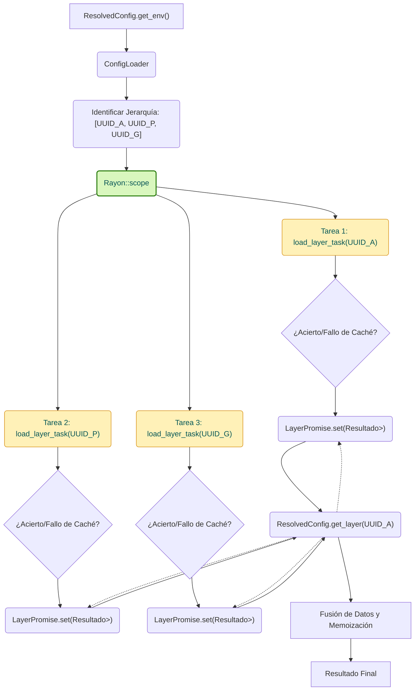

  <strong>Read this in other languages:</strong> 
  <a href="../../TECHNICAL.md">English</a> • 
  <a href="./TECHNICAL.md">Español</a>

> **Nota:** Esta traducción es mantenida por la comunidad y podría no estar completamente sincronizada con la [versión en inglés](../../TECNICAL.md), que es la fuente canónica de la documentación.

# 1. Introducción y Filosofía de Diseño

Este documento proporciona un análisis técnico en profundidad de la arquitectura interna de `axes`. A diferencia de la documentación de usuario, su propósito es detallar las decisiones de diseño, los patrones de software y las estrategias de optimización que permiten a `axes` cumplir sus objetivos de rendimiento y robustez.

## 1.1. El Problema Técnico Abordado

Los ejecutores de tareas tradicionales operan sobre un modelo sin estado y basado en texto. Este enfoque, aunque simple, introduce cuellos de botella fundamentales a medida que la complejidad del proyecto escala:

1. **Sobrecarga de Parseo en la Ruta Caliente (Hot Path):** Cada ejecución requiere leer y parsear archivos de configuración de texto (ej., `Makefile`, `Justfile`, `package.json`), una operación intensiva en I/O y CPU que se repite innecesariamente.
2. **Gestión Implícita de Dependencias:** La relación entre diferentes componentes de un monorepo (ej., `api` depende de `common-lib`) no está formalizada, lo que lleva a flujos de trabajo frágiles y a la falta de herencia de configuración.
3. **Falta de Identidad Persistente:** Identificar un proyecto basándose en su ruta del sistema de archivos es inherentemente volátil. Operaciones como renombrar o mover un directorio rompen flujos de trabajo y referencias.

`axes` fue diseñado desde cero para resolver estos problemas a nivel arquitectónico.

### 1.2. Los Tres Pilares de la Arquitectura de `axes`

La arquitectura de `axes` se asienta en tres principios fundamentales que funcionan sinérgicamente para ofrecer un rendimiento de élite y una robustez estructural.

#### 1.2.1. Estado Centralizado y Persistente (`GlobalIndex`)

El núcleo de `axes` es un **índice global** (`GlobalIndex`), una base de datos binaria compacta que actúa como la **Fuente Única de Verdad** para todo el ecosistema de proyectos. Este índice mapea un **UUID inmutable** para cada proyecto a sus metadatos esenciales, como su ruta física, nombre y relación padre-hijo.

- **Rendimiento de Inicio:** Al usar un formato binario (`bincode`), la deserialización del índice completo en memoria es órdenes de magnitud más rápida que el parseo de un equivalente en formato de texto (JSON, TOML). Esto minimiza drásticamente la latencia de arranque en frío.
- **Robustez Estructural:** Al desacoplar la identidad lógica (UUID) de la ubicación física (ruta), el sistema se vuelve resistente a los cambios en el sistema de archivos.

#### 1.2.2. Carga Perezosa y Concurrente (El Patrón `Facade`)

`axes` opera bajo el principio de "trabajo mínimo necesario". La lectura y compilación de archivos `axes.toml` no ocurre por adelantado. En su lugar, se construye una estructura liviana en memoria, la `ResolvedConfig`, que actúa como una **Fachada** (`Facade`).

- **Resolución Bajo Demanda:** Los datos de configuración (scripts, variables, etc.) solo se cargan del disco y se combinan cuando se invoca un método como `get_script()` o `get_env()` por primera vez.
- **Concurrencia Optimizada:** El `ConfigLoader` utiliza un pool de hilos (`rayon`) para cargar y compilar las diferentes capas de la jerarquía de un proyecto de forma concurrente. La sincronización se gestiona eficientemente usando promesas (`Arc<OnceLock<...>>`), asegurando que cada capa se compile solo una vez, incluso bajo demanda concurrente.

#### 1.2.3. Compilación Anticipada (AOT) y Caché de AST

Este es el pilar más crítico para el rendimiento en ejecuciones "calientes". `axes` no es un intérprete; es un compilador de flujos de trabajo con caché persistente.

- **Compilación a AST:** En la primera ejecución ("ruta fría"), `axes` parsea los archivos `axes.toml` y compila los scripts y variables en una representación intermedia optimizada: un **Árbol de Sintaxis Abstracta (AST)**, materializado en nuestras structs `Task`.
- **Caché Binaria Persistente:** Este AST se guarda en un archivo de caché binario (`.bin`).
- **Ejecuciones Instantáneas ("Ruta Caliente"):** Las ejecuciones posteriores se saltan por completo el costoso parseo de texto. `axes` deserializa el AST pre-compilado desde el caché binario—una operación órdenes de magnitud más rápida que el parseo de texto—y lo ejecuta instantáneamente.

**El resultado: pagas el costo de la orquestación una vez. Obtienes la velocidad de un ejecutor simple cada vez después.**

- ⚙️ **[Análisis Técnico Completo de la Arquitectura (`TECHNICAL.md`)](./TECNICAL.md):** Para aquellos interesados en la ingeniería detrás de nuestro rendimiento.

### 1.3. Diagrama de Flujo: El Ciclo de Vida AOT + JIT

El siguiente diagrama ilustra el ciclo de vida de una ejecución de script, destacando la compilación AOT (Anticipada) en la "ruta fría" y la optimización JIT (Justo a Tiempo) en la "ruta caliente".

```mermaid
graph TD
    subgraph "Ciclo de Vida de la Configuración en `axes`"
        A["<br><b>Inicio</b><br>Comando axes ejecutado"] --> B{"<br>¿Hay caché binaria válida<br>disponible para todas las capas de la jerarquía?"};

        B -- "<b>❄️ No (Ruta Fría / Fallo de Caché)</b>" --> C_IO["<br><b>[COMPILACIÓN AOT]</b><br>1. Lectura de `axes.toml` (I/O de Disco)"]
        C_IO --> C_CPU["<br>2. Compilar a <b>AST Universal</b> (Intensivo en CPU)"]
        C_CPU --> D_IO["<br>3. Escritura de AST Universal a<br>Caché Binaria (I/O de Disco)"]
        D_IO --> E["<br><b>[En Memoria]</b><br>Cargar AST Universal recién compilado"]
        
        B -- "<b>🔥 Sí (Ruta Caliente / Acierto de Caché)</b>" --> H_IO["<br><b>[I/O + CPU Mínimos]</b><br>1. Deserializar AST Universal<br>desde Caché Binaria"]
        H_IO --> E
        
        E --> I_JIT["<br><b>[OPTIMIZACIÓN JIT]</b><br>Especializar AST Universal a<br>Tarea Específica de Plataforma (En Memoria)"]
        
        I_JIT --> F["<br><b>Ejecución</b><br>TaskExecutor opera sobre la<br>lista de tareas simple y especializada en plataforma"]
        F --> G["<br><b>Fin</b><br>"]
    end

    %% Low-cost nodes (in-memory operations, decisions)
    style A fill:#e6f7ff,stroke:#0050b3,stroke-width:1px,color:#055
    style B fill:#e6f7ff,stroke:#0050b3,stroke-width:2px,color:#055
    style E fill:#d6f7ff,stroke:#0050b3,stroke-width:1px,color:#055
    style I_JIT fill:#d6f7ff,stroke:#0050b3,stroke-width:1px,color:#055
    style F fill:#d6f7ff,stroke:#0050b3,stroke-width:2px,color:#055
    style G fill:#d6f7ff,stroke:#595959,stroke-width:1px,color:#055

    %% Hot Path Nodes (Optimized I/O and CPU)
    style H_IO fill:#d9f7be,stroke:#237804,stroke-width:2px,color:#055
    
    %% Cold Path Nodes (High Cost)
    style C_IO fill:#fff1b8,stroke:#d48806,stroke-width:2px,color:#055
    style C_CPU fill:#ffd8bf,stroke:#d46b08,stroke-width:2px,color:#055
    style D_IO fill:#ffdfd7,stroke:#cf1322,stroke-width:2px,color:#055
```

Esta arquitectura **AOT + JIT** proporciona lo mejor de ambos mundos:

- La **Compilación AOT** paga el costo de parseo y compilación una sola vez, creando una **caché universal y portable**.
- La **Especialización JIT** realiza una transformación final, ultrarrápida, en memoria que proporciona al `TaskExecutor` una lista de comandos simple y plana, asegurando que la ruta caliente tenga cero sobrecarga de toma de decisiones.

Esta arquitectura de compilación y caché es lo que nos permite ofrecer el poder de la orquestación compleja a una velocidad que rivaliza con la de los ejecutores más simples. Además, el uso de hashes para los nombres de los archivos de caché permite que esta caché sea **compartida entre los miembros del equipo** a través de una unidad de red o un sistema de caché distribuido, asegurando que el costo de compilación se pague **solo una vez para todo el equipo**.

## 2. Anatomía de la Ejecución de Comandos: El Ciclo de Vida de un Comando

El proceso de ejecución de comandos en `axes` está rigurosamente coreografiado para maximizar la velocidad, la seguridad y el consumo perezoso de recursos.

### 2.1. El Despachador Universal y la Gramática

El binario de `axes` recibe todos los argumentos en un vector (`Vec<String>`) y utiliza una gramática universal (implementada en `bin/axes.rs`) para determinar la intención del usuario. Esta lógica tiene tres reglas de decisión primarias (Contexto, Acción, Argumentos) y es el punto donde se decide qué porción de la entrada se interpretará como el contexto (`<ctx>`) y cuál como comandos para el manejador (`[args...]`).

### 2.2. Resolución de Contexto y Persistencia de Identidad (`core/context_resolver.rs`)

Antes de cargar cualquier configuración, el sistema debe saber sobre qué proyecto está operando.

1. **Prioridad de Resolución:** El `context_resolver` transforma una entrada de texto (ej., `mi-app/api` o `g!`) en el **UUID** canónico del proyecto. La resolución sigue un orden estricto de prioridad: Alias (`g!`, `db!`), Navegación Relativa (`.`, `..`, `*`, `**`), y finalmente Nombres de Proyecto (búsqueda jerárquica).
2. **Referencia Local (`ProjectRef`):** El sistema mantiene un archivo binario de referencia local (`project_ref.bin`) en cada directorio de proyecto (`.axes/`). Este archivo almacena el propio `UUID` del proyecto, el `UUID` de su padre y su nombre simple. Si el índice global se corrompe, `axes` puede reconstruir la identidad del proyecto a partir de esta referencia local, asegurando la auto-reparación del sistema.
3. **Optimización `last_used`:** Cada resolución exitosa de contexto actualiza los *punteros de caché* (`last_used`, `last_used_child`) en el `GlobalIndex` para acelerar futuras búsquedas (`**` y `*`).

### 2.3. Carga de Capas Concurrente (`core/config_loader.rs`)

Una vez que se conoce el `UUID` del proyecto objetivo, la fachada `ResolvedConfig` inicia la fase de carga.

El `ConfigLoader` determina la cadena de herencia completa (desde el `UUID` objetivo hasta el proyecto raíz `global`) y orquesta la carga de las capas de configuración de estas cadenas de forma concurrente para minimizar la latencia.

#### Diagrama: Flujo de Carga de Capas

#### Mecanismos de Sincronización

1. **`LayerPromise` (`Arc<OnceLock<...>>`):** Cada tarea de carga de capa es asíncrona. El `ResolvedConfig` obtiene una "promesa" para el resultado. El uso de `OnceLock` es crucial: si un hilo ya está calculando la caché para una capa, cualquier otro hilo que la necesite simplemente **se bloquea y espera** en el mismo `OnceLock`. Esto asegura que la costosa operación de `Fallo de Caché` (I/O + Compilación) nunca se duplique, incluso en entornos altamente concurrentes.
2. **Manejo de `Fallo de Caché`:** Si se detecta un `Fallo de Caché` (el `axes.toml` ha cambiado), la tarea de carga procede a la compilación y produce un `IndexUpdate`. Estas *actualizaciones* son recolectadas por el hilo principal y aplicadas al `GlobalIndex` en un orden secuencial (antes de que la aplicación termine), garantizando la seguridad de la caché.

### 2.4. El Modelo de Comando: Compilación a AST

La compilación es el paso donde el texto del usuario se transforma en una estructura de datos optimizada y ejecutable.

1. **De TOML a AST:** `axes` convierte el `ProjectConfig` flexible (el formato de texto) en un `CachedProjectConfig`. Este proceso implica transformar cada `Command` en una `Task`, que es nuestra representación materializada y optimizada del AST. Una `Task` contiene una secuencia de `CommandExecution`.
2. **Propósito de `Task`:** Almacenar scripts pre-parseados y tokens resueltos (`TemplateComponent`), junto con metadatos de ejecución (`ignore_errors`, `run_in_parallel`). Esto elimina la necesidad de `shlex` y el parseo de plantillas en tiempo de ejecución.
3. **Separación de Modelos:** La caché binaria (`bincode`) solo almacena la `Task` compilada (y no el tipo intermedio `Command`), asegurando que la serialización binaria sea segura, rápida e inequívoca.

### 3. Las Estructuras de Datos Fundamentales y su Diseño

El rendimiento y la robustez de `axes` no son solo el resultado de los algoritmos, sino también del diseño deliberado de sus estructuras de datos. Cada `struct` ha sido diseñada para un propósito específico dentro del ciclo de vida de la aplicación.

### 3.1. Dualidad de Estado: `GlobalIndex` vs. `ProjectRef`

`axes` gestiona el estado en dos niveles: uno global y uno local, creando un sistema resiliente y auto-reparador.

- **`GlobalIndex` (El Mapa Global):**
  - **Estructura:** Un único archivo binario (`index.bin`) que contiene principalmente un `HashMap<Uuid, IndexEntry>`.
  - **Propósito:** Actúa como el índice primario para todas las operaciones de búsqueda y resolución de contexto. Permite la resolución de UUID a metadatos (ruta, nombre, padre) en tiempo constante O(1).
  - **Optimización de Alias:** Mantiene un `HashMap<String, Uuid>` separado para los alias. Esta es una decisión de diseño crítica: desacopla los "atajos" de la estructura jerárquica principal. Permite relaciones de alias de muchos a uno (múltiples alias pueden apuntar al mismo proyecto), una flexibilidad que se perdería si el alias fuera una propiedad del `IndexEntry`.

- **`ProjectRef` (La Identidad Local):**
  - **Estructura:** Un pequeño archivo binario (`.axes/project_ref.bin`) dentro de cada directorio de proyecto.
  - **Propósito:** Actúa como una "etiqueta de identidad" inmutable para el proyecto. Almacena su propio `self_uuid`, `name` y `parent_uuid`.
  - **Robustez y Auto-Reparación:** Este archivo es la clave de la resiliencia de `axes`. Si el `GlobalIndex` se corrompe o se elimina, el comando `axes register` puede recorrer el sistema de archivos y utilizar los archivos `project_ref.bin` para **reconstruir el índice global** con total fidelidad. Permite que un proyecto sea movido o renombrado en el sistema de archivos y luego "re-registrado" sin perder su identidad histórica o sus relaciones.

### 3.2. La Cadena de Transformación de Comandos: De la Sintaxis de Usuario al AST Optimizado

Para lograr tanto una sintaxis amigable para el usuario como un rendimiento de ejecución extremo, `axes` utiliza una cadena de transformación de modelos de datos de múltiples etapas. Esta es la clave de nuestra robustez arquitectónica.

```mermaid
graph LR
    A("<b>1. Sintaxis de Usuario</b><br><code>axes.toml</code>") --> B{"<b>2. Deserializador TOML</b><br>(<code>serde_toml</code>)"};
    
    subgraph "Fase de Compilación AOT (Fallo de Caché)"
        B --> C["<b>3. Modelos de Sintaxis Flexible</b><br><code>TomlScript</code>, <code>TomlVar</code><br>Usa <code>#[serde(untagged)]</code><br>para aceptar múltiples formatos."];
        C --> D["<b>4. Compilador (`compiler.rs`)</b><br>Transforma la sintaxis flexible en<br>el AST universal y agnóstico a la plataforma."];
        D --> E["<b>5. Modelo AST Universal</b><br><code>Task</code>, <code>CachedVar</code><br>Contiene bloques <code>PlatformExecution</code>.<br>100% compatible con <code>bincode</code>."];
    end
    
    E --> F{"<b>6. Serializador Binario</b><br>(<code>bincode</code>)"};
    F --> G("<b>7. Caché de Disco</b><br><code>.bin</code>");

    subgraph "Fase de Ejecución (Ruta Caliente)"
        G --> H{"<b>8. Deserializador Binario</b><br>(<code>bincode</code>)"};
        H --> I["<b>9. AST Universal en Memoria</b><br>Cargado directamente, evitando el parseo de texto."];
        I --> J["<b>10. Especializador JIT</b><br><code>specialize_task_for_platform()</code><br>Selecciona comandos para el SO actual."];
        J --> K["<b>11. AST Especializado en Plataforma</b><br><code>PlatformSpecializedTask</code><br>Una lista de comandos simple y plana."];
    end
    
    K --> L("<b>12. <code>TaskExecutor</code></b><br>Opera sobre el AST plano<br>con cero sobrecarga.");

    %% Styles
    style A fill:#f0f0f0,stroke:#333,color:#055
    style G fill:#f0f0f0,stroke:#333,color:#055
    style C fill:#e6f7ff,stroke:#096dd9,color:#055
    style D fill:#bae7ff,stroke:#096dd9,color:#055
    style E fill:#d9f7be,stroke:#237804,color:#055
    style I fill:#d9f7be,stroke:#237804,color:#055
    style J fill:#d9f7be,stroke:#237804,color:#055
    style K fill:#d9f7be,stroke:#237804,color:#055
```

- **`TomlScript`, `TomlVar`:** Estas structs de "solo lectura" están diseñadas con la máxima flexibilidad para el usuario, utilizando atributos como `#[serde(untagged)]` y `#[serde(deny_unknown_fields)]` para proporcionar una experiencia de configuración ergonómica y resistente a errores.
- **`Task`, `CachedVar` (El AST Universal):** Este es el producto final de la compilación AOT. Es una representación optimizada en memoria para el almacenamiento, que contiene bloques `PlatformExecution` que albergan la lógica para todos los sistemas operativos. Esta estructura es la que se serializa con `bincode` en la caché.
- **`PlatformSpecializedTask` (El AST Optimizado por JIT):** Esta es una estructura transitoria, solo en memoria, creada justo antes de la ejecución. Representa la ruta de ejecución más rápida posible, ya que todas las decisiones específicas de la plataforma ya se han tomado.

### 3.3. El Resolvedor de Argumentos (`ArgResolver`): Manejo de Parámetros de Cero Copia

El `ArgResolver` es un componente de alto rendimiento que valida y resuelve todos los parámetros del script *antes* de que comience la ejecución.

- **Validación de Contrato Pre-Ejecución:** El sistema primero recopila todas las definiciones de parámetros (`<params::...>`) de todo el script (potencialmente compuesto). Esto forma un "contrato" completo. Luego, el `ArgResolver` se construye una vez, validando los argumentos CLI del usuario contra este contrato. Esto atrapa todos los errores—parámetros requeridos faltantes, conflictos de banderas—por adelantado.
- **Rendimiento de Cero Copia:** El `ArgResolver` está diseñado para ser extremadamente eficiente en memoria. Utiliza el sistema de *lifetimes* de Rust para **tomar prestados** los argumentos de la línea de comandos directamente del `Vec<String>` de entrada en lugar de clonarlos. Esto significa que para un comando como `axes run -- --argumento-largo-1 --argumento-largo-2`, no se realizan nuevas asignaciones de cadenas para los parámetros, minimizando la sobrecarga de memoria.
- **Resultado Inmutable:** El `ArgResolver` produce un `HashMap` inmutable de valores resueltos. El `TaskExecutor` luego realiza búsquedas rápidas en este mapa, eliminando cualquier sobrecarga de parseo o validación durante el bucle de ejecución caliente.

- **Pre-Parseo y Validación:** Antes de la ejecución, el sistema (`run::handle`, `start::handle`, etc.) atraviesa la `Task` aplanada y recopila **todas** las definiciones de parámetros (`ParameterDef`) en una sola lista. Esta lista representa el "contrato" completo del script.
- **Resolución de una Sola Pasada:** El `ArgResolver` se construye una vez con este contrato y los argumentos del usuario. En su constructor, realiza toda la validación:
  - Comprueba que todos los parámetros `required` estén presentes.
  - Detecta conflictos, como el uso simultáneo de una bandera y su alias (`--verbose` y `-v`).
  - Detecta argumentos inesperados si el script no utiliza el token genérico `<params>`.
- **Resultado Inmutable:** El `ArgResolver` produce un `HashMap` inmutable que mapea el token original (ej., `<params::0(required)>`) a su valor final resuelto. Durante la ejecución, el `TaskExecutor` simplemente realiza búsquedas rápidas en este mapa, sin necesidad de más parseo o validación.

### 3.4. El Sistema de Caché

- **Caché por Capas:** `axes` no tiene una única caché monolítica, sino una caché para cada `axes.toml` en la jerarquía del proyecto. Esto mejora la granularidad y reduce la invalidación: un cambio en `mi-app/api/axes.toml` solo invalida la caché de `api`, no la de `mi-app` o `global`.
- **Gestión de Caché:** El comando `axes <ctx> _cache clear` invalida la caché de una capa específica eliminando su `config_hash` y `cache_dir` del `GlobalIndex`. La próxima vez que se necesite esa capa, se fuerza una recompilación. Un futuro comando `axes cache gc` será responsable de limpiar los archivos de caché binaria del disco que ya no son referenciados por ningún proyecto en el `GlobalIndex`.

## 4. Optimizaciones Adicionales y Conclusiones de Rendimiento

Más allá de los tres pilares arquitectónicos, `axes` implementa una serie de optimizaciones micro-arquitectónicas para minimizar la latencia en cada operación.

### 4.1. Patrón de Memoización en `ResolvedConfig`

La fachada `ResolvedConfig` no solo es perezosa a nivel de I/O de disco, sino también a nivel de computación. Las operaciones como fusionar variables de entorno a través de toda una jerarquía (`get_env()`) son costosas. Para evitar repetir este trabajo, `ResolvedConfig` utiliza un patrón de **memoización** interno.

- **Mecanismo:** Cada método costoso (ej., `get_env`, `get_options`) utiliza un campo `memoized_*` protegido por un `Mutex`.
  - En la **primera llamada**, el `Mutex` se bloquea, se realiza el cálculo costoso (fusionar `HashMap`s de todas las capas) y el resultado se almacena en el campo `memoized_*`.
  - En **llamadas subsiguientes**, el `Mutex` solo se bloquea brevemente para verificar si el resultado ya existe, y lo devuelve instantáneamente.
- **Optimización con `Arc`:** Para resultados que son colecciones grandes (como el `HashMap` de `get_env`), el valor cacheado se envuelve en un `Arc` (`Arc<HashMap<...>>`). El método devuelve un `clone()` del `Arc`, que es un incremento atómico del conteo de referencias (extremadamente rápido), en lugar de un clon completo de `HashMap` (extremadamente lento). Esta fue una optimización clave identificada a través de `flamegraph` para eliminar un cuello de botella grave.

### 4.2. Minimización de Llamadas al Sistema de Archivos

Las operaciones de I/O de disco y las llamadas al sistema son los mayores enemigos de la latencia en una herramienta CLI. `axes` las minimiza activamente:

- **Resolución de Contexto en Sesión:** Cuando un usuario está dentro de una sesión (`AXES_PROJECT_UUID` está definido), la resolución de contexto para referencias como `.` se realiza **completamente en memoria**. En lugar de llamar a `dunce::canonicalize` para preguntar al sistema de archivos por el directorio actual, `axes` simplemente utiliza la ruta del proyecto de la sesión, que ya está cargada en el `GlobalIndex`.
- **Validación de Caché por Hash:** El sistema de caché no se basa en las `timestamps` de los archivos, que pueden ser inconsistentes. Utiliza un hash criptográfico (`blake3`) del contenido de `axes.toml`. Esto no solo es más robusto, sino que en muchos sistemas operativos modernos, leer un archivo pequeño para hashearlo puede ser más rápido que múltiples accesos a metadatos si el contenido ya está en la caché de páginas del SO.

### 4.3. Elección de Dependencias de Alto Rendimiento

El stack de dependencias de `axes` ha sido seleccionado con el rendimiento como criterio principal:

- **`bincode` vs. `serde_json`/`serde_toml`:** Para la serialización de caché e índice, `bincode` ofrece un rendimiento de deserialización muy superior en comparación con los formatos de texto, ya que no requiere un analizador léxico/sintáctico.
- **`rayon`:** Para la carga concurrente de capas, `rayon` proporciona un pool de hilos de "robo de trabajo" de clase mundial con una sobrecarga mínima, permitiendo una paralelización casi ideal de las tareas de I/O y compilación.
- **`clap`:** Utilizado para el parseo de argumentos CLI. Su macro `derive` genera código de parseo altamente optimizado en tiempo de compilación, lo que resulta en un análisis de argumentos muy rápido en tiempo de ejecución.

### 4.4. Conclusión: Una Arquitectura Orientada al Rendimiento

Cada decisión de diseño en `axes` se ha tomado a través de la lente de la optimización del rendimiento, priorizando la velocidad en la "ruta caliente" (la ejecución de comandos por el usuario).

- Hemos **desplazado los costos computacionales** del tiempo de ejecución al tiempo de compilación de caché (`Compilación AOT a AST`).
- Hemos **eliminado la redundancia** a través de la memoización (`ResolvedConfig`).
- Hemos **minimizado las operaciones lentas** como I/O y parseo de texto, reemplazándolas con lectura binaria y operaciones en memoria.

El resultado es un sistema que no solo *se siente* rápido, sino que empíricamente demuestra superar a sus competidores, proporcionando una base sólida y de alto rendimiento sobre la cual construir el futuro de la orquestación de flujos de trabajo.
